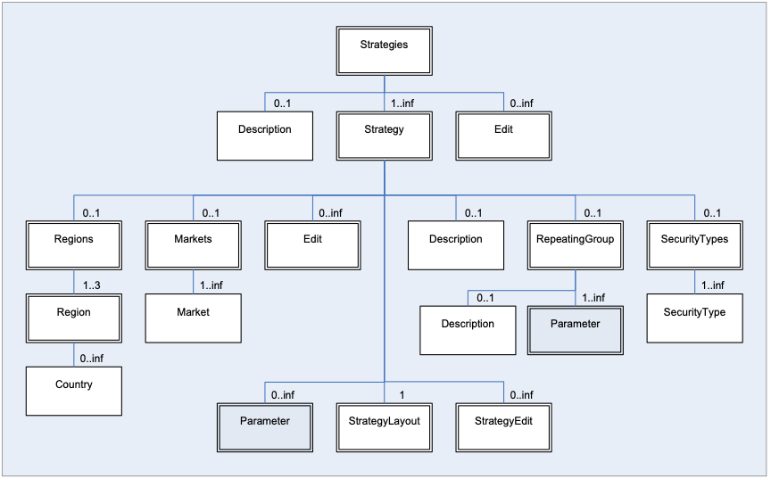
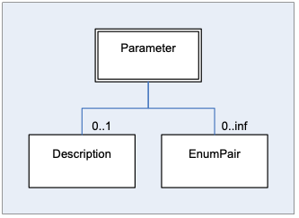
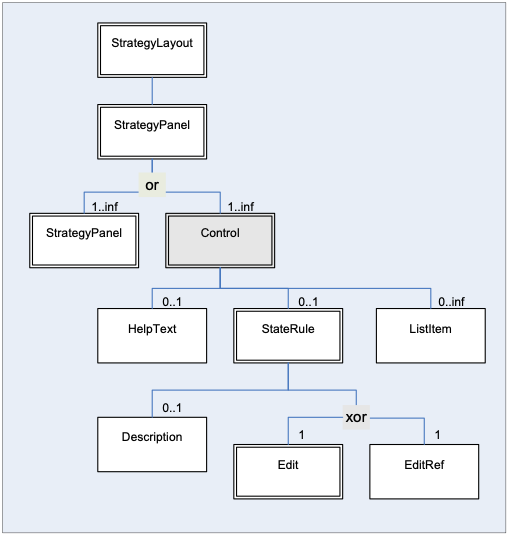
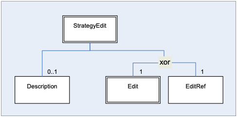
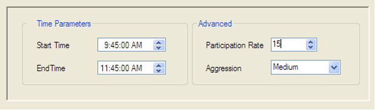
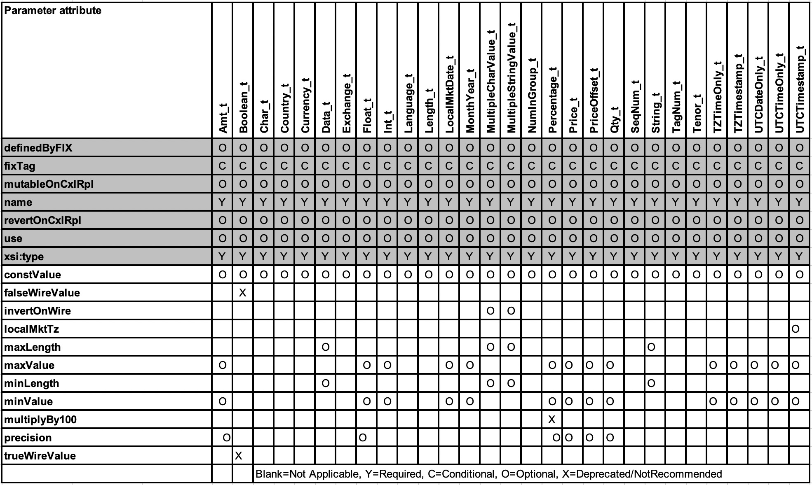
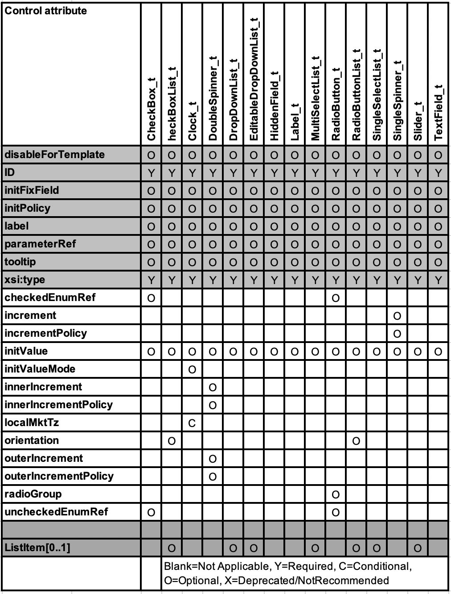

# Introduction

This document serves as a specification of the FIX Algorithmic Trading
Definition Language (FIXatdl), a markup language that works in
conjunction with the FIX Protocol. FIXatdl is used to define the FIX
interface of algorithmic order types. An algorithmic order interface
description consists of: a description of tags that are to be included
in FIX New Order Single, Order Cancel Request and Order Cancel/Replace
Request messages that are to be sent to an order recipient; rules for
validating the data entered into an order form by a user; suggestions on
how to render GUI controls within an order entry form; and rules
affecting the visual state of the GUI controls as information is being
entered into the order form.

Rather than describing interfaces in a natural language, such as
English, which can be subject to differing interpretations, FIXatdl
standardizes the way algorithmic interfaces are described thus reducing
interpretation errors and allowing for the creation of documents in a
machine-readable format. It is envisioned that applications supporting
this standard would be able to receive an XML document conforming to
FIXatdl and, based on the information within this document, be able to:

- Dynamically display an order ticket containing algorithmic order
parameters.

- Change the visual state of GUI controls based on user input.

- Validate the values entered into the ticket before an order is
transmitted.

- Create and transmit a FIX order message with the appropriate standard
and/or user-defined fields populated.

These capabilities are achievable without the need for custom software
development or subsequent product deployment.

## Audience

This specification is intended for those interested in either: (1)
developing applications with FIX order entry capabilities supporting
order type definition via FIXatdl; or (2) algorithmic order providers
who wish to describe the interface to their algorithms in FIXatdl.

# FIXatdl Schema Files

A set of XML Schema files has been created to describe the structure
of a FIXatdl document instance. These files can be used with
commercial XML parsing software to validate a FIXatdl document
instance. They can also be used with XML data binding utilities to
generate source code which maps classes to XML representations. The
files are grouped into two functional categories:

- **Data Contract** -- Defines the wire-value interface of an
algorithmic order. For each algorithm/strategy it defines the valid
set of parameters and availability of the strategy for specific
markets. For each parameter of an algorithm/strategy it defines the
type; the legal range of values (including minimum and maximum
values); whether it is optional or required; and value constraints
based on certain conditions or the value of other parameters
(validation rules).

- **GUI** -- Defines the recommended GUI controls that should be
rendered on the order entry screen and their location on the screen.
Defines the rules that affect the state of a GUI control. Provides a
mapping of the on screen controls with the parameters of the data
contract.

The constructs of the schema files have been categorized this way to
ensure that the data contract is de-coupled from the GUI. This
provides some flexibility for E/OMS vendors in how FIXatdl is applied.
For example, data contract functions, such as parameter validation,
may be performed in an application downstream from the E/OMS without
the need for the XML that describes the GUI.

The FIXatdl language definition is contained within six XML
Schema files:

+---------------------------------------------------+-----------------------------------------------------------------------------------------------+
| XML Schema file / namespace                       | Purpose                                                                                       |
+===================================================+===============================================================================================+
| fixatdl-core-1-2.xsd                              | Data: Defines attributes and elements that are used to describe the data content of the       |
|                                                   | algorithm and the parameters.                                                                 |
| http://www.fixprotocol.org/FIXatdl-1-2/Core       |                                                                                               |
+---------------------------------------------------+-----------------------------------------------------------------------------------------------+
| fixatdl-validation-1-2.xsd                        | Data: Defines attributes and elements used to author rules that are applied to the parameter  |
|                                                   | values as a validation check. These rules can be simple where boundary conditions are         |
| http://www.fixprotocol.org/FIXatdl-1-2/Validation | checked, or complex where compound boolean expressions involving several parameters are       |
|                                                   | evaluated.                                                                                    |
+---------------------------------------------------+-----------------------------------------------------------------------------------------------+
| fixatdl-layout-1-2.xsd                            | GUI: XML constructs to describe how a parameter should be rendered within a user interface -- |
|                                                   | this includes recommendations about GUI controls and their relative location within the       |
| http://www.fixprotocol.org/FIXatdl-1-2/Layout     | interface.                                                                                    |
+---------------------------------------------------+-----------------------------------------------------------------------------------------------+
| fixatdl-flow-1-2.xsd                              | GUI: Provides the ability to dynamically affect the behavior of a GUI control. Rules can be   |
|                                                   | created to enable or disable parameters based on values entered by the user in other          |
| http://www.fixprotocol.org/FIXatdl-1-2/Flow       | parameters.                                                                                   |
+---------------------------------------------------+-----------------------------------------------------------------------------------------------+
| fixatdl-regions-1-2.xsd                           | Data: Enumeration values for countries within three regions: TheAmericas,                     |
|                                                   | EuropeMiddleEastAfrica and AsiaPacificJapan.                                                  |
| http://www.fixprotocol.org/FIXatdl-1-2/Regions    |                                                                                               |
+---------------------------------------------------+-----------------------------------------------------------------------------------------------+
| fixatdl-timezones-1-2.xsd                         | Data: Lists enumeration values for world timezones based on zoneinfo database.                |
|                                                   |                                                                                               |
| http://www.fixprotocol.org/FIXatdl-1-2/Timezones  |                                                                                               |
+---------------------------------------------------+-----------------------------------------------------------------------------------------------+

# Key Concepts

## Element Hierarchy

The FIXatdl schema provides a set of XML elements that are used to
create a conforming FIXatdl document. These elements are described later
in this section. The attributes of each of these elements are described
in latter in this document.

In a FIXatdl document an algorithm provider can define any number of
algorithmic order interfaces by using multiple Strategy elements. Each
strategy is identified by a unique name that must be provided in the XML
of each of the Strategy elements. Instances of documents begin with the
root element, Strategies, and follow the hierarchy:

```xml
<Strategies>
    <Strategy>
        ... strategy definition ...
    </Strategy>
    <Strategy>
        ... strategy definition ...
    </Strategy>
        . . .
    <Strategy>
        ... strategy definition ...
    </Strategy>
</Strategies>
```
\
At the root level, the algorithm provider must specify which tag to use
to identify the individual strategies. (At one time TargetStrategy(847) was
intended to carry this information. However, most providers use
a user-defined field for this purpose.) For example to indicate that tag
5009 will be used to identify strategies the Strategies element would be
written as

```xml
<Strategies strategyIdentifierTag="5009"/>
```
\
Parameters for each strategy are defined via Parameter elements.
Validation rules are defined via StrategyEdit elements. Each strategy
can have any number of parameters or validation rules. An algorithm can
have only one section where the layout of the controls is defined. A
layout is defined via the StrategyLayout element. So if we look deeper
into the strategy definition we'll see that it follows the hierarchy:

```xml
<Strategy>
    <Parameter>
    <Parameter>
    . . .
    <Parameter>
    <StrategyEdit>
    <StrategyEdit>
    . . .
    <StrategyEdit>
    <StrategyLayout>
</Strategy>
```
\
The following figure shows the hierarchy of elements in tree form
starting from the root element, Strategies. The XML Schema values
minOccurs and maxOccurs are given for each branch of the tree. Elements
with optional or required child elements are indicated by double-line
borders. Elements with no children (leaf nodes) have single-line
borders. Abstract elements, ones which require the use of a substitution
group, are shaded. The elements, Parameter, StrategyLayout and
StrategyEdit are somewhat complex; the hierarchy of their children is
shown in figures 2 through 4.



The following figure gives the hierarchy of elements descending from the
Parameter element.



The following figure gives the hierarchy of elements descending from the
StrategyLayout element. This element is responsible for binding GUI
controls to parameters and describing their arrangement on the
order-entry screen.



The following figure shows the StrategyEdit hierarchy. This element is
used to describe validation rules which are applied to the values of a
strategy's parameters at order-generation time. Each StrategyEdit must
contain a single Edit element (may contain further nested Edit rules)
which is used to describe a particular condition that must be met in
order to pass validation.



## Parameter Description

The interface of an algorithmic order type is described by a set of FIX
messages, the required, optional and user-defined fields of those
messages, and user-defined restrictions on the range of values for
particular fields. In general, when we speak of the parameters of an
algorithmic order we are, in fact, referring to the user-defined fields
of a New Order Single, Order Cancel Request or Order Cancel/Replace
Request. (In some cases a parameter may also refer to a standard FIX
field, one with a tag number in the range 1-5000, that broker-dealers
commonly included in their algorithmic interface specifications, such as
EffectiveTime(168) and ExpireTime(128).)

Parameters are strictly described in FIXatdl by the target firm who will
receive them (*order recipients*), and are communicated via an XML file
to various senders (*order initiators*). To describe these parameters,
FIXatdl provides the Parameter element. Parameter elements are
identified by their "name" attribute. There is no limit to the number of
parameters a strategy may have as long as each is uniquely identified at
the strategy level. Besides a parameter's name, other parameter
attributes include: its type; its maximum and minimum values (if
applicable); its corresponding FIX tag number; and its usage (optional
vs. required). For example, the following code snippet describes an
integer type parameter:

```xml
<Parameter name="SampleRate" xsi:type="Int_t" fixTag="8000"
use="optional" minValue="1" maxValue="9"/>
```
\
This listing describes a parameter named "SampleRate" which can
optionally be populated in tag 8000 of an order message. The attributes
"minValue" and "maxValue" describes the minimum and maximum values that
the recipient of an order message is expecting. Orders with SampleRate
values outside that range may be rejected. The attribute "xsi:type"
describes the parameter's type which must be one of the datatypes
specified by the FIX Protocol. FIXatdl provides enumeration values for
xsi:type that map directly to the FIX datatypes. (An explanation of
xsi:type can be found in this document in the section entitled "Abstract
Element Extensions".)

For certain parameters it may be appropriate to limit the legal values
to a set of enumerated values. This is done by adding child EnumPair
elements to the Parameter element. Each EnumPair represents one of the
enumerated values expected to be transmitted over the wire. For example:

```xml
<Parameter name="Aggression" xsi:type="Char_t" fixTag="8001" use="required">
    <EnumPair enumID="low" wireValue="L"/>
    <EnumPair enumID="medium" wireValue="M"/>
    <EnumPair enumID="high" wireValue="H"/>
</Parameter>
```
\
This describes the "Aggression" parameter. An order recipient would
expect to receive one of the values, "L", "M" or "H" in tag 8001 of an
order message. The attribute EnumPair/@enumID is a unique identifier of
EnumPair elements.

If a user of an order-entry system were to submit an order with
"SampleRate" set to 5 and "Aggression" set to "high", the order
recipient would expect to receive a FIX message containing a substring
similar to:

`...35=D|11=0001|55=AXP|44=77.25| ... 8000=5|8001=H ...`

## Validation Rules

Validation rules are defined by use of the StrategyEdit element. This
XML element enables the creation of complex and conditional rules which
can be applied to the orders generated by an E/OMS. The goal of a
validation rule is to process the

values of the strategy parameters after they have been entered by the
user. Each validation rule consists of a condition and an error message.
If the condition is true then the values of the parameters are valid. If
the condition is false, then the values of the parameters are invalid and
the provided error message should be displayed. That is to say,
validation conditions are much like assertions. When an assertion has
failed an error has occurred.

The conditions described within a validation rule are defined by use of
the Edit element. An Edit element defines a Boolean expression where
values of parameters can be compared to one another or to constant
values.

To illustrate, consider the most common parameters of all algorithms,
StartTime and EndTime. Their description and a rule guaranteeing that
StartTime precedes EndTime can be described by the following statements:

```xml
<Parameter name="StartTime" xsi:type="UTCTimestamp_t" fixTag="8005" use="required">
<Parameter name="EndTime" xsi:type="UTCTimestamp_t" fixTag="8006" use="required">
<StrategyEdit errorMessage="Start Time must precede End Time.">
    <Edit field="StartTime" operator="LT" field2="EndTime"/>
</StrategyEdit>
```
\
Here we have defined both StartTime and EndTime as UTCTimestamp
parameters. At validation time, the rule described in StrategyEdit
instructs the E/OMS to perform an evaluation of the Boolean expression
provided by the Edit element. In this case a comparison of StartTime and
EndTime will be made using the "LT" (less than) operator. If StartTime
is less than EndTime then the parameter values are deemed to be valid.
However, if StartTime is greater than or equal to EndTime then the
parameter values are invalid and the E/OMS can inform the user by
displaying the error message in a dialog box.

For more complex rules, Boolean expression may be formed by multiple
Edit elements organized in an expression tree using logical operators
AND, OR, XOR and NOT. For example consider these declarations:

```xml
<Parameter name="ParticipationRate" xsi:type="Float_t" fixTag="8008" use="optional"/>
<StrategyEdit errorMessage="If Participation Rate is entered it must be between 1 and 50">
    <Edit logicOperator="OR">
        <Edit field="ParticipationRate" operator="NX"/>
        <Edit logicOperator="AND">
            <Edit field="ParticipationRate" operator="GE" value="1"/>
            <Edit field="ParticipationRate" operator="LE" value="50"/>
        </Edit>
    </Edit>
</StrategyEdit>
```
\
Here we see a tree of Edit elements. The root Edit element is describing
a logical "OR" condition asserting that either ParticipationRate was not
provided or its value is in the range from 1 to 50. Note how in the
"AND" expression a parameter value is compared not to another parameter
but to a constant value.

Also note that the logical operators, AND and OR, can have more than two
operands. Furthermore, they both perform short-circuit evaluation of
their operands. (I.e. their operands are evaluated from left to right.
As soon as the value is known, evaluation of the
expression stops and the value is returned. Consequently, not all
operands need to be evaluated. For example, consider the previous
example in which "ParticipationRate" is an optional parameter. It is
quite possible that the user does not provide a value for
"ParticipationRate". If that is the case then evaluation of the "OR"
statement will terminate after it is established that its first operand,
`<Edit field="ParticipationRate" operator="NX"/>`, is true. The "AND"
statement that follows is never evaluated -- which is a good result
since, if we had attempted to evaluate it, it is quite possible that a "Null Reference"
error would occur.) That being the case, it is important
that XML parsing or binding libraries maintain the order of the elements
as they appear; otherwise unexpected results may occur.

The logical operator XOR can also have more than two operands. As a
convention we define XOR as "one and only one", which means
it evaluates to "true" when one and only one of its operands is true. If
none or more than one of its operands is true then XOR is false.
Short-circuit evaluation cannot be applied to XOR.

The "field" attribute of an Edit element is not restricted to strategy
parameters. Standard order tags (those not described in a FIXatdl
instance but nevertheless are required tags of order, cancel and
cancel/replace messages) may also be used to create Boolean expressions.
For example:

```xml
<StrategyEdit errorMessage="For IOC orders Participation Rate must
be between 1 and 25">
    <Edit logicOperator="OR">
        <Edit field="FIX_TimeInForce" operator="NX"/>
            <Edit field="FIX_TimeInForce" operator="NE" value="3"/>
            <Edit logicOperator="AND">
                <Edit field="ParticipationRate" operator="GE" value="1"/>
                <Edit field="ParticipationRate" operator="LE" value="25"/>
        </Edit>
    </Edit>
</StrategyEdit>
```
\
This rule incorporates the value of TimeInForce(59) which is a standard tag
found in most order messages. The values associated with standard tags
are those that are sent over the wire. For example, TimeInForce(59) is an
enumeration of char values ranging from "0" to "9" and "A" to "C" (FIX Latest as of EP264). So care must be
taken to assure the corresponding operand, "value", is of a similar
type. Support for these types of expressions is highly dependent on a
vendor's implementation of FIXatdl. Not all standard tags may be
available.

In cases where the field attribute is not recognized or not supported,
the rule containing the offending Edit element should be skipped-over by
a vendor's application and should not cause a validation error. The
end-result will be the same as if the condition of the rule were true.

## GUI Layout Description

In order to render a parameter within an order entry screen, an OMS must
be able to pick an appropriate GUI control to display. For instance, a
parameter representing a price would best be rendered as a number
spinner control while a parameter representing a choice between limited
numbers of values, such as "High", "Medium" and "Low", would best be
rendered as a combo box.

Once the GUI controls have been selected, the OMS must appropriately
arrange them on the screen. By using the elements and attributes of the
Layout Schema, an algorithm provider can describe the GUI controls to
use and describe how they should be arranged on the screen.

FIXatdl does not attempt to dictate user-interface style or
look-and-feel. It is designed to be platform neutral. The components
that are provided are those typically found in .Net, Java and Web
environments.

The layout schema allows GUI controls to be arranged by adding them to a
container define by the StrategyPanel element. Controls within a panel
may be arranged either vertically or horizontally. Panel themselves may
be nested and arranged either vertically or horizontally as well. The
attributes of the StrategyPanel element include

- **Title** -- a string representing the panel title which may or may
not be displayed

- **Collapsible** -- a Boolean value indicating whether the panel can be
collapsed.

- **Collapsed** -- a Boolean value indicating the panel's initial state.

- **Orientation** -- defines whether the panel's components should be
vertically or horizontally aligned.

An important aspect of the GUI description is that it is platform
neutral. The algorithm provider describes GUI controls without knowing
how an E/OMS has been implemented or knowledge of the widget toolkit
that it uses. The controls provided by FIXatdl are those typically found
in .Net, Java or Web environments. (The initial intention was to adopt a
standard such as XAML or XUL. However, it was believed that this would
put an excessive constraint on the E/OMS vendors. So a conscious
decision was made not to adopt any one of these languages. Instead
FIXatdl presents its own with the understanding that a vendor may extend
or transform it to be aligned with their architecture and internal data
structures.)

Most Controls are associated with a particular Parameter. This is done
via the Control attribute, parameterRef. However some controls may not
have an associated Parameter. These controls are typically defined in
order to affect the state of other controls via the use of a StateRule.

The following listing describes four parameters and the layout of their
four associated controls. (Key identifiers have been highlighted.)[HANNO: to be removed/revised, automatic syntax highlighting] If we
examine the code we'll notice that the controls are enclosed in two
StrategyPanels, one entitled "Time Parameters" and the other entitled
"Advanced". These two panels are nested horizontally into the top-level
StrategyPanel of the StrategyLayout element.

```xml
<Parameter name="StartTime" xsi:type="UTCTimestamp_t" fixTag="8005" use="required"/>
<Parameter name="EndTime" xsi:type="UTCTimestamp_t" fixTag="8006" use="required"/>
<Parameter name="ParticipationRate" xsi:type="Float_t" fixTag="8007" use="optional"/>
<Parameter name="Aggression" xsi:type="Char_t" fixTag="8001" use="required">
    <EnumPair enumID="e_low" wireValue="L"/>
    <EnumPair enumID="e_med" wireValue="M"/>
    <EnumPair enumID="e_high" wireValue="H"/>
</Parameter>
<StrategyLayout>
    <StrategyPanel orientation="HORIZONTAL">
        <StrategyPanel title="Time Parameters" orientation="VERTICAL">
            <Control ID="c_ST" xsi:type="Clock_t" label="Start Time" parameterRef="StartTime"/>
            <Control ID="c_ET" xsi:type="Clock_t" label="End Time" parameterRef="EndTime"/>
        </StrategyPanel>
        <StrategyPanel title="Advanced" orientation="VERTICAL">
            <Control ID="c_PR" xsi:type="SingleSpinner" label="Partic. Rate"
              parameterRef="ParticipationRate"/>
            <Control ID="c_A" xsi:type="DropDownList_t" label="Aggression"
              parameterRef="Aggression">
                <ListItem enumID="e_low" uiRep="Low"/>
                <ListItem enumID="e_med" uiRep="Medium"/>
                <ListItem enumID="e_high" uiRep="High"/>
            </Control>
        </StrategyPanel>
    </StrategyPanel>
</StrategyLayout>
```
\
Notice how the Parameter/@name attributes match with the
Control/@parameterRef attributes. This creates the binding between
parameters and controls. Also note how the EnumPair/@EnumID attributes
match with the ListItem/@EnumID attributes. This creates the binding
between the enumeration values of the parameter and the items of a
drop-down list.

If an application were to render this information on an order ticket it
would have to decide which GUI controls to instantiate and find a way to
insert them into panels and lay the panels out according to the
instructions of the XML. Different platforms will have different
controls and panels available for this purpose and the application built
on these platforms will have different appearances. So, a rendering of
the controls described in the previous listing may look similar to the
following image:



## Flow Control Rules

Interdependencies among standard FIX tags affecting their applicability
are quite common. For example, Price(44) is not applicable when OrdType(40)
is set to Market. The same can be said for algorithmic order types
and their parameters. Many algorithmic order types will have parameters
whose applicability is dependent on the value of one or more other
parameters. These rules are often listed in algorithmic order
specifications in the comments column of tables that describe the
parameters of the algorithm.

In order to standardize the way these rules are described we have
provided a sub-schema which contains elements and attributes used to
define rules that can be applied to the visual state of GUI Controls.
This capability is a means to direct the user's workflow and this is why
it has been called "flow control". When creating flow-control rules the
expectations are that they are evaluated every time a Control's value
has changed. Based on the outcome of the evaluations, certain GUI
controls may become grayed-out or hidden as the user enters values into
text fields or selects items from drop-down lists.

Flow-control rules can be described via the StateRule element. A
StateRule will consist of a Boolean expression and an action to take
when the Boolean expression is true. There are three actions that are
supported: (1) change the "enabled" state of a control to either True or
False; (2) change the "visible" state of a control to either True or
False; and (3) change the current value of the control to a supplied
value. (Supplied values may be a constant string value, an enumID, or
the special token {NULL}.)

As with validation rules, flow-control rules employ the Edit element to
describe the condition (or Boolean expression). However, when an Edit is
used in a Flow-control rule, it will not make comparisons of parameter
values; rather it will compare the values returned by the controls. For
example, the attributes Edit/@field and Edit/@field2 will refer to
either control values or constant values.

Another difference between validation rules and flow-control rules is
that the action of a flow-control rule is performed when the condition
it describes is true. This differs from validation rules, where the
action of "raising an error" occurs when the condition is false.

To illustrate the description of a Flow-control rule consider the
following code snippet. (Note how the highlighted Control/@ID attribute
matches the highlighted Edit/@field attribute and how the highlighted
enumID attribute matches the highlighted value attribute):[HANNO: to be removed/revised, automatic syntax highlighting]

```xml
<Parameter name="AlphaMode" xsi:type="Int_t" fixTag="8300" use="required">
    <EnumPair enumID="e_Annual" wireValue="1"/>
    <EnumPair enumID="e_Daily" wireValue="2"/>
    <EnumPair enumID="e_Custom" wireValue="3"/>
</Parameter>
<Parameter name="CustomValue" xsi:type="Float_t" fixTag="8301" use="optional"/>
<StrategyLayout>
    <StrategyPanel orientation="HORIZONTAL">
        <Control ID="c_AlphaMode" xsi:type="DropDownList" label="Alpha Benchmark" parameterRef="AlphaMode">
            <ListItem enumID="e_Annual" uiRep="Annual"/>
            <ListItem enumID="e_Daily" uiRep="Daily"/>
            <ListItem enumID="e_Custom" uiRep="Custom"/>
        </Control>
        <Control ID="c_CustomValue" xsi:type="SingleSpinner_t" label="Custom Alpha" parameterRef="CustomValue">
            <StateRule enabled="true">
                <Edit field="c_AlphaMode" operator="EQ" value="e_Custom"/>
            </StateRule>
            <StateRule value="{NULL}">
                <Edit field="c_AlphaMode" operator="NE" value="e_Custom"/>
            </StateRule>
        </Control>
    </StrategyPanel>
</StrategyLayout>
```
\
In this listing we have defined two parameters, "AlphaMode" and
"CustomValue". We have also defined two controls corresponding to the
parameters. A rule has been supplied to the control identified by
"c_CustomValue" governing its visual behavior. The rule should be
interpreted as: "The control c_CustomValue is enabled only when the
value of control c_AlphaMode has been set to "Custom". So a user who
selects "Annual" or "Daily" would not able to enter a custom Alpha
value. Only when "Custom" is selected from the dropdown list would the
custom Alpha control be able to accept values entered by the user.

While StateRules are explicit in defining the changes to a control when
the condition, described by its Edit element, makes the transition from
being false to being true, it is not clear what changes to make when the
condition becomes false again (or is initially false). So, to clarify
the behavior of the controls, the following conventions are applied:

i.  A StateRule that changes the "enabled" property of a control to X
    when its condition becomes true, will implicitly cause the
    "enabled" property of the control to change to NOT(X) when its
    condition becomes false, where X is Boolean. (The \"enabled\"
    property simply controls whether or not the value within the
    control can be changed (is read-only) and is not a determining
    factor in whether or not the control\'s value is to be included in
    the message transmitted over the wire.)

ii. A StateRule that changes the "visible" property of a control to X
    when its condition becomes true, will implicitly cause the
    "visible" property of the control to change to NOT(X) when its
    condition becomes false, where X is Boolean.

iii. A StateRule that changes the value of a control when its condition
     becomes true will cause no action to take place when its
     condition becomes false. Provided the vale expressed in the
     StateRule element is not the special token "{NULL}".

iv. A StateRule that changes the value of a control to "{NULL}" when its
    condition becomes true will cause the control's value to revert
    back to its previous non-{NULL} value or its initial value.

Note that due to (iv), when a StateRule condition becomes false it may
cause the control to become un-initialized. When this occurs the control
will have no value. Should a New Order Single, Order Cancel Request or
Order Cancel/Replace Request message be generated while the control is
in this condition, the associated parameter will not be included in that
message.

Also note that the state of a control's enabled property or visible
property does not influence whether the control's associated parameter
is sent on the wire or not. This behavior is governed entirely by the
control's value. To clarify this, we must adhere to another convention:

v.  To the extent that a control's value determines the "wire-value" of
    a particular parameter, if the control is un-initialized or has
    been set to the value of "{NULL}" then the associated parameter
    will not have a "wire-value" and will not have its tag-value pair
    included in a New Order Single, Order Cancel Request or Order
    Cancel/Replace Request message.

In other words, if a user enters a value into a control and subsequently
the control becomes disabled then the value that was entered would cause
a tag to be populated in the generated FIX message and the value would
go out over the wire. This is why, in the previous listing, a second
StateRule was required:

```xml
<StateRule value="{NULL}">
    <Edit field="c_AlphaMode" operator="NE" value="e_Custom"/>
</StateRule>
```
\
If this rule had not been provided, a "CustomValue" parameter (tag 8301)
would be transmitted on the wire if the user had entered a value into
the spinner and then selected "Daily" or "Annual" from the drop-down
list.

## Parameter-to-Control Bindings

In order for an E/OMS to generate an order message it must iterate
through all the parameters, find the associated controls, retrieve the
control values and determine appropriate values with which to populate
the custom FIX tags of the order message. In order for this to be
accomplished FIXatdl provides a means for relating controls to
parameters, mainly, the parameterRef attribute of the Control element.
This attribute is set to the value of a Parameter's name attribute, thus
providing a binding between the two.

Bindings of controls to parameters may be either one-to-one, where one
control is bound to one parameter, or many-to-one, where multiple
controls are bound to one parameter. (The only cases of many-to-one
bindings involve groups of radio buttons. All other bindings are
one-to-one.)

When a binding of a control to a parameter is declared it must be
possible for the control's value to be converted to a legal wire-value
of the control. For example, it makes little sense for a checkbox
control to be bound to a floating point parameter. Rather, a checkbox is
more logically fit to be bound to a Boolean parameter.

Not all parameters need an associated control. Some parameters are
intended to act as constants and have no GUI control representation. The
FIX tags of the parameters are expected to be populated with the same
value in every order message regardless of the values of other
parameters. When this is the case, an attribute of the Parameter
element, constValue, is used to indicate that the parameter is a
constant and provides the value, as in the following listing.

```xml
<Parameter name="ExecService" xsi:type="Char_t" fixTag="9050" constValue="A"/>
```
\
Based on this description of "ExecService" the order recipient would
expect to receive a FIX message containing the substring "9050=A".

Conversely, it is also the case that not all control need to be bound to
a parameter. Controls with no declared parameterRef attribute are
considered helper controls. They are used to manage the state of other
controls via the use of flow-control rules. For example, the following
listing describes two controls -- a helper control and a control bound
to some integer parameter named "CrossQty".

```xml
<Control ID="EnableCross" xsi:type="CheckBox_t" label="Enable Cross" initValue="false">
<Control ID="CrossQty" xsi:type="SingleSpinner_t" label="Cross Qty" parameterRef="CrossQty">
    <StateRule enable="true">
        <Edit field="EnableCross" operator="EQ" value="true"/>
    </StateRule>
</Control>
```
\
For a strategy rendered from this description, the user would not be
able to enter a value into the CrossQty spinner control unless the
EnableCross checkbox is checked.

## Transport of Strategy Parameters

The FIX Protocol allows algorithmic order parameters to be transported
between parties either by use of the StrategyParametersGrp repeating
group or by use of user-defined tags mutually agreed upon by the order
originator and order recipient. FIXatdl provides a means for the order
recipient to inform the order originator which of these methods to use.

An algorithmic order provider indicates that it can receive parameters
through the StrategyParametersGrp component (tags 957-960) by
setting the attribute of the Strategies element, tag957Support, to true.
The recipient can also indicate that it is able to receive parameters
via user-defined tags by proving values for the fixTag attributes of
each Parameter element. An algorithmic order provider may support both
transport methods.

To illustrate, consider the following listing:

```xml
<Strategies strategyIdentifierTag="7000" versionIdentifierTag="7001" tag957Support="true">
    <Strategy name="POV" uiRep="POV" wireValue="v" version="1" fixMsgType="D">
        <Parameter name="PctVol" xsi:type="Percentage_t" fixTag="7002" use="required"/>
        <Parameter name="FC" xsi:type="Boolean_t" fixTag="7003" use="required"/>
        <StrategyLayout>
            <StrategyPanel>
                <Control ID="c_PctVol" xsi:type="SingleSpinner_t" label="Pct of Volume" parameterRef="PctVol"/>
                <Control ID="c_FC" xsi:type="CheckBox_t" label="Force Completion" parameterRef="FC"/>
            </StrategyPanel>
        </StrategyLayout>
    </Strategy>
</Strategies>
```
\
This document instance describes an algorithm with two parameters,
PctVol and ForceCompletion. The algorithm provider has also indicated
that it supports receipt of these parameters via StrategyParametersGrp
and via the custom tags 7002 and 7003. So an E/OMS would be free to
choose between the two methods when it transmits the parameters. If this
were to be rendered by an E/OMS and a user was to enter a PctVol value
of 0.15 and check the Force Completion checkbox, then the order
generated may contain a substring similar to:

`. . 35=D|11=1234|55=AXP|. . |7000=v|7001=1|957=2|958=PctVol|959=11|960=0.15|958=FC|959=13|960=Y`

In this case the E/OMS has decided to use the StrategyParametersGrp
repeating group. If tag957Support were set to false then the E/OMS
would be forced to use the UDFs, 7002 and 7003, as in:

`. . 35=D|11=1234|55=AXP|. . |7000=v|7001=1|7002=0.15|7003=Y`

The general rule for determining which method to use is as follows.

**tag957Support**   **fixTag attributes provided**   **Method for transmitting parameters**
------------------- -------------------------------- --------------------------------------------------------
true                no                               StrategyParametersGrp
true                yes                              StrategyParametersGrp or UDFs (but never both)
false               yes                              UDFs
false               no                               (Not allowed -- at least one method must be specified)

# Element Definitions

A high-level description of the elements is provided in the following
table.

+------------------+-------------------------------------------------+---------------------------------------------------------------+
| Element Name     | Parent Element(s)                               | Description                                                   |
+==================+=================================================+===============================================================+
| Country          | Region                                          | An element used to build a list of countries that may be      |
|                  |                                                 | included or excluded from a region. Its attribute,            |
|                  |                                                 | CountryCode, contains an ISO 3166-1 alpha-2 code.             |
+------------------+-------------------------------------------------+---------------------------------------------------------------+
| Description      | Parameter, RepeatingGroup, Strategies, Strategy | Text providing a description of its parent element.           |
+------------------+-------------------------------------------------+---------------------------------------------------------------+
| Edit             | StrategyEdit, StateRule, Strategies, Strategy   | Boolean expression evaluated in validation and flow control   |
|                  |                                                 | rules. An Edit element will describe a condition that is      |
|                  |                                                 | either true or false.                                         |
|                  |                                                 |                                                               |
|                  |                                                 | An Edit element is most commonly used within StrategyEdit and |
|                  |                                                 | StateRule elements where its scope is limited to its parent   |
|                  |                                                 | element. However, when an Edit is child of a Strategy         |
|                  |                                                 | element, its scope extends the entire Strategy and can be     |
|                  |                                                 | reference by the child StateRule and StrategyEdit elements of |
|                  |                                                 | the Strategy element. When an Edit is a child of the          |
|                  |                                                 | Strategies element, its scope extends the entire XML instance |
|                  |                                                 | and may be referenced by any StateRule or StrategyEdit.       |
+------------------+-------------------------------------------------+---------------------------------------------------------------+
| EditRef          | StrategyEdit, StateRule                         | Child of a StrategyEdit element used to refer to an Edit      |
|                  |                                                 | element which was declared as a child of a Strategy or as a   |
|                  |                                                 | child of Strategies.                                          |
+------------------+-------------------------------------------------+---------------------------------------------------------------+
| EnumPair         | Parameter                                       | Defines a legal value of a parameter in the form of a wire    |
|                  |                                                 | value. A Parameter element will have an EnumPair element for  |
|                  |                                                 | each enumerated value which the parameter can take.           |
+------------------+-------------------------------------------------+---------------------------------------------------------------+
| HelpText         | Control                                         | Text describing the use of a particular GUI control. This     |
|                  |                                                 | element is used when information about a control is lengthy   |
|                  |                                                 | and would only be appropriate to display in a dialog box --   |
|                  |                                                 | not as a tooltip.                                             |
+------------------+-------------------------------------------------+---------------------------------------------------------------+
| ListItem         | Control                                         | Used for controls that let the user choose from a list of     |
|                  |                                                 | items. When a Control element is mapped top a Parameter       |
|                  |                                                 | element, via means of the Control element's "parameterRef"    |
|                  |                                                 | attribute, each ListItem will contain a reference to an       |
|                  |                                                 | EnumPair defined within the Parameter element.                |
+------------------+-------------------------------------------------+---------------------------------------------------------------+
| Market           | Markets                                         | Used as a child element of the Markets element. Defines a     |
|                  |                                                 | particular market using a market identifier code (MIC). An    |
|                  |                                                 | attribute, inclusion, determines whether the market should be |
|                  |                                                 | included or excluded from the list of markets created by the  |
|                  |                                                 | patterned element, Markets.                                   |
+------------------+-------------------------------------------------+---------------------------------------------------------------+
| Markets          | Strategy                                        | This element defines the markets/exchanges (by ISO 10383 MIC  |
|                  |                                                 | Code) of which the strategy is applicable. If no Markets      |
|                  |                                                 | element is defined then the strategy is applicable for        |
|                  |                                                 | \*ALL\* markets. If a market is defined and has its           |
|                  |                                                 | 'inclusion' attribute set to "Include", then it is            |
|                  |                                                 | implied that the strategy is applicable for \*ONLY\* that     |
|                  |                                                 | market.  If a region is defined and is set to "Exclude",      |
|                  |                                                 | then it is implied that the strategy is applicable for all    |
|                  |                                                 | markets \*EXCEPT\* that market.                               |
|                  |                                                 |                                                               |
|                  |                                                 | Include takes precedence over Exclude - for example, if XNAS  |
|                  |                                                 | is defined and set to "Include" and XLON is defined and set   |
|                  |                                                 | to "Exclude" then all other markets will also be excluded     |
|                  |                                                 | since the "Include" on XNAS takes precedence over the         |
|                  |                                                 | "Exclude" on XLON.  In this example, the definition of XLON   |
|                  |                                                 | as "Exclude" is unnecessary.                                  |
|                  |                                                 |                                                               |
|                  |                                                 | Markets are used in conjunction with regions and countries to |
|                  |                                                 | define the scope of the strategy.  Markets take precedence    |
|                  |                                                 | over regions and countries.  For example, if AsiaPacificJapan |
|                  |                                                 | is defined as "Exclude" but the Fukuoka Stock Exchange        |
|                  |                                                 | (XFKA) is defined as an included market, the strategy will be |
|                  |                                                 | applicable for all markets in The Americas and EMEA, as well  |
|                  |                                                 | as only the Fukuoka Stock Exchange in the APAC region.        |
+------------------+-------------------------------------------------+---------------------------------------------------------------+
| Parameter        | Strategy, RepeatingGroup                        | Element to define the characteristics of an algo parameter    |
|                  |                                                 | with respect to the data interface with the algo provider.    |
+------------------+-------------------------------------------------+---------------------------------------------------------------+
| Region           | Regions                                         | An individual region used as a child element of the Regions   |
|                  |                                                 | element.                                                      |
+------------------+-------------------------------------------------+---------------------------------------------------------------+
| Regions          | Strategy                                        | This element defines the globally based regions to which the  |
|                  |                                                 | strategy is applicable. It serves as a container of Region    |
|                  |                                                 | elements. To define a set of regions for a strategy use one   |
|                  |                                                 | or more Region elements. Region elements contain the          |
|                  |                                                 | attribute "inclusion" that determines whether the region is   |
|                  |                                                 | included from the set or excluded.                            |
|                  |                                                 |                                                               |
|                  |                                                 | If no Regions element is defined then the strategy is         |
|                  |                                                 | applicable for \*ALL\* regions. If a region is defined and    |
|                  |                                                 | has its 'inclusion' attribute set to 'Include', then it       |
|                  |                                                 | is implied that the strategy is applicable for \*ONLY\* that  |
|                  |                                                 | region. If a region is defined and is set to 'Exclude',       |
|                  |                                                 | then it is implied that the strategy is applicable for all    |
|                  |                                                 | regions \*EXCEPT\* that region.                               |
|                  |                                                 |                                                               |
|                  |                                                 | 'Include' takes precedence over 'Exclude' - for example,      |
|                  |                                                 | if TheAmericas is defined and set to 'Include' and            |
|                  |                                                 | EuropeMiddleEastAfrica is defined and set to 'Exclude' then   |
|                  |                                                 | AsiaPacificJapan will also be excluded since the 'Include'    |
|                  |                                                 | on TheAmericas takes precedence over the 'Exclude' on         |
|                  |                                                 | EuropeMiddleEastAfrica. In this example, the definition of    |
|                  |                                                 | "EuropeMiddleEastAfrica" as 'Exclude' is unnecessary.         |
|                  |                                                 |                                                               |
|                  |                                                 | Regions also contain a child element called "Country" that    |
|                  |                                                 | allows the algo author to further specify the geographic      |
|                  |                                                 | scope of the strategy. Countries can be included and excluded |
|                  |                                                 | in the same manner as regions and the same rules of           |
|                  |                                                 | precedence apply. Please see fixatdl-regions-1-2.xsd for the  |
|                  |                                                 | list of ISO 3166 Country Code to region mappings.             |
+------------------+-------------------------------------------------+---------------------------------------------------------------+
| RepeatingGroup   | Strategy                                        | Container of a group of Parameter elements that are intended  |
|                  |                                                 | for use with multi-leg or basket strategies.                  |
|                  |                                                 |                                                               |
|                  |                                                 | Parameters contained within a RepeatingGroup element are      |
|                  |                                                 | intended to have their tag=value pairs populated in either    |
|                  |                                                 | the ListOrdGrp repeating group of a New Order List message or |
|                  |                                                 | the LegOrdGrp repeating group of a New Order Multileg         |
|                  |                                                 | message.                                                      |
|                  |                                                 |                                                               |
|                  |                                                 | Parameters not contained within a RepeatingGroup element have |
|                  |                                                 | their values populated in the main body of a message.         |
+------------------+-------------------------------------------------+---------------------------------------------------------------+
| SecurityType     | SecurityTypes                                   | An element used to describe a security type that may be       |
|                  |                                                 | included or excluded from the list built by the parent        |
|                  |                                                 | element, SecurityTypes. Its attribute, "name", contains a FIX |
|                  |                                                 | SecurityType(167) value.                                      |
+------------------+-------------------------------------------------+---------------------------------------------------------------+
| SecurityTypes    | Strategy                                        | The list of security types (by SecurityType(167)) for         |
|                  |                                                 | which the given strategy is valid. The absence of any         |
|                  |                                                 | security types implies that the strategy is valid for all     |
|                  |                                                 | security types.                                               |
+------------------+-------------------------------------------------+---------------------------------------------------------------+
| StateRule        | Control                                         | Defines workflow rule for a Control. Defines a workflow rule  |
|                  |                                                 | for a GUI control. Using StateRule as a child element of a    |
|                  |                                                 | Control element, rules can be defined which affect the        |
|                  |                                                 | "enabled" and "hidden" properties of the underlying           |
|                  |                                                 | Java/.Net/Web/etc. rendered on the screen.                    |
|                  |                                                 |                                                               |
|                  |                                                 | A StateRule element must contain a child Edit element. The    |
|                  |                                                 | action defined by the StateRule is in-effect when the         |
|                  |                                                 | condition described by its child Edit element is true. The    |
|                  |                                                 | action is not in-effect when the condition described by its   |
|                  |                                                 | child Edit element is false.                                  |
+------------------+-------------------------------------------------+---------------------------------------------------------------+
| Strategies       | [n/a]                                           | Container for all strategy elements. It is the root element   |
|                  |                                                 | of all FIXatdl conforming documents.                          |
+------------------+-------------------------------------------------+---------------------------------------------------------------+
| Strategy         | Strategies                                      | Root level of a strategy definition.                          |
+------------------+-------------------------------------------------+---------------------------------------------------------------+
| StrategyEdit     | Strategy                                        | Definition of a validation rule. A StrategyEdit element must  |
|                  |                                                 | contain an Edit element as a child. The boolean expression    |
|                  |                                                 | described by the Edit element is an assertion, i.e.,          |
|                  |                                                 | validation succeeds if the condition described by the Edit is |
|                  |                                                 | true and fails when the condition described by the Edit       |
|                  |                                                 | element is false. In the case where validation fails, the     |
|                  |                                                 | error message, supplied by the errorMsg attribute of          |
|                  |                                                 | StrategyEdit, may be displayed to an OMS user or logged.      |
+------------------+-------------------------------------------------+---------------------------------------------------------------+
| StrategyLayout   | Strategy                                        | Container for strategyPanels. If declared, a strategyLayout   |
|                  |                                                 | must contain at exactly one strategyPanel as a child element. |
+------------------+-------------------------------------------------+---------------------------------------------------------------+
| StrategyPanel    | StrategyLayout                                  | Container for either groups of parameters or strategyPanels,  |
|                  |                                                 | but not both. I.e., a StrategyPanel will contain either all   |
|                  |                                                 | Control elements or all StrategyPanel elements.               |
+------------------+-------------------------------------------------+---------------------------------------------------------------+

# Attribute Definitions

The following table describes the attributes of all the FIXatdl XML
elements. The format of the attribute name is

`<element name>/@<attribute>` where the element is one of the XML elements defined by FIXatdl.

Since some of the attributes are overloaded due to the way the
Parameter and Control elements can be extended, types of certain
attributes will depend on the type of the element. For these
attributes, the conditions determining their type will be listed in
their description.

+-------------------------------------+--------------------------------------------+-----------+--------------------------------------------+
| Attribute                           | Type                                       | Req'd     | Description                                |
+=====================================+============================================+:=========:+============================================+
| Control/@checkedEnumRef             | StringID                                   | N         | Refers to an enumID defined in the         |
|                                     |                                            |           | definition of the Parameter referred by    |
|                                     |                                            |           | Control/@parameterRef. This enumID is the  |
|                                     |                                            |           | output from this control if it is          |
|                                     |                                            |           | checked/selected.                          |
|                                     |                                            |           |                                            |
|                                     |                                            |           | **(See the section [A Sample FIXatdl Document](#a-sample-fixatdl-document) |
|                                     |                                            |           | in this document for an example.           |
|                                     |                                            |           | Examine the Parameter "AllowDarkPoolExec"  |
|                                     |                                            |           | and Control "DPOption" for details.)**     |
|                                     |                                            |           |                                            |
|                                     |                                            |           | Applicable when xsi:type is CheckBox_t or  |
|                                     |                                            |           | RadioButton_t.                             |
+-------------------------------------+--------------------------------------------+-----------+--------------------------------------------+
| Control/@disableForTemplate         | boolean                                    | N         | For implementing systems that support      |
|                                     |                                            |           | saving order templates or pre-populated    |
|                                     |                                            |           | orders for basket trading/list trading     |
|                                     |                                            |           | this attribute specifies that the control  |
|                                     |                                            |           | should be disabled when the order screen   |
|                                     |                                            |           | is going to be saved as a template and not |
|                                     |                                            |           | actually used to place an order.           |
+-------------------------------------+--------------------------------------------+-----------+--------------------------------------------+
| Control/@ID                         | StringID                                   | Y         | Unique identifier of this control. No two  |
|                                     |                                            |           | controls of the same strategy can have the |
|                                     |                                            |           | same ID.                                   |
+-------------------------------------+--------------------------------------------+-----------+--------------------------------------------+
| Control/@increment                  | decimal                                    | N         | Limits the granularity of a spinner        |
|                                     |                                            |           | control. Useful in spinner objects to      |
|                                     |                                            |           | enforce odd-lot and sub-penny              |
|                                     |                                            |           | restrictions.                              |
|                                     |                                            |           |                                            |
|                                     |                                            |           | Applicable when xsi:type is                |
|                                     |                                            |           | SingleSpinner_t or Slider_t. (In this      |
|                                     |                                            |           | case a Slider_t must be used to select a   |
|                                     |                                            |           | value within a continuous range, say a     |
|                                     |                                            |           | decimal value between a minimum and        |
|                                     |                                            |           | maximum value. As opposed to the case      |
|                                     |                                            |           | where the Slider_t is used to select from  |
|                                     |                                            |           | a set of values not unlike a               |
|                                     |                                            |           | DropDownList_t.)                           |
+-------------------------------------+--------------------------------------------+-----------+--------------------------------------------+
| Control/@incrementPolicy            | string                                     | N         | For single spinner control, defines how to |
|                                     |                                            |           | determine the increment.                   |
|                                     |                                            |           |                                            |
|                                     |                                            |           | Valid values:                              |
|                                     |                                            |           |                                            |
|                                     |                                            |           | -   "Static" -- use value from increment   |
|                                     |                                            |           |     attribute                              |
|                                     |                                            |           |                                            |
|                                     |                                            |           | -   "LotSize" -- use the round lot size of |
|                                     |                                            |           |     symbol. (If this value is not          |
|                                     |                                            |           |     available, use the value from the      |
|                                     |                                            |           |     increment attribute.)                  |
|                                     |                                            |           |                                            |
|                                     |                                            |           | -   "Tick" -- use symbol minimum tick size.|
|                                     |                                            |           |     (If this value is not available, use   |
|                                     |                                            |           |     the value from the increment           |
|                                     |                                            |           |     attribute.)                            |
|                                     |                                            |           |                                            |
|                                     |                                            |           | Applicable when xsi:type is                |
|                                     |                                            |           | SingleSpinner_t.                           |
|                                     |                                            |           |                                            |
|                                     |                                            |           | If no value is supplied then use value     |
|                                     |                                            |           | from increment attribute.                  |
|                                     |                                            |           |                                            |
|                                     |                                            |           | **Please note: The schema file,            |
|                                     |                                            |           | fixatdl-layout-1-2.xsd, does not include   |
|                                     |                                            |           | the "Static" enumeration value. If         |
|                                     |                                            |           | "Static" behavior is desired then do not   |
|                                     |                                            |           | populate this attribute.**                 |
+-------------------------------------+--------------------------------------------+-----------+--------------------------------------------+
| Control/@initFixField               | pos int                                    | N         | Indicates the initialization value is to   |
|                                     |                                            |           | be taken from this standard FIX field.     |
|                                     |                                            |           | Format: "FIX_" + FIXFieldName. E.g.        |
|                                     |                                            |           | "FIX_OrderQty".                            |
|                                     |                                            |           |                                            |
|                                     |                                            |           | Required when initPolicy="UseFixField".    |
+-------------------------------------+--------------------------------------------+-----------+--------------------------------------------+
| Control/@initPolicy                 | string                                     | N         | Describes how to initialize the control.   |
|                                     |                                            |           |                                            |
|                                     |                                            |           | If the value of this attribute is          |
|                                     |                                            |           | undefined or equal to "UseValue" and       |
|                                     |                                            |           | initValue is defined then initialize with  |
|                                     |                                            |           | initValue.                                 |
|                                     |                                            |           |                                            |
|                                     |                                            |           | If the value is equal to "UseFixField"     |
|                                     |                                            |           | then attempt to initialize with the value  |
|                                     |                                            |           | of the tag specified in initFixField. If   |
|                                     |                                            |           | the value is equal to "UseFixField" and    |
|                                     |                                            |           | it is not possible to access the value of  |
|                                     |                                            |           | the specified fix tag then revert to using |
|                                     |                                            |           | initValue. If the value is equal to        |
|                                     |                                            |           | "UseFixField", the field is not            |
|                                     |                                            |           | accessible, and initValue is not defined,  |
|                                     |                                            |           | then do not initialize.                    |
|                                     |                                            |           |                                            |
|                                     |                                            |           | Valid values:                              |
|                                     |                                            |           |                                            |
|                                     |                                            |           | -   UseValue                               |
|                                     |                                            |           | -   UseFixField                            |
+-------------------------------------+--------------------------------------------+-----------+--------------------------------------------+
| Control/@initValue                  | (Depends on value of xsi:type)             | N         | The value used to pre-populate the GUI     |
|                                     |                                            |           | component when the order entry screen is   |
|                                     |                                            |           | initially rendered. The type of initValue  |
|                                     |                                            |           | is dependent on the value of               |
|                                     |                                            |           | Control/@xsi:type.                         |
|                                     |                                            |           |                                            |
|                                     |                                            |           | The following list gives the type of this  |
|                                     |                                            |           | attribute based on the value of xsi:type.  |
|                                     |                                            |           |                                            |
|                                     |                                            |           | **[xsi:type]{.underline}:**                |
|                                     |                                            |           | [initValue type]{.underline}               |
|                                     |                                            |           |                                            |
|                                     |                                            |           | **Clock_t:** time                          |
|                                     |                                            |           |                                            |
|                                     |                                            |           | **TextField_t:** string                    |
|                                     |                                            |           |                                            |
|                                     |                                            |           | **SingleSelectList_t:** string             |
|                                     |                                            |           |                                            |
|                                     |                                            |           | **MultiSelectList_t:** MultipleStringValue |
|                                     |                                            |           |                                            |
|                                     |                                            |           | **Slider_t:** double                       |
|                                     |                                            |           |                                            |
|                                     |                                            |           | **CheckBox_t:** boolean ("true"/"false")   |
|                                     |                                            |           |                                            |
|                                     |                                            |           | **CheckBoxList_t:** MultipleStringValue    |
|                                     |                                            |           |                                            |
|                                     |                                            |           | **SingleSpinner_t:** double                |
|                                     |                                            |           |                                            |
|                                     |                                            |           | **DoubleSpinner_t** double                 |
|                                     |                                            |           |                                            |
|                                     |                                            |           | **DropDownList_t** string                  |
|                                     |                                            |           |                                            |
|                                     |                                            |           | **EditableDropDownList_t:** string         |
|                                     |                                            |           |                                            |
|                                     |                                            |           | **RadioButton_t:** boolean ("true"/"false")|
|                                     |                                            |           |                                            |
|                                     |                                            |           | **RadioButtonList_t:** string              |
|                                     |                                            |           |                                            |
|                                     |                                            |           | **Label_t:** string                        |
|                                     |                                            |           |                                            |
|                                     |                                            |           | **HiddenField_t:** string                  |
|                                     |                                            |           |                                            |
|                                     |                                            |           | The use of initValue also depends on the   |
|                                     |                                            |           | value of xsi:type.                         |
|                                     |                                            |           |                                            |
|                                     |                                            |           | **[xsi:type]{.underline}:**                |
|                                     |                                            |           | [initValue use]{.underline}                |
|                                     |                                            |           |                                            |
|                                     |                                            |           | **Clock_t:** A time (expressed in          |
|                                     |                                            |           | Control/@localMktTz)                       |
|                                     |                                            |           |                                            |
|                                     |                                            |           | **TextField_t:** string                    |
|                                     |                                            |           |                                            |
|                                     |                                            |           | **SingleSelectList_t:** enumID of a child  |
|                                     |                                            |           | ListItem                                   |
|                                     |                                            |           |                                            |
|                                     |                                            |           | **MultiSelectList_t:** enumIDs of child    |
|                                     |                                            |           | ListItems                                  |
|                                     |                                            |           |                                            |
|                                     |                                            |           | **Slider_t:** A valid value returned by    |
|                                     |                                            |           | the slider                                 |
|                                     |                                            |           |                                            |
|                                     |                                            |           | **CheckBox_t:** "true" (checked) or        |
|                                     |                                            |           | "false" (unchecked)                        |
|                                     |                                            |           |                                            |
|                                     |                                            |           | **CheckBoxList_t:** enumIDs of ListItems   |
|                                     |                                            |           | to be checked (separated by single spaces  |
|                                     |                                            |           |                                            |
|                                     |                                            |           | **SingleSpinner_t:** double                |
|                                     |                                            |           |                                            |
|                                     |                                            |           | **DoubleSpinner_t:** double                |
|                                     |                                            |           |                                            |
|                                     |                                            |           | **DropDownList_t:** enumID of a child      |
|                                     |                                            |           | ListItem                                   |
|                                     |                                            |           |                                            |
|                                     |                                            |           | **EditableDropDownList_t:** enumID of a    |
|                                     |                                            |           | child ListItem                             |
|                                     |                                            |           |                                            |
|                                     |                                            |           | **RadioButton_t:** "true" (selected) or    |
|                                     |                                            |           | "false" (unselected)                       |
|                                     |                                            |           |                                            |
|                                     |                                            |           | **RadioButtonList_t:** enumID of ListItem  |
|                                     |                                            |           | to be pushed                               |
|                                     |                                            |           |                                            |
|                                     |                                            |           | **Label_t:** string to render              |
|                                     |                                            |           |                                            |
|                                     |                                            |           | **HiddenField_t:** non-displayed string    |
|                                     |                                            |           |                                            |
|                                     |                                            |           | Required when initPolicy="UseValue".       |
+-------------------------------------+--------------------------------------------+-----------+--------------------------------------------+
| Control/@initValueMode              | int                                        | N         | Defines the treatment of initValue time.   |
|                                     |                                            |           | 0: use initValue; 1: use current time if   |
|                                     |                                            |           | initValue time has passed.                 |
|                                     |                                            |           |                                            |
|                                     |                                            |           | The default value is 0.                    |
|                                     |                                            |           |                                            |
|                                     |                                            |           | Applicable only when Control/@xsi:type is  |
|                                     |                                            |           | Clock_t.                                   |
+-------------------------------------+--------------------------------------------+-----------+--------------------------------------------+
| Control/@innerIncrement             | decimal                                    | N         | Limits the granularity of the inner        |
|                                     |                                            |           | spinner of a double spinner control.       |
|                                     |                                            |           | Useful in spinner objects to enforce       |
|                                     |                                            |           | odd-lot and sub-penny restrictions.        |
|                                     |                                            |           |                                            |
|                                     |                                            |           | Applicable when xsi:type is                |
|                                     |                                            |           | DoubleSpinner_t.                           |
+-------------------------------------+--------------------------------------------+-----------+--------------------------------------------+
| Control/@innerIncrementPolicy       | string                                     | N         | For double spinner control, defines how to |
|                                     |                                            |           | determine the increment for the inner set  |
|                                     |                                            |           | of spinners.                               |
|                                     |                                            |           |                                            |
|                                     |                                            |           | Valid values:                              |
|                                     |                                            |           |                                            |
|                                     |                                            |           | -   "Static" -- use value from             |
|                                     |                                            |           |     innerIncrement attribute               |
|                                     |                                            |           |                                            |
|                                     |                                            |           | -   "LotSize" -- use the round lot size of |
|                                     |                                            |           |     symbol                                 |
|                                     |                                            |           |                                            |
|                                     |                                            |           | -   "Tick" -- use symbol minimum tick size |
|                                     |                                            |           |                                            |
|                                     |                                            |           | Applicable when xsi:type is                |
|                                     |                                            |           | DoubleSpinner_t.                           |
|                                     |                                            |           |                                            |
|                                     |                                            |           | If no value is supplied then use value     |
|                                     |                                            |           | from innerIincrement attribute.            |
|                                     |                                            |           |                                            |
|                                     |                                            |           | **Please note: The schema file,            |
|                                     |                                            |           | fixatdl-layout-1-2.xsd, does not include   |
|                                     |                                            |           | the "Static" enumeration value. If         |
|                                     |                                            |           | "Static" behavior is desired then do not   |
|                                     |                                            |           | populate this attribute.**                 |
+-------------------------------------+--------------------------------------------+-----------+--------------------------------------------+
| Control/@label                      | string                                     | N         | A title for this control which may be      |
|                                     |                                            |           | displayed.                                 |
|                                     |                                            |           |                                            |
|                                     |                                            |           | If the control is a Label_t then           |
|                                     |                                            |           | Control/@label or Control/@initValue       |
|                                     |                                            |           | must be used to define the string which is |
|                                     |                                            |           | to be rendered. If both attributes are     |
|                                     |                                            |           | provided then Control/@initValue takes     |
|                                     |                                            |           | precedence.                                |
+-------------------------------------+--------------------------------------------+-----------+--------------------------------------------+
| Control/@localMktTz                 | LocalMktTz                                 | N         | The timezone in which initValue is         |
|                                     |                                            |           | represented in. Required when initValue is |
|                                     |                                            |           | supplied.                                  |
|                                     |                                            |           |                                            |
|                                     |                                            |           | Applicable when xsi:type is Clock_t.       |
+-------------------------------------+--------------------------------------------+-----------+--------------------------------------------+
| Control/@orientation                | Orientation                                | Y         | Must be "HORIZONTAL" or "VERTICAL".        |
|                                     |                                            |           | Declares the orientation of the radio      |
|                                     |                                            |           | buttons within a RadioButtonList or the    |
|                                     |                                            |           | checkboxes within a CheckBoxList.          |
|                                     |                                            |           |                                            |
|                                     |                                            |           | Applicable when xsi:type is                |
|                                     |                                            |           | RadioButtonList_t or CheckBoxList_t.       |
+-------------------------------------+--------------------------------------------+-----------+--------------------------------------------+
| Control/@outerIncrement             | decimal                                    | N         | Limits the granularity an outer spinner of |
|                                     |                                            |           | a double spinner control. Useful in        |
|                                     |                                            |           | spinner objects to enforce odd-lot and     |
|                                     |                                            |           | sub-penny restrictions.                    |
|                                     |                                            |           |                                            |
|                                     |                                            |           | Applicable when xsi:type is                |
|                                     |                                            |           | DoubleSpinner_t.                           |
+-------------------------------------+--------------------------------------------+-----------+--------------------------------------------+
| Control/@outerIncrementPolicy       | string                                     | N         | For double spinner control, defines how to |
|                                     |                                            |           | determine the increment for the outer set  |
|                                     |                                            |           | of spinners.                               |
|                                     |                                            |           |                                            |
|                                     |                                            |           | Valid values:                              |
|                                     |                                            |           |                                            |
|                                     |                                            |           | -   "Static" -- use value from             |
|                                     |                                            |           |     outerIncrement attribute               |
|                                     |                                            |           |                                            |
|                                     |                                            |           | -   "LotSize" -- use the round lot size of |
|                                     |                                            |           |     symbol                                 |
|                                     |                                            |           |                                            |
|                                     |                                            |           | -   "Tick" -- use symbol minimum tick size |
|                                     |                                            |           |                                            |
|                                     |                                            |           | Applicable when xsi:type is                |
|                                     |                                            |           | DoubleSpinner_t.                           |
|                                     |                                            |           |                                            |
|                                     |                                            |           | If no value is supplied then use value     |
|                                     |                                            |           | from outerIincrement attribute.            |
|                                     |                                            |           |                                            |
|                                     |                                            |           | **Please note: The schema file,            |
|                                     |                                            |           | fixatdl-layout-1-2.xsd, does not include   |
|                                     |                                            |           | the "Static" enumeration value. If         |
|                                     |                                            |           | "Static" behavior is desired then do not   |
|                                     |                                            |           | populate this attribute.**                 |
+-------------------------------------+--------------------------------------------+-----------+--------------------------------------------+
| Control/@parameterRef               | StringID                                   | N         | The name of the parameter for which this   |
|                                     |                                            |           | control gives the visual representation. A |
|                                     |                                            |           | parameter with this name must be defined   |
|                                     |                                            |           | within the same strategy as this control.  |
+-------------------------------------+--------------------------------------------+-----------+--------------------------------------------+
| Control/@radioGroup                 | String                                     | N         | Identifies a common group name used by a   |
|                                     |                                            |           | set of RadioButton_t among which only one  |
|                                     |                                            |           | radio button may be selected at a time.    |
|                                     |                                            |           |                                            |
|                                     |                                            |           | Applicable when xsi:type is                |
|                                     |                                            |           | RadioButton_t.                             |
+-------------------------------------+--------------------------------------------+-----------+--------------------------------------------+
| Control/@tooltip                    | string                                     | N         | Tool tip text for rendered GUI objects     |
|                                     |                                            |           | rendered for the parameter.                |
+-------------------------------------+--------------------------------------------+-----------+--------------------------------------------+
| Control/@uncheckedEnumRef           | StringID                                   | N         | Refers to an enumID defined in the         |
|                                     |                                            |           | definition of the Parameter referred by    |
|                                     |                                            |           | Control/@parameterRef. This enumID is the  |
|                                     |                                            |           | output from this control if it is          |
|                                     |                                            |           | unchecked/unselected.                      |
|                                     |                                            |           |                                            |
|                                     |                                            |           | **(See the section [A Sample FIXatdl Document](#a-sample-fixatdl-document) |
|                                     |                                            |           | in this document for an example.           |
|                                     |                                            |           | Examine the Parameter "AllowDarkPoolExec"  |
|                                     |                                            |           | and Control "DPOption" for details.)**     |
|                                     |                                            |           |                                            |
|                                     |                                            |           | Applicable when xsi:type is CheckBox_t or  |
|                                     |                                            |           | RadioButton_t.                             |
+-------------------------------------+--------------------------------------------+-----------+--------------------------------------------+
| Control/@xsi:type                   | string                                     | Y         | Indicates the type of GUI control that     |
|                                     |                                            |           | should be rendered on the screen.          |
|                                     |                                            |           |                                            |
|                                     |                                            |           | Valid values:                              |
|                                     |                                            |           |                                            |
|                                     |                                            |           | -   CheckBox_t                             |
|                                     |                                            |           | -   CheckBoxList_t                         |
|                                     |                                            |           | -   Clock_t                                |
|                                     |                                            |           | -   DoubleSpinner_t                        |
|                                     |                                            |           | -   DropDownList_t                         |
|                                     |                                            |           | -   EditableDropDownList_t                 |
|                                     |                                            |           | -   HiddenField_t                          |
|                                     |                                            |           | -   Label_t                                |
|                                     |                                            |           | -   MultiSelectList_t                      |
|                                     |                                            |           | -   RadioButton_t                          |
|                                     |                                            |           | -   RadioButtonList_t                      |
|                                     |                                            |           | -   SingleSelectList_t                     |
|                                     |                                            |           | -   SingleSpinner_t                        |
|                                     |                                            |           | -   Slider_t                               |
|                                     |                                            |           | -   TextField_t                            |
+-------------------------------------+--------------------------------------------+-----------+--------------------------------------------+
| Country/@CountryCode                | String restricted to "[A-Z0-9]{2}"         | Y         | ISO 3166-1 alpha-2 code for the countries  |
|                                     |                                            |           | to include or exclude in a given region.   |
+-------------------------------------+--------------------------------------------+-----------+--------------------------------------------+
| Country/@inclusion                  | string                                     | Y         | Indicates whether this country should be   |
|                                     |                                            |           | included or excluded from encompassing     |
|                                     |                                            |           | list. Valid values:     "Include",         |
|                                     |                                            |           | "Exclude".                                 |
+-------------------------------------+--------------------------------------------+-----------+--------------------------------------------+
| Edit/@field                         | string                                     | N         | Field name for comparison. When the edit   |
|                                     |                                            |           | is used within a stateRule, this field     |
|                                     |                                            |           | must refer to the ID of a Control. When    |
|                                     |                                            |           | the edit is used within a strategyEdit,    |
|                                     |                                            |           | this field must refer to either the name   |
|                                     |                                            |           | of a parameter or a standard FIX field     |
|                                     |                                            |           | name. When referring to a standard FIX tag |
|                                     |                                            |           | then the name must be pre-pended with the  |
|                                     |                                            |           | string "FIX_", e.g. "FIX_OrderQty".        |
|                                     |                                            |           |                                            |
|                                     |                                            |           | Required when: Edit/@operator is defined.  |
+-------------------------------------+--------------------------------------------+-----------+--------------------------------------------+
| Edit/@field2                        | string                                     | N         | Value used as the second operand. Used in  |
|                                     |                                            |           | conjunction with Edit/@field and           |
|                                     |                                            |           | Edit/@operator. Similar definition to      |
|                                     |                                            |           | Edit/@field except that it is mutually     |
|                                     |                                            |           | exclusive with Edit/@value.                |
|                                     |                                            |           |                                            |
|                                     |                                            |           | Required when: Edit/@operator is in {GE,   |
|                                     |                                            |           | GT, LE, LT, EQ, NE} and Edit/@value is     |
|                                     |                                            |           | not specified.                             |
+-------------------------------------+--------------------------------------------+-----------+--------------------------------------------+
| Edit/@id                            | string                                     | N         | Optional identifier. Allows for re-use of  |
|                                     |                                            |           | this edit within stateRule or editRef      |
|                                     |                                            |           | elements. This attribute is required if    |
|                                     |                                            |           | the Edit element is a direct child of      |
|                                     |                                            |           | either the Strategies or Strategy          |
|                                     |                                            |           | elements.                                  |
+-------------------------------------+--------------------------------------------+-----------+--------------------------------------------+
| Edit/@logicOperator                 | LogicalOperator                            | N         | Operator where operands are one or more    |
|                                     |                                            |           | Edit elements. Short-circuit evaluation is |
|                                     |                                            |           | assumed in all edit statements. Valid      |
|                                     |                                            |           | values are one of the following enumerated |
|                                     |                                            |           | types:                                     |
|                                     |                                            |           |                                            |
|                                     |                                            |           | -   AND                                    |
|                                     |                                            |           | -   OR                                     |
|                                     |                                            |           | -   XOR                                    |
|                                     |                                            |           | -   NOT                                    |
|                                     |                                            |           |                                            |
|                                     |                                            |           | Required when operator is not present. An  |
|                                     |                                            |           | edit element must contain either a         |
|                                     |                                            |           | logicOperator attribute or an operator     |
|                                     |                                            |           | attribute, but never both.                 |
|                                     |                                            |           |                                            |
|                                     |                                            |           | By convention, XOR returns true when **one |
|                                     |                                            |           | and only one** of its operands is true.    |
+-------------------------------------+--------------------------------------------+-----------+--------------------------------------------+
| Edit/@operator                      | Operator                                   | N         | One of the following enumerated types:     |
|                                     |                                            |           |                                            |
|                                     |                                            |           | -   EX (Exists. I.e. the user has entered  |
|                                     |                                            |           |     a value)                               |
|                                     |                                            |           | -   NX (Not exists. I.e. the user has not  |
|                                     |                                            |           |     entered a value)                       |
|                                     |                                            |           | -   EQ (Equal)                             |
|                                     |                                            |           | -   LT (Less than)                         |
|                                     |                                            |           | -   GT (Greater than)                      |
|                                     |                                            |           | -   NE (Not equal)                         |
|                                     |                                            |           | -   LE (Less than equal)                   |
|                                     |                                            |           | -   GE (Greater than equal)                |
|                                     |                                            |           |                                            |
|                                     |                                            |           | Required when logicOperator is not         |
|                                     |                                            |           | present. An edit element must contain      |
|                                     |                                            |           | either a logicOperator attribute or an     |
|                                     |                                            |           | operator attribute, but never both.        |
+-------------------------------------+--------------------------------------------+-----------+--------------------------------------------+
| Edit/@value                         | string                                     | N         | Value used as the second operand. Used in  |
|                                     |                                            |           | conjunction with Edit/@field and           |
|                                     |                                            |           | Edit/@operator. Represents a string        |
|                                     |                                            |           | literal value and not a reference.         |
|                                     |                                            |           |                                            |
|                                     |                                            |           | When Edit is a descendant of a StateRule   |
|                                     |                                            |           | element, Edit/@value refers to the value   |
|                                     |                                            |           | of the control referred by Edit/@field.    |
|                                     |                                            |           | If the control referred by Edit/@field     |
|                                     |                                            |           | has enumerated values then Edit/@value     |
|                                     |                                            |           | refers to the enumID of one of the         |
|                                     |                                            |           | control's ListItem elements.               |
|                                     |                                            |           |                                            |
|                                     |                                            |           | When Edit is a descendant of a             |
|                                     |                                            |           | StrategyEdit element, Edit/@value refers   |
|                                     |                                            |           | to the wireValue of the parameter referred |
|                                     |                                            |           | by Edit/@field.                            |
|                                     |                                            |           |                                            |
|                                     |                                            |           | Required when: Edit/@operator is in {GE,   |
|                                     |                                            |           | GT, LE, LT, EQ, NE} and Edit/@field2 is    |
|                                     |                                            |           | not specified.                             |
+-------------------------------------+--------------------------------------------+-----------+--------------------------------------------+
| EditRef/@id                         | string                                     | Y         | Refers to an ID of a previously defined    |
|                                     |                                            |           | edit element. The edit element may be      |
|                                     |                                            |           | defined at the strategy level or at the    |
|                                     |                                            |           | strategies level.                          |
+-------------------------------------+--------------------------------------------+-----------+--------------------------------------------+
| EnumPair/@enumID                    | StringID                                   | Y         | A unique identifier of an enumPair element |
|                                     |                                            |           | per parameter.                             |
+-------------------------------------+--------------------------------------------+-----------+--------------------------------------------+
| EnumPair/@index                     | integer                                    | N         | **Deprecated.** Previously defined an      |
|                                     |                                            |           | ordering of the enumerated values. If      |
|                                     |                                            |           | defined it should be ignored.              |
+-------------------------------------+--------------------------------------------+-----------+--------------------------------------------+
| EnumPair/@wireValue                 | string                                     | Y         | The corresponding value that is used to    |
|                                     |                                            |           | populate the FIX message.                  |
+-------------------------------------+--------------------------------------------+-----------+--------------------------------------------+
| ListItem/@enumID                    | StringID                                   | N         | A reference to the enumPair specified in   |
|                                     |                                            |           | the parameter definition specified by the  |
|                                     |                                            |           | parent Control's parameterRef attribute.   |
|                                     |                                            |           | Use is optional when the parent Control    |
|                                     |                                            |           | element does not refer to a parameter.     |
|                                     |                                            |           |                                            |
|                                     |                                            |           | Required when: the parent Control element  |
|                                     |                                            |           | has a defined parameterRef attribute.      |
+-------------------------------------+--------------------------------------------+-----------+--------------------------------------------+
| ListItem/@uiRep                     | string                                     | Y         | The value shown in the list. These are the |
|                                     |                                            |           | values that go into Java, .Net or Web list |
|                                     |                                            |           | controls.                                  |
+-------------------------------------+--------------------------------------------+-----------+--------------------------------------------+
| Market/@inclusion                   | string                                     | Y         | Indicates whether this market should be    |
|                                     |                                            |           | included or excluded from encompassing     |
|                                     |                                            |           | list. Valid values:     "Include",         |
|                                     |                                            |           | "Exclude".                                 |
+-------------------------------------+--------------------------------------------+-----------+--------------------------------------------+
| Market/@MICCode                     | string                                     | Y         | String representing a market or exchange - |
|                                     |                                            |           | ISO 10383 Market Identifier Code (MIC).    |
+-------------------------------------+--------------------------------------------+-----------+--------------------------------------------+
| Parameter/@constValue               | (Depends on value of xsi:type)             | N         | The value of a parameter that is constant  |
|                                     |                                            |           | and is not referred by a Control element.  |
|                                     |                                            |           | This value must be sent on the wire by the |
|                                     |                                            |           | order generating application.              |
|                                     |                                            |           |                                            |
|                                     |                                            |           | The following list give the type of this   |
|                                     |                                            |           | attribute based on the value of xsi:type.  |
|                                     |                                            |           |                                            |
|                                     |                                            |           | **[xsi:type]{.underline}:**                |
|                                     |                                            |           | [constValue type]{.underline}              |
|                                     |                                            |           |                                            |
|                                     |                                            |           | **Int_t:** int                             |
|                                     |                                            |           |                                            |
|                                     |                                            |           | **Length_t:** positiveInteger              |
|                                     |                                            |           |                                            |
|                                     |                                            |           | **NumInGroup_t:** positiveInteger          |
|                                     |                                            |           |                                            |
|                                     |                                            |           | **SeqNum_t:** positiveInteger              |
|                                     |                                            |           |                                            |
|                                     |                                            |           | **TagNum_t:** positiveInteger              |
|                                     |                                            |           |                                            |
|                                     |                                            |           | **Float_t:** decimal                       |
|                                     |                                            |           |                                            |
|                                     |                                            |           | **Qty_t:** Qty                             |
|                                     |                                            |           |                                            |
|                                     |                                            |           | **Price_t:** Price                         |
|                                     |                                            |           |                                            |
|                                     |                                            |           | **PriceOffset_t:** PriceOffset             |
|                                     |                                            |           |                                            |
|                                     |                                            |           | **Amt_t:** Amt                             |
|                                     |                                            |           |                                            |
|                                     |                                            |           | **Percentage_t:** Percentage               |
|                                     |                                            |           |                                            |
|                                     |                                            |           | **Char_t:** char                           |
|                                     |                                            |           |                                            |
|                                     |                                            |           | **Boolean_t:** Boolean ('Y'/'N')           |
|                                     |                                            |           |                                            |
|                                     |                                            |           | **String_t:** string                       |
|                                     |                                            |           |                                            |
|                                     |                                            |           | **MultipleCharValue_t:** MultipleCharValue |
|                                     |                                            |           |                                            |
|                                     |                                            |           | **Currency_t:** Currency                   |
|                                     |                                            |           |                                            |
|                                     |                                            |           | **Exchange_t:** Exchange                   |
|                                     |                                            |           |                                            |
|                                     |                                            |           | **MonthYear_t:** MonthYear                 |
|                                     |                                            |           |                                            |
|                                     |                                            |           | **UTCTimestamp_t:** time                   |
|                                     |                                            |           |                                            |
|                                     |                                            |           | **UTCTimeOnly_t:** time                    |
|                                     |                                            |           |                                            |
|                                     |                                            |           | **LocalMktDate_t:** date                   |
|                                     |                                            |           |                                            |
|                                     |                                            |           | **UTCDateOnly_t:** UTCDateOnly             |
|                                     |                                            |           |                                            |
|                                     |                                            |           | **Data_t:** Data                           |
|                                     |                                            |           |                                            |
|                                     |                                            |           | **MultipleStringValue_t:**                 |
|                                     |                                            |           | MultipleStringValue                        |
|                                     |                                            |           |                                            |
|                                     |                                            |           | **Country_t:** Country                     |
|                                     |                                            |           |                                            |
|                                     |                                            |           | **Language_t:** language                   |
|                                     |                                            |           |                                            |
|                                     |                                            |           | **TZTimestamp_t:** time                    |
|                                     |                                            |           |                                            |
|                                     |                                            |           | **TZTimeOnly_t:** TZTimeOnly               |
|                                     |                                            |           |                                            |
|                                     |                                            |           | **Tenor_t:** Tenor                         |
|                                     |                                            |           |                                            |
|                                     |                                            |           | When defined in UTCTimestamp_t elements    |
|                                     |                                            |           | the following apply:                       |
|                                     |                                            |           |                                            |
|                                     |                                            |           | -   Contains only time information - not   |
|                                     |                                            |           |     day, month or year.                    |
|                                     |                                            |           |                                            |
|                                     |                                            |           | -   Used in conjunction with               |
|                                     |                                            |           |     Parameter@localMktTz, this value must  |
|                                     |                                            |           |     be used for the time portion of a      |
|                                     |                                            |           |     UTCTimestamp that is sent on the wire  |
|                                     |                                            |           |     by the order generating application.   |
|                                     |                                            |           |     For example, if constValue="08:30:00"  |
|                                     |                                            |           |     localMktTz="America/Chicago", daylight |
|                                     |                                            |           |     savings time is in effect in Chicago   |
|                                     |                                            |           |     and the date is July 1, 2010, then the |
|                                     |                                            |           |     value "20100701-13:30:00" would be     |
|                                     |                                            |           |     sent on the wire.                      |
+-------------------------------------+--------------------------------------------+-----------+--------------------------------------------+
| Parameter/@definedByFIX             | boolean                                    | N         | Indicates whether the parameter is a       |
|                                     |                                            |           | redefinition of a standard FIX tag. The    |
|                                     |                                            |           | default value is False.                    |
|                                     |                                            |           |                                            |
|                                     |                                            |           | For example, if the algorithm redefines    |
|                                     |                                            |           | the OrderQty(38) then the Parameter        |
|                                     |                                            |           | declaration may be similar to:             |
|                                     |                                            |           |                                            |
|                                     |                                            |           | ```xml                                     |
|                                     |                                            |           | <Parameter name="OrderQty"                 |
|                                     |                                            |           | xsi:type="Qty_t" fixTag="38"               |
|                                     |                                            |           | definedByFIX="true" use="required"/>       |
|                                     |                                            |           | ```                                        |
+-------------------------------------+--------------------------------------------+-----------+--------------------------------------------+
| Parameter/@falseWireValue           | string                                     | N         | Applicable only when xsi:type is           |
|                                     |                                            |           | Boolean_t.                                 |
|                                     |                                            |           |                                            |
|                                     |                                            |           | **This attribute is targeted for           |
|                                     |                                            |           | deprecation.**                             |
|                                     |                                            |           |                                            |
|                                     |                                            |           | **To achieve the same functionality, it is |
|                                     |                                            |           | recommended that a Char_t or String_t      |
|                                     |                                            |           | type parameter be used instead of a        |
|                                     |                                            |           | Boolean_t. The parameter should have two   |
|                                     |                                            |           | EnumPairs defined with one defining the    |
|                                     |                                            |           | false wire-value and the other defining    |
|                                     |                                            |           | the true wire-value. The parameter should  |
|                                     |                                            |           | be bound to a CheckBox control. The        |
|                                     |                                            |           | CheckBox control should define the         |
|                                     |                                            |           | parameters checkedEnumRef and              |
|                                     |                                            |           | uncheckedEnumRef to refer to the enumIDs   |
|                                     |                                            |           | of the parameter. (See the section         |
|                                     |                                            |           | [A Sample FIXatdl Document](#a-sample-fixatdl-document) in this document  |
|                                     |                                            |           | for an example. Examine the Parameter      |
|                                     |                                            |           | "AllowDarkPoolExec" and Control "DPOption" |
|                                     |                                            |           | for details.)**                            |
|                                     |                                            |           |                                            |
|                                     |                                            |           | The deprecated use is described as         |
|                                     |                                            |           | follows:                                   |
|                                     |                                            |           |                                            |
|                                     |                                            |           | Defines the value with which to populate   |
|                                     |                                            |           | the FIX message when the boolean parameter |
|                                     |                                            |           | is False. Overrides the standard FIX       |
|                                     |                                            |           | boolean value of "N". I.e. if this         |
|                                     |                                            |           | attribute is not provided then the         |
|                                     |                                            |           | order-sending application must use "N".    |
|                                     |                                            |           |                                            |
|                                     |                                            |           | If it is desired that the FIX message is   |
|                                     |                                            |           | not to be populated with this tag when the |
|                                     |                                            |           | value of the parameter is false, then      |
|                                     |                                            |           | falseWireValue should be defined as        |
|                                     |                                            |           | "{NULL}".                                  |
+-------------------------------------+--------------------------------------------+-----------+--------------------------------------------+
| Parameter/@fixTag                   | pos int                                    | N         | The tag that will hold the value of the    |
|                                     |                                            |           | parameter.                                 |
|                                     |                                            |           |                                            |
|                                     |                                            |           | Required when: parameter value is intended |
|                                     |                                            |           | to be transported over the wire.           |
|                                     |                                            |           |                                            |
|                                     |                                            |           | If fixTag is not provided then the         |
|                                     |                                            |           | Strategies-level attribute, tag957Support, |
|                                     |                                            |           | must be set to true, indicating that the   |
|                                     |                                            |           | order recipient expects to receive algo    |
|                                     |                                            |           | parameters in the StrategyParameterGrp     |
|                                     |                                            |           | repeating group beginning at tag 957.      |
+-------------------------------------+--------------------------------------------+-----------+--------------------------------------------+
| Parameter/@invertOnWire             | boolean                                    | N         | Applicable when: xsi:type is               |
|                                     |                                            |           | MultipleStringValue_t or                   |
|                                     |                                            |           | MultipleCharValue_t.                       |
|                                     |                                            |           |                                            |
|                                     |                                            |           | Instructs the OMS whether to perform a     |
|                                     |                                            |           | bitwise "not" operation on each element of |
|                                     |                                            |           | these lists.                               |
+-------------------------------------+--------------------------------------------+-----------+--------------------------------------------+
| Parameter/@localMktTz               | string                                     | N         | Describes the time zone without indicating |
|                                     |                                            |           | whether daylight savings is in effect.     |
|                                     |                                            |           | Valid values are taken from names in the   |
|                                     |                                            |           | Olson time zone database. All are of the   |
|                                     |                                            |           | form Area/Location, where Area is the name |
|                                     |                                            |           | of a continent or ocean, and Location is   |
|                                     |                                            |           | the name of a specific location within     |
|                                     |                                            |           | that region. E.g. America/Chicago.         |
|                                     |                                            |           |                                            |
|                                     |                                            |           | Applicable when xsi:type is                |
|                                     |                                            |           | UTCTimestamp_t.                            |
+-------------------------------------+--------------------------------------------+-----------+--------------------------------------------+
| Parameter/@maxLength                | non-neg int                                | N         | Applicable when xsi:type is String_t,      |
|                                     |                                            |           | MultipleCharValue_t or                     |
|                                     |                                            |           | MultipleStringValue_t.                     |
|                                     |                                            |           |                                            |
|                                     |                                            |           | The maximum allowable length of the        |
|                                     |                                            |           | parameter.                                 |
+-------------------------------------+--------------------------------------------+-----------+--------------------------------------------+
| Parameter/@maxValue                 | (Depends on value of xsi:type)             | N         | Maximum value of the parameter accepted by |
|                                     |                                            |           | the algorithm provider.                    |
|                                     |                                            |           |                                            |
|                                     |                                            |           | The following list give the type of this   |
|                                     |                                            |           | attribute based on the value of xsi:type.  |
|                                     |                                            |           |                                            |
|                                     |                                            |           | **[xsi:type]{.underline}:**                |
|                                     |                                            |           | [initValue type]{.underline}               |
|                                     |                                            |           |                                            |
|                                     |                                            |           | **Int_t:** int                             |
|                                     |                                            |           |                                            |
|                                     |                                            |           | **Float_t:** decimal                       |
|                                     |                                            |           |                                            |
|                                     |                                            |           | **Qty_t:** Qty                             |
|                                     |                                            |           |                                            |
|                                     |                                            |           | **Price_t:** Price                         |
|                                     |                                            |           |                                            |
|                                     |                                            |           | **PriceOffset_t:** PriceOffset             |
|                                     |                                            |           |                                            |
|                                     |                                            |           | **Amt_t:** Amt                             |
|                                     |                                            |           |                                            |
|                                     |                                            |           | **Percentage_t:** Percentage               |
|                                     |                                            |           |                                            |
|                                     |                                            |           | **MonthYear_t:** MonthYear                 |
|                                     |                                            |           |                                            |
|                                     |                                            |           | **UTCTimestamp_t:** time                   |
|                                     |                                            |           |                                            |
|                                     |                                            |           | **UTCTimeOnly_t:** time                    |
|                                     |                                            |           |                                            |
|                                     |                                            |           | **LocalMktDate_t:** date                   |
|                                     |                                            |           |                                            |
|                                     |                                            |           | **UTCDateOnly_t:** UTCDateOnly             |
|                                     |                                            |           |                                            |
|                                     |                                            |           | **TZTimestamp_t:** time                    |
|                                     |                                            |           |                                            |
|                                     |                                            |           | **TZTimeOnly_t:** TZTimeOnly               |
|                                     |                                            |           |                                            |
|                                     |                                            |           | **Tenor_t:** Tenor                         |
|                                     |                                            |           |                                            |
|                                     |                                            |           | This attribute is applicable only for the  |
|                                     |                                            |           | xsi:type values listed above.              |
|                                     |                                            |           |                                            |
|                                     |                                            |           | maxValue has no default value.             |
|                                     |                                            |           |                                            |
|                                     |                                            |           | When defined in UTCTimestamp_t elements    |
|                                     |                                            |           | the following applies:                     |
|                                     |                                            |           |                                            |
|                                     |                                            |           | -   Maximum local market time. Represents  |
|                                     |                                            |           |     an instance of time that recurs every  |
|                                     |                                            |           |     day. Contains only time information -  |
|                                     |                                            |           |     not day, month or year.                |
|                                     |                                            |           |                                            |
|                                     |                                            |           | -   Used in conjunction with               |
|                                     |                                            |           |     Parameter@localMktTz, this value       |
|                                     |                                            |           |     represents the maximum time of day     |
|                                     |                                            |           |     allowed for the parameter.             |
+-------------------------------------+--------------------------------------------+-----------+--------------------------------------------+
| Parameter/@minLength                | non-neg int                                | N         | Applicable when xsi:type is String_t.      |
|                                     |                                            |           |                                            |
|                                     |                                            |           | The minimum allowable length of the        |
|                                     |                                            |           | parameter.                                 |
+-------------------------------------+--------------------------------------------+-----------+--------------------------------------------+
| Parameter/@minValue                 | (Depends on value of xsi:type)             | N         | Minimum value of the parameter accepted by |
|                                     |                                            |           | the algorithm provider.                    |
|                                     |                                            |           |                                            |
|                                     |                                            |           | The following list give the type of this   |
|                                     |                                            |           | attribute based on the value of xsi:type.  |
|                                     |                                            |           | Default values, where applicable, are      |
|                                     |                                            |           | provided, otherwise minValue has no        |
|                                     |                                            |           | default value.                             |
|                                     |                                            |           |                                            |
|                                     |                                            |           | **[xsi:type]{.underline}:**                |
|                                     |                                            |           | [initValue type]{.underline}               |
|                                     |                                            |           | ([default]{.underline})                    |
|                                     |                                            |           |                                            |
|                                     |                                            |           | **Int_t:** int                             |
|                                     |                                            |           |                                            |
|                                     |                                            |           | **Float_t:** decimal                       |
|                                     |                                            |           |                                            |
|                                     |                                            |           | **Qty_t:** Qty (0)                         |
|                                     |                                            |           |                                            |
|                                     |                                            |           | **Price_t:** Price (0)                     |
|                                     |                                            |           |                                            |
|                                     |                                            |           | **PriceOffset_t:** PriceOffset (0)         |
|                                     |                                            |           |                                            |
|                                     |                                            |           | **Amt_t:** Amt (0)                         |
|                                     |                                            |           |                                            |
|                                     |                                            |           | **Percentage_t:** Percentage (0)           |
|                                     |                                            |           |                                            |
|                                     |                                            |           | **MonthYear_t:** MonthYear                 |
|                                     |                                            |           |                                            |
|                                     |                                            |           | **UTCTimestamp_t:** UTCTimestamp           |
|                                     |                                            |           |                                            |
|                                     |                                            |           | **UTCTimeOnly_t:** time                    |
|                                     |                                            |           |                                            |
|                                     |                                            |           | **LocalMktDate_t:** date                   |
|                                     |                                            |           |                                            |
|                                     |                                            |           | **UTCDateOnly_t:** UTCDateOnly             |
|                                     |                                            |           |                                            |
|                                     |                                            |           | **TZTimestamp_t:** time                    |
|                                     |                                            |           |                                            |
|                                     |                                            |           | **TZTimeOnly_t:** TZTimeOnly               |
|                                     |                                            |           |                                            |
|                                     |                                            |           | **Tenor_t:** Tenor                         |
|                                     |                                            |           |                                            |
|                                     |                                            |           | This attribute is applicable only for the  |
|                                     |                                            |           | xsi:type values listed above.              |
|                                     |                                            |           |                                            |
|                                     |                                            |           | When defined in UTCTimestamp_t the         |
|                                     |                                            |           | following applies:                         |
|                                     |                                            |           |                                            |
|                                     |                                            |           | -   Minimum local market time. Represents  |
|                                     |                                            |           |     an instance of time that recurs every  |
|                                     |                                            |           |     day. Contains only time information -  |
|                                     |                                            |           |     not day, month or year.                |
|                                     |                                            |           |                                            |
|                                     |                                            |           | -   Used in conjunction with               |
|                                     |                                            |           |     Parameter@localMktTz, this value       |
|                                     |                                            |           |     represents the minimum time of day     |
|                                     |                                            |           |     allowed for the parameter.             |
+-------------------------------------+--------------------------------------------+-----------+--------------------------------------------+
| Parameter/@multiplyBy100            | boolean                                    | N         | Applicable for xsi:type of Percentage_t.   |
|                                     |                                            |           | If true then percent values must be        |
|                                     |                                            |           | multiplied by 100 before being sent on the |
|                                     |                                            |           | wire. For example, if multiplyBy100 were   |
|                                     |                                            |           | false then the percentage, 75%, would be   |
|                                     |                                            |           | sent as 0.75 on the wire. However, if      |
|                                     |                                            |           | mulitplyBy100 were true then 75 would be   |
|                                     |                                            |           | sent on the wire.                          |
|                                     |                                            |           |                                            |
|                                     |                                            |           | If not provided it should be interpreted   |
|                                     |                                            |           | as false.                                  |
|                                     |                                            |           |                                            |
|                                     |                                            |           | **Use of this attribute is not             |
|                                     |                                            |           | recommended. The motivation for this       |
|                                     |                                            |           | attribute is to maximize compatibility     |
|                                     |                                            |           | with algorithmic interfaces that are       |
|                                     |                                            |           | non-compliant with FIX in regard to their  |
|                                     |                                            |           | handling of percentages. In these cases an |
|                                     |                                            |           | integer parameter should be used instead   |
|                                     |                                            |           | of a percentage.**                         |
+-------------------------------------+--------------------------------------------+-----------+--------------------------------------------+
| Parameter/@mutableOnCxlRpl          | boolean                                    | N         | Indication of whether the parameter's      |
|                                     |                                            |           | value can be modified by an Order          |
|                                     |                                            |           | Cancel/Replace Request message.            |
|                                     |                                            |           |                                            |
|                                     |                                            |           | Default value: true                        |
+-------------------------------------+--------------------------------------------+-----------+--------------------------------------------+
| Parameter/@name                     | string restricted to                       | Y         | The name of the parameter. No two          |
|                                     | "[A-Za-z][A-za-z0-9_]{0,255}"              |           | parameters of any strategy may have the    |
|                                     |                                            |           | same name. The name may be used as a       |
|                                     |                                            |           | unique key when referenced from the other  |
|                                     |                                            |           | sub-schemas. Names must begin with an      |
|                                     |                                            |           | alpha character followed only by           |
|                                     |                                            |           | alpha-numeric characters and must not      |
|                                     |                                            |           | contain whitespace characters.             |
+-------------------------------------+--------------------------------------------+-----------+--------------------------------------------+
| Parameter/@precision                | non-neg int                                | N         | The number of digits to the right of the   |
|                                     |                                            |           | decimal point in which to round when       |
|                                     |                                            |           | populating the FIX message. Lack of this   |
|                                     |                                            |           | attribute indicates that the value entered |
|                                     |                                            |           | by the user should be taken as-is without  |
|                                     |                                            |           | rounding.                                  |
|                                     |                                            |           |                                            |
|                                     |                                            |           | **Applicable when** xsi:type is Float_t,   |
|                                     |                                            |           | Price_t, PriceOffset_t and Qty_t.          |
+-------------------------------------+--------------------------------------------+-----------+--------------------------------------------+
| Parameter/@revertOnCxlRpl           | boolean                                    | N         | Indicates how to interpret those tags that |
|                                     |                                            |           | were populated in an original order but    |
|                                     |                                            |           | are not populated in a subsequent          |
|                                     |                                            |           | cancel/replace of the order message. If    |
|                                     |                                            |           | this value is true then revert to the      |
|                                     |                                            |           | value of the original order, otherwise a   |
|                                     |                                            |           | null value or the parameter's default      |
|                                     |                                            |           | value (Control/@initValue) is to be used   |
|                                     |                                            |           | or if none is specified, the parameter is  |
|                                     |                                            |           | to be omitted.                             |
|                                     |                                            |           |                                            |
|                                     |                                            |           | Default value: false                       |
|                                     |                                            |           |                                            |
|                                     |                                            |           | **NOTE:** Although revertOnCxlRpl and      |
|                                     |                                            |           | mutableOnCxlRpl might appear to be         |
|                                     |                                            |           | mutually exclusive, this is not strictly   |
|                                     |                                            |           | the case, and as the default value for     |
|                                     |                                            |           | mutableOnCxlRpl is 'true', it is           |
|                                     |                                            |           | recommended practice to explicitly include |
|                                     |                                            |           | **mutableOnCxlRpl="false"** if the option  |
|                                     |                                            |           | revertOnCxlRpl= "true" is set for a given  |
|                                     |                                            |           | parameter (assuming of course this is the  |
|                                     |                                            |           | intended behaviour).                       |
+-------------------------------------+--------------------------------------------+-----------+--------------------------------------------+
| Parameter/@trueWireValue            | string                                     | N         | Applicable only when xsi:type is           |
|                                     |                                            |           | Boolean_t.                                 |
|                                     |                                            |           |                                            |
|                                     |                                            |           | **This attribute is targeted for           |
|                                     |                                            |           | deprecation.**                             |
|                                     |                                            |           |                                            |
|                                     |                                            |           | **To achieve the same functionality, it is |
|                                     |                                            |           | recommended that a Char_t or String_t      |
|                                     |                                            |           | type parameter be used instead of a        |
|                                     |                                            |           | Boolean_t. The parameter should have two   |
|                                     |                                            |           | EnumPairs defined with one defining the    |
|                                     |                                            |           | false wire-value and the other defining    |
|                                     |                                            |           | the true wire-value. The parameter should  |
|                                     |                                            |           | be bound to a CheckBox control. The        |
|                                     |                                            |           | CheckBox control should define the         |
|                                     |                                            |           | parameters checkedEnumRef and              |
|                                     |                                            |           | uncheckedEnumRef to refer to the enumIDs   |
|                                     |                                            |           | of the parameter. (See the section         |
|                                     |                                            |           | [A Sample FIXatdl Document](#a-sample-fixatdl-document) in this document for an  |
|                                     |                                            |           | example. Examine the Parameter             |
|                                     |                                            |           | "AllowDarkPoolExec" and Control "DPOption" |
|                                     |                                            |           | for details.)**                            |
|                                     |                                            |           |                                            |
|                                     |                                            |           | The deprecated use is described as         |
|                                     |                                            |           | follows:                                   |
|                                     |                                            |           |                                            |
|                                     |                                            |           | Defines the value with which to populate   |
|                                     |                                            |           | the FIX message when the boolean parameter |
|                                     |                                            |           | is True. Overrides the standard FIX        |
|                                     |                                            |           | boolean value of "Y". I.e. if this         |
|                                     |                                            |           | attribute is not provided then the         |
|                                     |                                            |           | order-sending application must use "Y".    |
|                                     |                                            |           |                                            |
|                                     |                                            |           | If it is desired that the FIX message is   |
|                                     |                                            |           | not to be populated with this tag when the |
|                                     |                                            |           | value of the parameter is true, then       |
|                                     |                                            |           | trueWireValue should be defined as         |
|                                     |                                            |           | "{NULL}".                                  |
+-------------------------------------+--------------------------------------------+-----------+--------------------------------------------+
| Parameter/@use                      | Use_t                                      | N         | Indicates whether a parameter is optional  |
|                                     |                                            |           | or required. Valid values are "optional"   |
|                                     |                                            |           | and "required".                            |
|                                     |                                            |           |                                            |
|                                     |                                            |           | Default value: "optional"                  |
+-------------------------------------+--------------------------------------------+-----------+--------------------------------------------+
| Parameter/@xsi:type                 | string                                     | Y         | Indicates the type of the parameter. The   |
|                                     |                                            |           | type of the parameter determines which of  |
|                                     |                                            |           | the extended attributes are applicable.    |
|                                     |                                            |           | The namespace, xsi, must be declared       |
|                                     |                                            |           | within the Strategies element with the     |
|                                     |                                            |           | statement:                                 |
|                                     |                                            |           | xmlns:xsi=<http://www.w3.org/2001/XMLSchema-instance>. |
|                                     |                                            |           |                                            |
|                                     |                                            |           | Valid values:                              |
|                                     |                                            |           |                                            |
|                                     |                                            |           | -   Amt_t                                  |
|                                     |                                            |           | -   Boolean_t                              |
|                                     |                                            |           | -   Char_t                                 |
|                                     |                                            |           | -   Country_t                              |
|                                     |                                            |           | -   Currency_t                             |
|                                     |                                            |           | -   Data_t                                 |
|                                     |                                            |           | -   Exchange_t                             |
|                                     |                                            |           | -   Float_t                                |
|                                     |                                            |           | -   Int_t                                  |
|                                     |                                            |           | -   Language_t                             |
|                                     |                                            |           | -   Length_t                               |
|                                     |                                            |           | -   LocalMktDate_t                         |
|                                     |                                            |           | -   MonthYear_t                            |
|                                     |                                            |           | -   MultipleCharValue_t                    |
|                                     |                                            |           | -   MultipleStringValue_t                  |
|                                     |                                            |           | -   NumInGroup_t                           |
|                                     |                                            |           | -   Percentage_t                           |
|                                     |                                            |           | -   Price_t                                |
|                                     |                                            |           | -   PriceOffset_t                          |
|                                     |                                            |           | -   Qty_t                                  |
|                                     |                                            |           | -   SeqNum_t                               |
|                                     |                                            |           | -   String_t                               |
|                                     |                                            |           | -   TagNum_t                               |
|                                     |                                            |           | -   Tenor_t                                |
|                                     |                                            |           | -   TZTimeOnly_t                           |
|                                     |                                            |           | -   TZTimestamp_t                          |
|                                     |                                            |           | -   UTCDateOnly_t                          |
|                                     |                                            |           | -   UTCTimeOnly_t                          |
|                                     |                                            |           | -   UTCTimestamp_t                         |
+-------------------------------------+--------------------------------------------+-----------+--------------------------------------------+
| Region/@inclusion                   | string                                     | Y         | Indicates whether this region should be    |
|                                     |                                            |           | included or excluded when declared within  |
|                                     |                                            |           | a list of regions. Valid values:           |
|                                     |                                            |           | "Include", "Exclude".                      |
+-------------------------------------+--------------------------------------------+-----------+--------------------------------------------+
| Region/@name                        | String                                     | Y         | The name of the region. Valid values:      |
|                                     |                                            |           |                                            |
|                                     |                                            |           | -   "TheAmericas"                          |
|                                     |                                            |           | -   "EuropeMiddleEastAfrica"               |
|                                     |                                            |           | -   "AsiaPacificJapan"                     |
+-------------------------------------+--------------------------------------------+-----------+--------------------------------------------+
| RepeatingGroup/@fixTag              | int                                        | N         | The FIX tag corresponding to a NoXXX tag.  |
|                                     |                                            |           | Indicates that the Parameter elements      |
|                                     |                                            |           | defined within the RepeatingGroup element  |
|                                     |                                            |           | are repeating group tags when sent over    |
|                                     |                                            |           | the wire.                                  |
|                                     |                                            |           |                                            |
|                                     |                                            |           | Valid values: 555 (NoLegs) and 68          |
|                                     |                                            |           | (TotNoOrders). In the case where           |
|                                     |                                            |           | fixTag=68, either multiple NewOrder-List   |
|                                     |                                            |           | messages may be sent where the total       |
|                                     |                                            |           | number of orders over the entire list must |
|                                     |                                            |           | be equal to Strategy/@totalOrders, or      |
|                                     |                                            |           | multiple NewOrder-Single messages may be   |
|                                     |                                            |           | sent where total number of orders must be  |
|                                     |                                            |           | equal to Strategy/@totalOrders.            |
+-------------------------------------+--------------------------------------------+-----------+--------------------------------------------+
| RepeatingGroup/@maxSize             | int                                        | N         | The maximum number of legs or list orders. |
+-------------------------------------+--------------------------------------------+-----------+--------------------------------------------+
| RepeatingGroup/@minSize             | int                                        | Y         | The minimum number of legs or list orders. |
+-------------------------------------+--------------------------------------------+-----------+--------------------------------------------+
| RepeatingGroup/@name                | string                                     | N         | FIX Field name of the repeating group.     |
|                                     |                                            |           | Must refer to a FIX field of NumInGroup    |
|                                     |                                            |           | type. Valid values: "TotNoOrders"          |
|                                     |                                            |           | (when NewOrder-List messages are           |
|                                     |                                            |           | expected), "NoLegs" (when                  |
|                                     |                                            |           | NewOrder-Multileg messages are expected).  |
|                                     |                                            |           | This field should be omitted when          |
|                                     |                                            |           | NewOrder-Single message are expected.      |
+-------------------------------------+--------------------------------------------+-----------+--------------------------------------------+
| SecurityType/@inclusion             | string                                     | Y         | Indicates whether this security type       |
|                                     |                                            |           | should be included or excluded from        |
|                                     |                                            |           | encompassing list. Valid values:           |
|                                     |                                            |           | "Include", "Exclude".                      |
+-------------------------------------+--------------------------------------------+-----------+--------------------------------------------+
| SecurityType/@name                  | string                                     | Y         | Indicates type of security. Valid values   |
|                                     |                                            |           | equivalent to FIX SecurityType(167) values.|
+-------------------------------------+--------------------------------------------+-----------+--------------------------------------------+
| StateRule/@enabled                  | boolean                                    | N         | Indicates whether or not to enable the     |
|                                     |                                            |           | control when the edit expression of the    |
|                                     |                                            |           | strategyEdit element evaluates to True.    |
|                                     |                                            |           | The desired behavior is as follows: when   |
|                                     |                                            |           | the StateRule's edit condition is true and |
|                                     |                                            |           | enabled=True then enable the control; when |
|                                     |                                            |           | the edit condition is true and             |
|                                     |                                            |           | enabled=false then disable the control;    |
|                                     |                                            |           | when the edit condition is false and       |
|                                     |                                            |           | enable=True then disable the control; when |
|                                     |                                            |           | the edit condition is false and            |
|                                     |                                            |           | enabled=false then enable the control.     |
|                                     |                                            |           |                                            |
|                                     |                                            |           | The value of a control's "enabled"         |
|                                     |                                            |           | property does not play a role in           |
|                                     |                                            |           | determining whether a value is populated   |
|                                     |                                            |           | when a FIX order message is generated. Ie. |
|                                     |                                            |           | A control's "enabled" property does not    |
|                                     |                                            |           | influence what goes out on the wire.       |
+-------------------------------------+--------------------------------------------+-----------+--------------------------------------------+
| StateRule/@value                    | string                                     | N         | GUI control's displayed value should be    |
|                                     |                                            |           | set to this value when edit condition is   |
|                                     |                                            |           | true. Although the type of this attribute  |
|                                     |                                            |           | has been listed as string, ultimately the  |
|                                     |                                            |           | type of this attribute must be compatible  |
|                                     |                                            |           | with the type of the control. For example, |
|                                     |                                            |           | if the control is numeric, such as a       |
|                                     |                                            |           | SingleSpinner, then a string containing a  |
|                                     |                                            |           | numeric value would an appropriate value   |
|                                     |                                            |           | (e.g. "15").                               |
|                                     |                                            |           |                                            |
|                                     |                                            |           | If the control contains ListItem elements  |
|                                     |                                            |           | then allowable values of StateRule/@value  |
|                                     |                                            |           | is restricted to the enumIDs of the        |
|                                     |                                            |           | ListItem elements.                         |
|                                     |                                            |           |                                            |
|                                     |                                            |           | A special token, "{NULL}", may be used for |
|                                     |                                            |           | the value of this attribute to indicate    |
|                                     |                                            |           | that the control should be set to an       |
|                                     |                                            |           | uninitialized state. Controls that are     |
|                                     |                                            |           | un-initialized should have no value. The   |
|                                     |                                            |           | effect of an un-initialized control is as  |
|                                     |                                            |           | follows: When an order is to be generated, |
|                                     |                                            |           | the controls which are linked to           |
|                                     |                                            |           | parameters will have their values          |
|                                     |                                            |           | retrieved. If there is no retrieved value  |
|                                     |                                            |           | because the control was un-initialized     |
|                                     |                                            |           | then the parameter should have no value    |
|                                     |                                            |           | and its associated FIX tag should be       |
|                                     |                                            |           | excluded from the message. This is         |
|                                     |                                            |           | relevant only for controls that can be in  |
|                                     |                                            |           | an un-initialized state such as spinners   |
|                                     |                                            |           | and text fields. Controls such as check    |
|                                     |                                            |           | boxes and radio buttons are always         |
|                                     |                                            |           | initialized. (They are either checked or   |
|                                     |                                            |           | unchecked.)                                |
+-------------------------------------+--------------------------------------------+-----------+--------------------------------------------+
| StateRule/@visible                  | boolean                                    | N         | Indicates whether or not to show the       |
|                                     |                                            |           | control when the boolean expression,       |
|                                     |                                            |           | defined by the Edit element, evaluates to  |
|                                     |                                            |           | True. The desired behavior is as follows:  |
|                                     |                                            |           | when the StateRule's edit condition is     |
|                                     |                                            |           | true and visible=True then display the     |
|                                     |                                            |           | control; when the edit condition is true   |
|                                     |                                            |           | and visible=false then hide the control;   |
|                                     |                                            |           | when the edit condition is false and       |
|                                     |                                            |           | visible=True then hide the control; when   |
|                                     |                                            |           | the edit condition is false and            |
|                                     |                                            |           | enabled=false then display the control.    |
+-------------------------------------+--------------------------------------------+-----------+--------------------------------------------+
| Strategies/@changeStrategyOnCxlRpl  | boolean                                    | N         | Indicates whether a new strategy can be    |
|                                     |                                            |           | chosen during a Cancel/Replace.            |
+-------------------------------------+--------------------------------------------+-----------+--------------------------------------------+
| Strategies/@draftFlagIdentifierTag  | pos int                                    | N         | The tag within the FIX order message to be |
|                                     |                                            |           | populated with a boolean ('Y'/'N')         |
|                                     |                                            |           | indicating whether the order is a draft.   |
+-------------------------------------+--------------------------------------------+-----------+--------------------------------------------+
| Strategies/@imageLocation           | string                                     | N         | Filepath or URL of an image file or logo   |
|                                     |                                            |           | of the algo providing firm.                |
+-------------------------------------+--------------------------------------------+-----------+--------------------------------------------+
| Strategies/@strategyIdentifierTag   | pos int                                    | Y         | The tag within the FIX order message to be |
|                                     |                                            |           | populated with a value identifying the     |
|                                     |                                            |           | chosen strategy. E.g. if                   |
|                                     |                                            |           | strategyIdentifierTag is 5001 and the      |
|                                     |                                            |           | chosen strategy is identified by the value |
|                                     |                                            |           | 'VWAP' then the FIX order message would    |
|                                     |                                            |           | contain the tag-value pair 5001=VWAP.      |
+-------------------------------------+--------------------------------------------+-----------+--------------------------------------------+
| Strategies/@versionIdentifierTag    | pos int                                    | N         | The tag within the FIX order message to be |
|                                     |                                            |           | populated with a value identifying the     |
|                                     |                                            |           | version of a chosen strategy. For example, |
|                                     |                                            |           | if versionIdentifierTag is 5002 and the    |
|                                     |                                            |           | version of the chosen strategy is '2.01'   |
|                                     |                                            |           | then the FIX order message would contain   |
|                                     |                                            |           | the tag-value pair 5001=2.01               |
+-------------------------------------+--------------------------------------------+-----------+--------------------------------------------+
| Strategies/@tag957Support           | boolean                                    | N         | Indicates whether the order recipient can  |
|                                     |                                            |           | receive algorithmic parameters in the      |
|                                     |                                            |           | StrategyParametersGrp component block, a   |
|                                     |                                            |           | repeating group starting at                |
|                                     |                                            |           | NoStrategyParameters(957). If              |
|                                     |                                            |           | this mode of parameter transport is not    |
|                                     |                                            |           | supported then the fixTag attribute of all |
|                                     |                                            |           | Parameter elements is required.            |
|                                     |                                            |           |                                            |
|                                     |                                            |           | Default value: false.                      |
+-------------------------------------+--------------------------------------------+-----------+--------------------------------------------+
| Strategy/@commonIDTag               | non-neg int                                | N         | Used to denote where to place a common     |
|                                     |                                            |           | basket ID when linking together single     |
|                                     |                                            |           | orders.                                    |
+-------------------------------------+--------------------------------------------+-----------+--------------------------------------------+
| Strategy/@disclosureDoc             | anyURI                                     | N         | URL of a disclosure document supplied by   |
|                                     |                                            |           | the algorithm provider.                    |
+-------------------------------------+--------------------------------------------+-----------+--------------------------------------------+
| Strategy/@fixMsgType                | string                                     | N         | Indicates the FIX message to use when      |
|                                     |                                            |           | transmitting the order. Values taken from  |
|                                     |                                            |           | FIX field MsgType(35). Can be one of "D"   |
|                                     |                                            |           | (NewOrderSingle), "E" (NewOrderList),      |
|                                     |                                            |           | "AB" (NewOrderMultileg), or "s"            |
|                                     |                                            |           | (NewOrderCross).                           |
+-------------------------------------+--------------------------------------------+-----------+--------------------------------------------+
| Strategy/@imageLocation             | string                                     | N         | File path or URL of an image file or logo  |
|                                     |                                            |           | of this particular strategy.               |
+-------------------------------------+--------------------------------------------+-----------+--------------------------------------------+
| Strategy/@name                      | StringID                                   | Y         | Unique identifier of a strategy. Strategy  |
|                                     |                                            |           | names must be unique per provider.         |
+-------------------------------------+--------------------------------------------+-----------+--------------------------------------------+
| Strategy/@orderSequenceTag          | Non-neg int                                | N         | Used to denote the tag which will contain  |
|                                     |                                            |           | the sequence number of a particular order  |
|                                     |                                            |           | of a basket.                               |
+-------------------------------------+--------------------------------------------+-----------+--------------------------------------------+
| Strategy/@providerID                | string                                     | N         | Identifies the firm providing the          |
|                                     |                                            |           | algorithm.                                 |
+-------------------------------------+--------------------------------------------+-----------+--------------------------------------------+
| Strategy/@providerSubID             | string                                     | N         | A further level of firm identification.    |
+-------------------------------------+--------------------------------------------+-----------+--------------------------------------------+
| Strategy/@sentOrderLink             | anyURI                                     | N         | Prefix portion of a URL to access the      |
|                                     |                                            |           | order or draft at the target, e.g.,        |
|                                     |                                            |           | https://xyz.com/algo/dashboard?SenderCompID=OMS |
|                                     |                                            |           | appends to this the specific               |
|                                     |                                            |           | SenderCompID string, an ampersand          |
|                                     |                                            |           | "ClOrdID=" and the specific                |
|                                     |                                            |           | ClOrdID-string. Trader hits this full URL  |
|                                     |                                            |           | to communicate regarding the order or      |
|                                     |                                            |           | draft. See additional documentation.       |
+-------------------------------------+--------------------------------------------+-----------+--------------------------------------------+
| Strategy/@totalLegs                 | non-neg int                                | N         | Used when msgType is AB and denotes number |
|                                     |                                            |           | of repeating legs.                         |
+-------------------------------------+--------------------------------------------+-----------+--------------------------------------------+
| Strategy/@totalOrders               | non-neg int                                | N         | Used to denote number of repeating orders  |
|                                     |                                            |           | in a NewOrder-List message or a basket of  |
|                                     |                                            |           | NewOrder-Single messages.                  |
+-------------------------------------+--------------------------------------------+-----------+--------------------------------------------+
| Strategy/@totalOrdersTag            | non-neg int                                | N         | In basket trading, used to denote where to |
|                                     |                                            |           | place the total number of orders of a      |
|                                     |                                            |           | basket.                                    |
+-------------------------------------+--------------------------------------------+-----------+--------------------------------------------+
| Strategy/@uiRep                     | string                                     | N         | The name of the strategy as rendered in    |
|                                     |                                            |           | the UI. If not provided then the "name"    |
|                                     |                                            |           | attribute should be used. (This is the     |
|                                     |                                            |           | value rendered on the UI when the user is  |
|                                     |                                            |           | presented with a choice of algorithms.)    |
+-------------------------------------+--------------------------------------------+-----------+--------------------------------------------+
| Strategy/@version                   | string                                     | Y         | Information to facilitate version control  |
+-------------------------------------+--------------------------------------------+-----------+--------------------------------------------+
| Strategy/@wireValue                 | string                                     | Y         | The value used to identify the algorithm.  |
|                                     |                                            |           | The tag referred to by                     |
|                                     |                                            |           | Strategy/@strategyIdentifierTag will be    |
|                                     |                                            |           | set to this value.                         |
+-------------------------------------+--------------------------------------------+-----------+--------------------------------------------+
| StrategyEdit/@errorMsg              | string                                     | Y         | The error message to display when the      |
|                                     |                                            |           | boolean expression defined by              |
|                                     |                                            |           | StrategyEdit/Edit evaluates to False.      |
+-------------------------------------+--------------------------------------------+-----------+--------------------------------------------+
| StrategyPanel/@border               | Border                                     | N         | Recommended border for the panel.          |
|                                     |                                            |           |                                            |
|                                     |                                            |           | Valid values:                              |
|                                     |                                            |           |                                            |
|                                     |                                            |           | -   None                                   |
|                                     |                                            |           | -   Line                                   |
+-------------------------------------+--------------------------------------------+-----------+--------------------------------------------+
| StrategyPanel/@collapsed            | boolean                                    | N         | Initial visual state of a panel. Indicates |
|                                     |                                            |           | whether a panel is initially drawn in a    |
|                                     |                                            |           | collapsed state.                           |
|                                     |                                            |           |                                            |
|                                     |                                            |           | Default value: false.                      |
+-------------------------------------+--------------------------------------------+-----------+--------------------------------------------+
| StrategyPanel/@collapsible          | boolean                                    | N         | Indicates whether panel can be collapsed.  |
|                                     |                                            |           |                                            |
|                                     |                                            |           | Default value: false.                      |
|                                     |                                            |           |                                            |
|                                     |                                            |           | (Note that the default value may conflict  |
|                                     |                                            |           | with the default value defined in the      |
|                                     |                                            |           | schema file, fixatdl-layout.xsd. To avoid  |
|                                     |                                            |           | conflict it is recommended that this       |
|                                     |                                            |           | attribute be treated as a required         |
|                                     |                                            |           | attribute.)                                |
+-------------------------------------+--------------------------------------------+-----------+--------------------------------------------+
| StrategyPanel/@color                | string                                     | N         | The background color of a panel. The value |
|                                     |                                            |           | should appear as the RBG combination       |
|                                     |                                            |           | separated by commas.                       |
|                                     |                                            |           |                                            |
|                                     |                                            |           | **It is recommended that vendors ignore    |
|                                     |                                            |           | this attribute and rely on their own color |
|                                     |                                            |           | scheme.**                                  |
+-------------------------------------+--------------------------------------------+-----------+--------------------------------------------+
| StrategyPanel/@orientation          | Orientation                                | Y         | Must be "HORIZONTAL" or "VERTICAL".        |
|                                     |                                            |           | Declares the orientation of the components |
|                                     |                                            |           | (parameters or nested strategyPanels)      |
|                                     |                                            |           | within a strategyPanel.                    |
+-------------------------------------+--------------------------------------------+-----------+--------------------------------------------+
| StrategyPanel/@title                | string                                     | N         | Title that appears in the panel border.    |
+-------------------------------------+--------------------------------------------+-----------+--------------------------------------------+

# Parameter Type-Attribute Matrix



# Control Type-Attribute Matrix



# Type Definitions

The types of the attribute listed in the previous table are defined
here. Many of these datatypes have been leveraged from the FIXML
schema file fixml-datatypes-5-0.xsd. Some come from the XML Schema
namespace [http://www.w3.org/2001/XMLSchema](http://www.w3.org/2001/XMLSchema)
All others have been defined explicitly within the FIXatdl schema files.

+--------------------------+------------+----------------------------------------------------------------------------------------------------------+
| Type Name                | Source     | Description                                                                                              |
+==========================+============+==========================================================================================================+
| MonthYear                | FIXML      | String field representing month of a year. An optional day of the month can be appended or an optional   |
|                          |            | week code. Valid formats: YYYYMM YYYYMMDD YYYYMMWW YYYY = 0000-9999, MM = 01-12, DD = 01-31, WW = w1,    |
|                          |            | w2, w3, w4, w5.                                                                                          |
+--------------------------+------------+----------------------------------------------------------------------------------------------------------+
| MultipleCharValue        | FIXML      | String field containing one or more space delimited char values.                                         |
+--------------------------+------------+----------------------------------------------------------------------------------------------------------+
| MultipleStringValue      | FIXML      | String field containing one or more space delimited string values.                                       |
+--------------------------+------------+----------------------------------------------------------------------------------------------------------+
| Orientation              | FIXatdl    | Enumerated type describing the orientation of a group of GUI components or controls. Valid values:       |
|                          |            | "HORIZONTAL", "VERTICAL".                                                                                |
+--------------------------+------------+----------------------------------------------------------------------------------------------------------+
| Percentage               | FIXML      | Float value representing a percentage (e.g. .05 represents 5% and .9525 represents 95.25%). Note the     |
|                          |            | number of decimal places may vary.                                                                       |
+--------------------------+------------+----------------------------------------------------------------------------------------------------------+
| positiveInteger (posint) | XML Schema | An integer greater than or equal to 0.                                                                   |
+--------------------------+------------+----------------------------------------------------------------------------------------------------------+
| Price                    | FIXML      | Float value representing a price. Note the number of decimal places may vary. For certain asset classes, |
|                          |            | prices may be negative values. For example, prices for options strategies can be negative under certain  |
|                          |            | market conditions. Refer to Volume 7: FIX Usage by Product for asset classes that support negative price |
|                          |            | values.                                                                                                  |
+--------------------------+------------+----------------------------------------------------------------------------------------------------------+
| PriceOffset              | FIXML      | Float value representing a price offset, which can be mathematically added to a "Price". Note the        |
|                          |            | number of decimal places may vary and some fields such as LastForwardPoints may be negative.             |
+--------------------------+------------+----------------------------------------------------------------------------------------------------------+
| Qty                      | FIXML      | float value capable of storing either a whole number (no decimal places) of "shares" (securities         |
|                          |            | denominated in whole units) or a decimal value containing decimal places for non-share quantity asset    |
|                          |            | classes (securities denominated in fractional units).                                                    |
+--------------------------+------------+----------------------------------------------------------------------------------------------------------+
| SeqNum                   | FIXML      | Int representing a message sequence number. Value must be positive.                                      |
+--------------------------+------------+----------------------------------------------------------------------------------------------------------+
| string                   | XML Schema | The string datatype represents character strings in XML.                                                 |
+--------------------------+------------+----------------------------------------------------------------------------------------------------------+
| StringID                 | FIXatdl    | String with pattern restriction "[A-Za-z][A-za-z0-9_]{0,255}".                                           |
+--------------------------+------------+----------------------------------------------------------------------------------------------------------+
| time                     | XML Schema | Time specified in the format "hh:mm[:ss]" or "hh:mm[:ss]{+,-}hh:mm". In the later format the offset      |
|                          |            | from UTC is provided.                                                                                    |
+--------------------------+------------+----------------------------------------------------------------------------------------------------------+
| date                     | XML Schema | The date data type is used to specify a date. The date is specified in the following form "YYYY-MM-DD"   |
|                          |            | where:                                                                                                   |
|                          |            |                                                                                                          |
|                          |            | -   YYYY indicates the year                                                                              |
|                          |            |                                                                                                          |
|                          |            | -   MM indicates the month                                                                               |
|                          |            |                                                                                                          |
|                          |            | -   DD indicates the day                                                                                 |
+--------------------------+------------+----------------------------------------------------------------------------------------------------------+
| TZTimestamp              | FIXML      | String field representing a time/date combination representing local time with an offset to UTC to allow |
|                          |            | identification of local time and timezone offset of that time. The representation is based on ISO 8601.  |
|                          |            |                                                                                                          |
|                          |            | Format is YYYYMMDD-HH:MM:SS[Z | [ + | - hh[:mm]]] where YYYY = 0000 to 9999, MM = 01-12, DD =            |
|                          |            | 01-31 HH = 00-23 hours, MM = 00-59 minutes, SS = 00-59 seconds, hh = 01-12 offset hours, mm = 00-59      |
|                          |            | offset minutes                                                                                           |
|                          |            |                                                                                                          |
|                          |            | Example: 20060901-07:39Z is 07:39 UTC on 1st of September 2006                                           |
|                          |            |                                                                                                          |
|                          |            | Example: 20060901-02:39-05 is five hours behind UTC, thus Eastern Time on 1st of September 2006          |
|                          |            |                                                                                                          |
|                          |            | Example: 20060901-15:39+08 is eight hours ahead of UTC, Hong Kong/Singapore time on 1st of September     |
|                          |            | 2006                                                                                                     |
|                          |            |                                                                                                          |
|                          |            | Example: 20060901-13:09+05:30 is 5.5 hours ahead of UTC, India time on 1st of September 2006.            |
+--------------------------+------------+----------------------------------------------------------------------------------------------------------+
| TZTimeOnly               | FIXML      | String field representing the time represented based on ISO 8601. This is the time with a UTC offset to  |
|                          |            | allow identification of local time and timezone of that time.                                            |
|                          |            |                                                                                                          |
|                          |            | Format is HH:MM[:SS][Z | [ + | - hh[:mm]]] where HH = 00-23 hours, MM = 00-59 minutes, SS =              |
|                          |            | 00-59 seconds, hh = 01-12 offset hours, mm = 00-59 offset minutes.                                       |
|                          |            |                                                                                                          |
|                          |            | Example: 07:39Z is 07:39 UTC                                                                             |
|                          |            |                                                                                                          |
|                          |            | Example: 02:39-05 is five hours behind UTC, thus Eastern Time                                            |
|                          |            |                                                                                                          |
|                          |            | Example: 15:39+08 is eight hours ahead of UTC, Hong Kong/Singapore time                                  |
|                          |            |                                                                                                          |
|                          |            | Example: 13:09+05:30 is 5.5 hours ahead of UTC, India time.                                              |
+--------------------------+------------+----------------------------------------------------------------------------------------------------------+
| Tenor                    | FIXML      | Pattern used to allow the expression of FX standard tenors in addition to the base valid enumerations    |
|                          |            | defined for the field that uses this pattern data type. This pattern data type is defined as follows:    |
|                          |            |                                                                                                          |
|                          |            | Dx = tenor expression for "days", e.g. "D5", where "x" is any integer > 0                                |
|                          |            |                                                                                                          |
|                          |            | Mx = tenor expression for "months", e.g. "M3", where "x" is any integer > 0                              |
|                          |            |                                                                                                          |
|                          |            | Wx = tenor expression for "weeks", e.g. "W13", where "x" is any integer > 0                              |
|                          |            |                                                                                                          |
|                          |            | Yx = tenor expression for "years", e.g. "Y1", where "x" is any integer > 0                               |
+--------------------------+------------+----------------------------------------------------------------------------------------------------------+
| UTCDateOnly              | FIXML      | String Date represented in UTC (Universal Time Coordinated, also known as "GMT") in YYYYMMDD format.     |
|                          |            | This special-purpose field is paired with UTCTimeOnly to form a proper UTCTimestamp for                  |
|                          |            | bandwidth-sensitive messages.                                                                            |
|                          |            |                                                                                                          |
|                          |            | Valid values:                                                                                            |
|                          |            |                                                                                                          |
|                          |            | YYYY = 0000-9999, MM = 01-12, DD = 01-31.                                                                |
+--------------------------+------------+----------------------------------------------------------------------------------------------------------+
| UTCTimeOnly              | FIXML      | String Time-only represented in UTC (Universal Time Coordinated, also known as "GMT") in either          |
|                          |            | HH:MM:SS (whole seconds) or HH:MM:SS.sss (milliseconds) format, colons, and period required. This        |
|                          |            | special-purpose field is paired with UTCDateOnly to form a proper UTCTimestamp for bandwidth-sensitive   |
|                          |            | messages.                                                                                                |
|                          |            |                                                                                                          |
|                          |            | Valid values:                                                                                            |
|                          |            |                                                                                                          |
|                          |            | HH = 00-23, MM = 00-60 (60 only if UTC leap second), SS = 00-59. (without milliseconds)                  |
|                          |            |                                                                                                          |
|                          |            | HH = 00-23, MM = 00-59, SS = 00-60 (60 only if UTC leap second), sss=000-999 (indicating milliseconds).  |
+--------------------------+------------+----------------------------------------------------------------------------------------------------------+
| UTCTimestamp             | FIXML      | String representing Time/date combination represented in UTC (Universal Time Coordinated, also known as  |
|                          |            | "GMT") in either YYYYMMDD-HH:MM:SS (whole seconds) or YYYYMMDD-HH:MM:SS.sss (milliseconds) format,       |
|                          |            | colons, dash, and period required.                                                                       |
|                          |            |                                                                                                          |
|                          |            | Valid values:                                                                                            |
|                          |            |                                                                                                          |
|                          |            | YYYY = 0000-9999, MM = 01-12, DD = 01-31, HH = 00-23, MM = 00-59, SS = 00-60 (60 only if UTC leap        |
|                          |            | second) (without milliseconds).                                                                          |
|                          |            |                                                                                                          |
|                          |            | YYYY = 0000-9999, MM = 01-12, DD = 01-31, HH = 00-23, MM = 00-59, SS = 00-60 (60 only if UTC leap        |
|                          |            | second), sss=000-999 (indicating milliseconds).                                                          |
|                          |            |                                                                                                          |
|                          |            | Leap Seconds: Note that UTC includes corrections for leap seconds, which are inserted to account for     |
|                          |            | slowing of the rotation of the earth. Leap second insertion is declared by the International Earth       |
|                          |            | Rotation Service (IERS) and has, since 1972, only occurred on the night of Dec. 31 or Jun 30. The IERS   |
|                          |            | considers March 31 and September 30 as secondary dates for leap second insertion, but has never utilized |
|                          |            | these dates. During a leap second insertion, a UTCTimestamp field may read "19981231-23:59:59",          |
|                          |            | "19981231-23:59:60", "19990101-00:00:00"                                                                 |
|                          |            | (see [http://tycho.usno.navy.mil/leapsec.html](http://tycho.usno.navy.mil/leapsec.html).)                |
+--------------------------+------------+----------------------------------------------------------------------------------------------------------+

# Abstract Element Extensions

There are two elements in the schema that are defined as abstract. For
example, they cannot be included in an ATDL document without being
extended by another element via the XML Schema extension element. All
instances of these elements must indicate a derived type that is not
abstract via use of the attribute xsi:type defined in the namespace
[http://www.w3.org/2001/XMLSchema-instance](http://www.w3.org/2001/XMLSchema-instance).

## Parameter Element Extension

Custom parameters received by an algorithmic order recipient must be of
a type known to the recipient. For example, if the recipient is
expecting a floating point number in a particular tag then the order
sender must make certain that an actual floating point number goes in
that tag. FIXatdl requires that any custom parameter to an algorithm
must be of a type defined by the FIX Protocol. So the schema provides a
set of complex types that are used to extend the Parameter element.
These complex types directly correspond to the enumeration type
description of StrategyParameterType(959) in the [FIX Latest specification](https://www.fixtrading.org/online-specification/).

It is required that each Parameter element be extended by setting the
attribute xsi:type equal to the name of one of the FIXatdl parameter
extension types. An abstract Parameter element has the following
attributes (which are described in the section "Attribute Definitions"):

- name
- fixTag
- use
- mutableOnCxlRpl
- revertOnCxlRpl
- definedByFIX
- xsi:type

When the Parameter element is extended it gains several more attributes
depending on the element to which it is extended.

The types of these attributes are also dependent on the extended element
and may vary from one Parameter to another.

The following table presents the xsi:type names, the expected data type
of the wire-value and the extended attributes that apply only to the
specific parameter extension type.

------------------------------------------------------------------------------------------------------------------------------
**Parameter xsi:type**   **Corresponding FIX Latest**\    **Attribute Name[^2]**                         **Attribute Type[^2]**
                         **Types**
------------------------ -------------------------------- ---------------------------------------------- ---------------------
Amt_t                    Amt                              minValue\                                      decimal\
                                                          maxValue\                                      decimal\
                                                          constValue                                     decimal

Boolean_t                Boolean                          trueWireValue[^3]\                             string\
                                                          falseWireValue[^3]\                            string\
                                                          constValue                                     boolean

Char_t                   char                             constValue                                     char

Country_t                Country                          constValue                                     Country

Currency_t               Currency                         constValue                                     string

Data_t                   data                             minLength\                                     Length\
                                                          maxLength\                                     Length\
                                                          constValue                                     Data

Exchange_t               Exchange                         constValue                                     Exchange

Float_t                  float                            minValue\                                      decimal\
                                                          maxValue\                                      decimal\
                                                          constValue\                                    decimal\
                                                          precision                                      non-neg int

Int_t                    int                              minValue\                                      int\
                                                          maxValue\                                      int\
                                                          constValue                                     int

Language_t               Language                         constValue                                     language

Length_t                 Length                           constValue                                     positiveInteger

LocalMktDate_t           LocalMktDate                     minValue\                                      LocalMktDate\
                                                          maxValue\                                      LocalMktDate\
                                                          constValue                                     LocalMktDate

MonthYear_t              month-year                       minValue\                                      MonthYear\
                                                          maxValue\                                      MonthYear\
                                                          constValue                                     MonthYear

MultipleCharValue_t      MultipleCharValue                minLength\                                     Length\
                                                          maxLength\                                     Length\
                                                          constValue\                                    MultipleCharValue\
                                                          invertOnWire                                   boolean

MultipleStringValue_t    MultipleStringValue              minLength\                                     Length\
                                                          maxLength\                                     Length\
                                                          constValue\                                    MultipleStringValue\
                                                          invertOnWire                                   boolean

NumInGroup_t             NumInGroup                       constValue                                     positiveInteger

Percentage_t             Percentage                       minValue\                                      Percentage\
                                                          maxValue\                                      Percentage\
                                                          constValue\                                    Percentage\
                                                          multiplyBy100                                  boolean

Price_t                  Price                            minValue\                                      Price\
                                                          maxValue\                                      Price\
                                                          constValue\                                    Price\
                                                          precision                                      non-neg int

PriceOffset_t            PriceOffset                      minValue\                                      PriceOffset\
                                                          maxValue\                                      PriceOffset\
                                                          constValue\                                    PriceOffset\
                                                          precision                                      non-neg int

Qty_t                    Qty                              minValue\                                      Qty\
                                                          maxValue\                                      Qty\
                                                          constValue\                                    Qty\
                                                          precision                                      non-neg int

SeqNum_t                 SeqNum                           constValue                                     positiveInteger

String_t                 string                           minLength\                                     Length\
                                                          maxLength\                                     Length\
                                                          constValue                                     string

TagNum_t                 int                              constValue                                     positiveInteger

Tenor_t                  Tenor                            constValue                                     Tenor

UTCDateOnly_t            UTCDateOnly                      minValue\                                      UTCDateOnly\
                                                          maxValue\                                      UTCDateOnly\
                                                          constValue                                     UTCDateOnly

UTCTimeOnly_t            UTCTimeOnly                      minValue\                                      time\
                                                          maxValue\                                      time\
                                                          constValue                                     time

UTCTimestamp_t           UTCTimestamp                     minValue\                                      time\
                                                          maxValue\                                      time\
                                                          constValue\                                    time\
                                                          localMktTz                                     LocalMktTz

TZTimestamp_t            TZTimestamp                      minValue\                                      time\
                                                          maxValue\                                      time\
                                                          constValue                                     time

TZTimeOnly_t             TZTimeOnly                       minValue\                                      TZTimeOnly\
                                                          maxValue\                                      TZTimeOnly\
                                                          constValue                                     TZTimeOnly
------------------------------------------------------------------------------------------------------------------------------

[^2]: Extended attributes specific to xsi:type
[^3]: Deprecated

For example in the following code snippet an algorithmic parameter,
MktOnCloseFlag, is defined as being a Boolean_t type.

```xml
<Parameter name="MktOnCloseFlag" xsi:type="Boolean_t" fixTag="8001" use="required" trueWireValue="T" falseWireValue="F"/>
```
\
Notice that by setting xsi:type of this parameter to "Boolean_t" we can
now use the attributes, "trueWireValue" and "falseWireValue", which are
members of the derived element and accept standard XML string values.

[Please note that the previous example shows two attributes which have
been deprecated, Parameter/@trueWireValue and
Parameter/@falseWireValue. The intention was to illustrate how extended
elements are used.]

In this next snippet a quantity parameter is defined.

```xml
<Parameter name="CrossQty" xsi:type="Qty_t" fixTag="8002" use="required" minValue="100"/>
```
\
By setting xsi:type to Qty_t we can now provide a value for minValue.

## Control Element Extension

As with extensions to Parameter, ATDL provides a set of elements that
are derived from Control. Each of these elements inherits the attributes
of Control. They also have their own distinct attributes.

An abstract Control element has the following attributes (which are
described in the section "Attribute Definitions"):

- ID
- parameterRef
- label
- initFixField
- initPolicy
- tooltip
- disableForTemplate
- xsi:type

When the Control element is extended it gains several more attributes
depending on the element to which it is extended.

The types of these attributes are also dependent on the extended element
and may vary from one Control to another.

The following types are used to extend the Control element:

+-------------------------+-------------------------------------------------+-------------------------------------+---------------------+
| Control xsi:type        | Description of desired control                  | Attribute Name[^1]                  | Attribute Type[^1]  |
+=========================+=================================================+=====================================+=====================+
| Clock_t                 | Clock with hours, minutes, seconds and AM/PM    | initValue                           | time                |
|                         | setting.                                        |                                     |                     |
|                         |                                                 | initValueMode                       | int                 |
|                         | Depending on the parameter type, this control   |                                     |                     |
|                         | may optionally also display a date selector.    |                                     |                     |
+-------------------------+-------------------------------------------------+-------------------------------------+---------------------+
| TextField_t             | Standard text field.                            | initValue                           | string              |
+-------------------------+-------------------------------------------------+-------------------------------------+---------------------+
| SingleSelectList_t      | Affords the user the ability to select one item | initValue                           | string              |
|                         | from a list.                                    |                                     |                     |
+-------------------------+-------------------------------------------------+-------------------------------------+---------------------+
| MultiSelectList_t       | Affords the user the ability to select many     | initValue                           | MultipleStringValue |
|                         | items from a list. Values extracted from this   |                                     |                     |
|                         | type of control are expected to be transmitted  |                                     |                     |
|                         | using a MultipleStringValue or                  |                                     |                     |
|                         | MultipleCharValue FIX type.                     |                                     |                     |
+-------------------------+-------------------------------------------------+-------------------------------------+---------------------+
| Slider_t                | Draggable slider with labels that map to        | initValue                           | string              |
|                         | values.                                         |                                     |                     |
|                         |                                                 | increment                           | double              |
|                         |                                                 |                                     |                     |
|                         |                                                 | incrementPolicy                     | string              |
+-------------------------+-------------------------------------------------+-------------------------------------+---------------------+
| CheckBox_t              | Standard check box -- initialized to checked or | initValue                           | boolean             |
|                         | unchecked.                                      |                                     |                     |
+-------------------------+-------------------------------------------------+-------------------------------------+---------------------+
| CheckBoxList_t          | A list of check boxes where multiple selections | initValue                           | MultipleStringValue |
|                         | can be made. Values extracted from this type of |                                     |                     |
|                         | control are expected to be transmitted using a  | orientation                         | Orientation         |
|                         | MultipleStringValue or MultipleCharValue FIX    |                                     |                     |
|                         | type.                                           |                                     |                     |
+-------------------------+-------------------------------------------------+-------------------------------------+---------------------+
| SingleSpinner_t         | A numeric field that has arrows to increment    | initValue                           | double              |
|                         | and decrement                                   |                                     |                     |
|                         |                                                 | increment                           | double              |
|                         |                                                 |                                     |                     |
|                         |                                                 | incrementPolicy                     | string              |
+-------------------------+-------------------------------------------------+-------------------------------------+---------------------+
| DoubleSpinner_t         | A numeric field that has two sets of arrows to  | initValue                           | double              |
|                         | increment and decrement by different values     |                                     |                     |
|                         | (say for pennies and dollars). When pressed,    | innerIncrement                      | double              |
|                         | the right-most pair of arrows will increment    |                                     |                     |
|                         | (or decrement) the value of the control by the  | innerIncrementPolicy                | string              |
|                         | value of outerIncrement. Pressing the other     |                                     |                     |
|                         | pair of arrows will cause the value to be       | outerIncrement                      | double              |
|                         | incremented (or decremented) by the value of    |                                     |                     |
|                         | innerIncrement.                                 | outerIncrementPolicy                | string              |
+-------------------------+-------------------------------------------------+-------------------------------------+---------------------+
| DropDownList_t          | More specific derivation of a SingleSelectList. | initValue                           | string              |
|                         | E.g., a combo box.                              |                                     |                     |
+-------------------------+-------------------------------------------------+-------------------------------------+---------------------+
| EditableDropDownList_t  | More specific derivation of a SingleSelectList. | initValue                           | string              |
|                         | E.g., an editable combo box.                    |                                     |                     |
+-------------------------+-------------------------------------------------+-------------------------------------+---------------------+
| RadioButton_t           | Standard radio button, but with no associated   | initValue                           | boolean             |
|                         | group.                                          |                                     |                     |
+-------------------------+-------------------------------------------------+-------------------------------------+---------------------+
| RadioButtonList_t       | More specific derivation of a SingleSelectList. | initValue                           | string              |
|                         | Several items are presented with an associated  |                                     |                     |
|                         | radio button where the user can select only one | orientation                         | Orientation         |
|                         | of them.                                        |                                     |                     |
+-------------------------+-------------------------------------------------+-------------------------------------+---------------------+
| Label_t                 | Plain text.                                     | initValue                           | string              |
|                         |                                                 |                                     |                     |
|                         | Note that the label control's text may be       |                                     |                     |
|                         | updated through the execution of a StateRule.   |                                     |                     |
+-------------------------+-------------------------------------------------+-------------------------------------+---------------------+

[^1]: Attributes specific to xsi:type.

For example in the following code snippet a control, StartTimeCntl, is
defined as being a Clock_t. An initial value of 09:30 has been
specified.

```xml
<Control ID="StartTimeCntl" xsi:type="lay:Clock_t" label="Start Time" initValue="09:30" localMktTz="America/New_York" parameterRef="StartTime"/>
```

# Dependencies and Structural Constraints beyond XML Schema

While W3C XML Schema is useful for describing the structure of an
XML-based language, it still has its limitations. For example, it only
allows the specification of whether attributes are required or
optional. Furthermore, there is no way to specify more complex
constraints between attributes or between attributes or elements.

With this in mind the following table presents further constraints to
which XML document instances must conform if they are to be FIXatdl
compliant.

+----+-------------------+-------------------------+------------------------------------------------------------------------------------------------+
| ID | Affected Elements | Affected Attributes     | Description                                                                                    |
+====+===================+=========================+================================================================================================+
| 1  | Edit              | logicOperator, operator | Within an edit element, the attributes "operator" and" logicOperator" are mutually exclusive.  |
+----+-------------------+-------------------------+------------------------------------------------------------------------------------------------+
| 2  | Edit              | field2, value           | Within an edit element, the attributes "field2" and "value" are mutually exclusive.            |
+----+-------------------+-------------------------+------------------------------------------------------------------------------------------------+
| 3  | StrategyPanel     |                         | A strategyPanel cannot have as child elements both Control elements and StrategyPanel          |
|    |                   |                         | elements.                                                                                      |
+----+-------------------+-------------------------+------------------------------------------------------------------------------------------------+
| 4  | Edit              | field, field2           | Within an edit element the attributes field and field2 must refer to either a pre-declared     |
|    |                   |                         | parameter name or a standard FIX field name (taken from the FIX specification) pre-pended with |
|    |                   |                         | the string "FIX\_".                                                                            |
+----+-------------------+-------------------------+------------------------------------------------------------------------------------------------+
| 5  | Edit              | value                   | Within an edit element, the type of the value attribute must safely match with the type of     |
|    |                   |                         | parameter specified by the field attribute.                                                    |
+----+-------------------+-------------------------+------------------------------------------------------------------------------------------------+
| 6  | Edit              | logicOperator, operator | If an Edit element is a child of another Edit element then the parent Edit element must have   |
|    |                   |                         | its logicOperator attribute defined and its operator attribute undefined.                      |
+----+-------------------+-------------------------+------------------------------------------------------------------------------------------------+
| 7  | Edit              | field1, field2          | When a comparison is made between two operands, the values of the operands must either be of   |
|    |                   |                         | the same type or be able to be converted in such a way so that the resulting converted types   |
|    |                   |                         | are the same.                                                                                  |
+----+-------------------+-------------------------+------------------------------------------------------------------------------------------------+
| 8  | Control           | parameterRef            | If Control/@parameterRef is defined it must be equal to the "name" attribute of one of the     |
|    |                   |                         | defined Parameter elements.                                                                    |
+----+-------------------+-------------------------+------------------------------------------------------------------------------------------------+
| 9  | EnumPair          | enumID                  | If a Control is linked to a Parameter via use of Control/@parameterRef, and the Control        |
|    |                   |                         | contains ListItem elements, then the Parameter must contain EnumPair elements. Furthermore,    |
|    | ListItem          |                         | each of the Control's ListItem/@enumID values must match one and only one of the Parameter's   |
|    |                   |                         | EnumPair/@enumID values.                                                                       |
+----+-------------------+-------------------------+------------------------------------------------------------------------------------------------+
| 10 | Control           | checkedEnumRef          | If values for Control/@checkedEnumRef or Control/@uncheckedEnumRef are provided then           |
|    |                   |                         | Control/@parameterRef must also be provided. Furthermore, the values of                        |
|    |                   | uncheckedEnumRef        | Control/@checkedEnumRef and Control/@uncheckedEnumRef each must be equal to one of the         |
|    |                   |                         | EnumPair/@enumID values of the Parameter referred to by Control/@parameterRef.                 |
+----+-------------------+-------------------------+------------------------------------------------------------------------------------------------+

# A Sample FIXatdl Document

The following listing shows a FIXatdl instance document describing one
strategy with six parameters. The associated controls to be rendered are
aligned horizontally within two panels which are, in turn, are
vertically aligned. Three validation rules are provided.

```xml
<Strategies
    xmlns="http://www.fixprotocol.org/FIXatdl-1-2/Core"
    xmlns:val="http://www.fixprotocol.org/FIXatdl-1-2/Validation"
    xmlns:lay="http://www.fixprotocol.org/FIXatdl-1-2/Layout"
    xmlns:flow="http://www.fixprotocol.org/FIXatdl-1-2/Flow"
    xmlns:xsi="http://www.w3.org/2001/XMLSchema-instance"
    xsi:schemaLocation="http://www.fixprotocol.org/FIXatdl-1-2/Core fixatdl-core-1-2.xsd"
    strategyIdentifierTag="7620"
    versionIdentifierTag="7621"
>

    <Strategy name="Tazer1" uiRep="Tazer" wireValue="Tazer" version="1" fixMsgType="D"
      providerID="ABC">

        <!--
            Declare the algorithm to be applicable in The U.S., Canada and the UK.
        -->
        <Regions>
            <Region name="TheAmericas" inclusion="Include">
                <Country CountryCode="US" inclusion="Include"/>
                <Country CountryCode="CA" inclusion="Include"/>
            </Region>
            <Region name="EuropeMiddleEastAfrica" inclusion="Include">
                <Country CountryCode="UK" inclusion="Include"/>
            </Region>
        </Regions>

        <!--
            Declare the markets where order may be executed.
        -->
        <Markets>
            <Market MICCode="BATS" inclusion="Include"/>
            <Market MICCode="NYSE" inclusion="Include"/>
            <Market MICCode="XTSE" inclusion="Include"/>
            <Market MICCode="LSE" inclusion="Include"/>
        </Markets>

        <!--
        This algorithm will be applied to equity common stock.
        -->
        <SecurityTypes>
            <SecurityType name="CS" inclusion="Include"/>
        </SecurityTypes>

        <!--
            Parameter declarations

            Five parameters are declared here. The order recipient may reject
            orders with: EndTime(7603) values greater than 4pm New York time;
            SweepDistribution(7640) values other than "U" or "G"; Variance(7641)
            values outside the range [0.01, 0.50]; and DisplayQty(7645)
            values less than 0.
        -->
        <Parameter name="StartTime" xsi:type="UTCTimestamp_t" fixTag="7602" use="required"/>
        <Parameter name="EndTime" xsi:type="UTCTimestamp_t" fixTag="7603" use="required"
          maxValue="16:00:00" localMktTz="America/New_York "/>
        <Parameter name="DisplayQty" xsi:type="Int_t" fixTag="7645" use="optional"
          minValue="0"/>
        <Parameter name="SweepDistribution" xsi:type="Char_t" fixTag="7640" use="required">
            <EnumPair enumID="e_Uniform" wireValue="U"/>
            <EnumPair enumID="e_Gaussian" wireValue="G"/>
        </Parameter>
        <Parameter name="Variance" xsi:type="Float_t" fixTag="7641" use="optional"
          minValue="0.01" maxValue="0.50"/>
        <Parameter name="AllowDarkPoolExec" xsi:type="Char_t" fixTag="7642" use="required">
            <EnumPair enumID="e_True" wireValue="T"/>
            <EnumPair enumID="e_False" wireValue="F"/>
        </Parameter>

        <!--
            Description and Layout of GUI controls
        -->
        <lay:StrategyLayout>
            <lay:StrategyPanel orientation="VERTICAL">
                <lay:StrategyPanel orientation="HORIZONTAL">
                    <!--
                        The StartTimeClock control will be initialized to 9:30am (New
                        York time). If it is past 9:30am when the control is rendered,
                        then it will be initialized with the current time.

                        Note that the user will see the 9:30am New York time rendered
                        according to his/her environment's local timezone setup.
                    -->
                    <lay:Control xsi:type="lay:Clock_t" ID="StartTimeClock" label="Start Time"
                      parameterRef="StartTime" initValue="09:30:00" localMktTz="America/New_York"
                      initValueMode="1"/>

                    <!--
                      The EndTimeClock control is not initialized.
                    -->

                    <lay:Control xsi:type="lay:Clock_t" ID="EndTimeClock" label="End Time"
                      parameterRef="EndTime"/>

                    <!--
                        The next control is not bound to any parameter. It is intended to
                        direct the behavior of the DisplayQty control. It presents 3
                        options in a drop-down list.
                    -->

                    <lay:Control ID="DQHandling" xsi:type="lay:DropDownList_t"
                      label="Display Handling">
                        <lay:ListItem enumID="choice1" uiRep="Send nothing"/>
                        <lay:ListItem enumID="choice2" uiRep="Send 0"/>
                        <lay:ListItem enumID="choice3" uiRep="Send what user enters"/>
                    </lay:Control>

                    <!--
                        The DisplayQty control is bound to the DisplayQty parameter. The
                        control is un-initialized when it is first rendered. Its
                        subsequent behavior is directed by DQHandling control. When
                        DQHandling's choice1 is selected DisplayQty will revert to an
                        un-initialized state and become disabled. When DQHandling's
                        choice2 is selected, DisplayQty's value will be set to 0 and
                        it will become disabled. When DQHandling's choice3 is selected,
                        DisplayQty will be enabled and will accept user input.
                    -->

                    <lay:Control xsi:type="lay:TextField_t" ID="DisplayQty" label="Display Qty"
                      parameterRef="DisplayQty">
                        <flow:StateRule enabled="true">
                          <val:Edit field="DQHandling" operator="EQ" value="choice3"/>
                        </flow:StateRule>
                        <flow:StateRule value="{NULL}">
                            <val:Edit field="DQHandling" operator="EQ" value="choice1"/>
                        </flow:StateRule>
                        <flow:StateRule value="0">
                            <val:Edit field="DQHandling" operator="EQ" value="choice2"/>
                        </flow:StateRule>
                    </lay:Control>
                </lay:StrategyPanel>
                <lay:StrategyPanel orientation="HORIZONTAL">
                    <!--
                        The SweepDist control will present the 2 options corresponding to
                        the enumPairs of the SweepDistribution parameter.
                    -->
                    <lay:Control ID="SweepDist" xsi:type="lay:DropDownList_t"
                      label="Sweep Distribution"
                      parameterRef="SweepDistribution" initValue="Uniform">
                        <lay:ListItem enumID="e_Uniform" uiRep="Uniform"/>
                        <lay:ListItem enumID="e_Gaussian" uiRep="Gaussian"/>
                    </lay:Control>
                    <!--
                        The Variance control is enabled only when SweepDist's e_Gaussian
                        item is selected.
                    -->
                    <lay:Control xsi:type="lay:SingleSpinner_t" ID="Variance" label="Variance"
                      parameterRef="Variance">
                        <flow:StateRule enabled="true">
                            <val:Edit field="SweepDist" operator="EQ" value="e_Gaussian"/>
                        </flow:StateRule>
                    </lay:Control>
                </lay:StrategyPanel>
                <lay:StrategyPanel orientation="HORIZONTAL">
                    <lay:Control xsi:type="CheckBox_t" ID="DPOption"
                      label="Allow Dark Pool Execution" parameterRef="AllowDarkPoolExec"
                      checkedEnumRef="e_True" uncheckedEnumRef="e_False">
                    </lay:Control>
                </lay:StrategyPanel>
            </lay:StrategyPanel>
        </lay:StrategyLayout>

        <!--
            Validation Section

            Note that the attribute, field, always refers to a Parameter name and
            not a Control ID. Also note that short-circuit evaluation is fully
            exploited.
        -->
        <val:StrategyEdit errorMessage="End Time should be later than Start Time">
            <val:Edit field="EndTime" operator="GT" field2="StartTime"/>
        </val:StrategyEdit>

        <val:StrategyEdit errorMessage="Variance is required when Sweep Distribution is
          Gaussian.">
            <val:Edit logicOperator="OR">
                <val:Edit field="SweepDistribution" operator="NE" value="G"/>
                <val:Edit logicOperator="AND">
                    <val:Edit field="SweepDistribution" operator="EQ" value="G"/>
                    <val:Edit field="Variance" operator="EX"/>
                </val:Edit>
            </val:Edit>
        </val:StrategyEdit>

        <val:StrategyEdit errorMessage="Variance must be between 0 and 2.0">
            <val:Edit logicOperator="OR">
                <val:Edit field="SweepDistribution" operator="NE" value="G"/>
                <val:Edit logicOperator="AND">
                    <val:Edit field="SweepDistribution" operator="EQ" value="G"/>
                    <val:Edit field="Variance" operator="EX"/>
                    <val:Edit field="Variance" operator="GT" value="0.0"/>
                    <val:Edit field="Variance" operator="LT" value="2.0"/>
                </val:Edit>
            </val:Edit>
        </val:StrategyEdit>
    </Strategy>
</Strategies>
```

::: {custom-style="Annex"}
Appendix 1 - LocalMktTz Type
:::

The following table shows the valid values of attributes of the type
LocalMktTz. In the FIXatdl schema a simple type, LocalMktTz_t, has
been defined as a string which is restricted to the zone names of the
TZ environment variable.

A reference to the zone environment variable can be found at
[http://en.wikipedia.org/wiki/List_of_zoneinfo_time_zones](http://en.wikipedia.org/wiki/List_of_zoneinfo_time_zones).

------------------------ --------------------------------- ---------------------------------
Africa/Abidjan           Africa/Libreville                 America/Argentina/La\_Rioja
Africa/Accra             Africa/Lome                       America/Argentina/Mendoza
Africa/Addis\_Ababa      Africa/Luanda                     America/Argentina/Rio\_Gallegos
Africa/Algiers           Africa/Lubumbashi                 America/Argentina/Salta
Africa/Asmara            Africa/Lusaka                     America/Argentina/San\_Juan
Africa/Bamako            Africa/Malabo                     America/Argentina/San\_Luis
Africa/Bangui            Africa/Maputo                     America/Argentina/Tucuman
Africa/Banjul            Africa/Maseru                     America/Argentina/Ushuaia
Africa/Bissau            Africa/Mbabane                    America/Aruba
Africa/Blantyre          Africa/Mogadishu                  America/Asuncion
Africa/Brazzaville       Africa/Monrovia                   America/Atikokan
Africa/Bujumbura         Africa/Nairobi                    America/Bahia
Africa/Cairo             Africa/Ndjamena                   America/Barbados
Africa/Casablanca        Africa/Niamey                     America/Belem
Africa/Ceuta             Africa/Nouakchott                 America/Belize
Africa/Conakry           Africa/Ouagadougou                America/Blanc-Sablon
Africa/Dakar             Africa/Porto-Novo                 America/Boa\_Vista
Africa/Dar\_es\_Salaam   Africa/Sao\_Tome                  America/Bogota
Africa/Djibouti          Africa/Tripoli                    America/Boise
Africa/Douala            Africa/Tunis                      America/Cambridge\_Bay
Africa/El\_Aaiun         Africa/Windhoek                   America/Campo\_Grande
Africa/Freetown          America/Adak                      America/Cancun
Africa/Gaborone          America/Anchorage                 America/Caracas
Africa/Harare            America/Anguilla                  America/Cayenne
Africa/Johannesburg      America/Antigua                   America/Cayman
Africa/Kampala           America/Araguaina                 America/Chicago
Africa/Khartoum          America/Argentina/Buenos\_Aires   America/Chihuahua
Africa/Kigali            America/Argentina/Catamarca       America/Costa\_Rica
Africa/Kinshasa          America/Argentina/Cordoba         America/Cuiaba
Africa/Lagos             America/Argentina/Jujuy           America/Curacao
------------------------ --------------------------------- ---------------------------------

::: {custom-style="NewPageSmall"}
\
:::

------------------------------ ---------------------------------- ---------------------------
America/Danmarkshavn           America/Managua                    America/Shiprock
America/Dawson                 America/Manaus                     America/St\_Barthelemy
America/Dawson\_Creek          America/Marigot                    America/St\_Johns
America/Denver                 America/Martinique                 America/St\_Kitts
America/Detroit                America/Mazatlan                   America/St\_Lucia
America/Dominica               America/Menominee                  America/St\_Thomas
America/Edmonton               America/Merida                     America/St\_Vincent
America/Eirunepe               America/Mexico\_City               America/Swift\_Current
America/El\_Salvador           America/Miquelon                   America/Tegucigalpa
America/Fortaleza              America/Moncton                    America/Thule
America/Glace\_Bay             America/Monterrey                  America/Thunder\_Bay
America/Godthab                America/Montevideo                 America/Tijuana
America/Goose\_Bay             America/Montreal                   America/Toronto
America/Grand\_Turk            America/Montserrat                 America/Tortola
America/Grenada                America/Nassau                     America/Vancouver
America/Guadeloupe             America/New\_York                  America/Whitehorse
America/Guatemala              America/Nipigon                    America/Winnipeg
America/Guayaquil              America/Nome                       America/Yakutat
America/Guyana                 America/Noronha                    America/Yellowknife
America/Halifax                America/North\_Dakota/Center       Antarctica/Casey
America/Havana                 America/North\_Dakota/New\_Salem   Antarctica/Davis
America/Hermosillo             America/Panama                     Antarctica/DumontDUrville
America/Indiana/Indianapolis   America/Pangnirtung                Antarctica/Mawson
America/Indiana/Knox           America/Paramaribo                 Antarctica/McMurdo
America/Indiana/Marengo        America/Phoenix                    Antarctica/Palmer
America/Indiana/Petersburg     America/Port-au-Prince             Antarctica/Rothera
America/Indiana/Tell\_City     America/Port\_of\_Spain            Antarctica/South\_Pole
America/Indiana/Vevay          America/Porto\_Velho               Antarctica/Syowa
America/Indiana/Vincennes      America/Puerto\_Rico               Antarctica/Vostok
America/Indiana/Winamac        America/Rainy\_River               Arctic/Longyearbyen
America/Inuvik                 America/Rankin\_Inlet              Asia/Aden
America/Iqaluit                America/Recife                     Asia/Almaty
America/Jamaica                America/Regina                     Asia/Amman
America/Juneau                 America/Resolute                   Asia/Anadyr
America/Kentucky/Louisville    America/Rio\_Branco                Asia/Aqtau
America/Kentucky/Monticello    America/Santarem                   Asia/Aqtobe
America/La\_Paz                America/Santiago                   Asia/Ashgabat
America/Lima                   America/Santo\_Domingo             Asia/Baghdad
America/Los\_Angeles           America/Sao\_Paulo                 Asia/Bahrain
America/Maceio                 America/Scoresbysund               Asia/Baku
------------------------------ ---------------------------------- ---------------------------

::: {custom-style="NewPageSmall"}
\
:::

-------------------- ------------------------- ----------------------
Asia/Bangkok         Asia/Phnom\_Penh          Australia/Eucla
Asia/Beirut          Asia/Pontianak            Australia/Hobart
Asia/Bishkek         Asia/Pyongyang            Australia/Lindeman
Asia/Brunei          Asia/Qatar                Australia/Lord\_Howe
Asia/Choibalsan      Asia/Qyzylorda            Australia/Melbourne
Asia/Chongqing       Asia/Rangoon              Australia/Perth
Asia/Colombo         Asia/Riyadh               Australia/Sydney
Asia/Damascus        Asia/Sakhalin             Europe/Amsterdam
Asia/Dhaka           Asia/Samarkand            Europe/Andorra
Asia/Dili            Asia/Seoul                Europe/Athens
Asia/Dubai           Asia/Shanghai             Europe/Belgrade
Asia/Dushanbe        Asia/Singapore            Europe/Berlin
Asia/Gaza            Asia/Taipei               Europe/Bratislava
Asia/Harbin          Asia/Tashkent             Europe/Brussels
Asia/Ho\_Chi\_Minh   Asia/Tbilisi              Europe/Bucharest
Asia/Hong\_Kong      Asia/Tehran               Europe/Budapest
Asia/Hovd            Asia/Thimphu              Europe/Chisinau
Asia/Irkutsk         Asia/Tokyo                Europe/Copenhagen
Asia/Jakarta         Asia/Ulaanbaatar          Europe/Dublin
Asia/Jayapura        Asia/Urumqi               Europe/Gibraltar
Asia/Jerusalem       Asia/Vientiane            Europe/Guernsey
Asia/Kabul           Asia/Vladivostok          Europe/Helsinki
Asia/Kamchatka       Asia/Yakutsk              Europe/Isle\_of\_Man
Asia/Karachi         Asia/Yekaterinburg        Europe/Istanbul
Asia/Kashgar         Asia/Yerevan              Europe/Jersey
Asia/Katmandu        Atlantic/Azores           Europe/Kaliningrad
Asia/Kolkata         Atlantic/Bermuda          Europe/Kiev
Asia/Krasnoyarsk     Atlantic/Canary           Europe/Lisbon
Asia/Kuala\_Lumpur   Atlantic/Cape\_Verde      Europe/Ljubljana
Asia/Kuching         Atlantic/Faroe            Europe/London
Asia/Kuwait          Atlantic/Madeira          Europe/Luxembourg
Asia/Macau           Atlantic/Reykjavik        Europe/Madrid
Asia/Magadan         Atlantic/South\_Georgia   Europe/Malta
Asia/Makassar        Atlantic/St\_Helena       Europe/Mariehamn
Asia/Manila          Atlantic/Stanley          Europe/Minsk
Asia/Muscat          Australia/Adelaide        Europe/Monaco
Asia/Nicosia         Australia/Brisbane        Europe/Moscow
Asia/Novosibirsk     Australia/Broken\_Hill    Europe/Oslo
Asia/Omsk            Australia/Currie          Europe/Paris
Asia/Oral            Australia/Darwin          Europe/Podgorica
-------------------- ------------------------- ----------------------

::: {custom-style="NewPageSmall"}
\
:::

--------------------- --------------------- -----------------------
Europe/Prague         Indian/Mauritius      Pacific/Pitcairn
Europe/Riga           Indian/Mayotte        Pacific/Ponape
Europe/Rome           Indian/Reunion        Pacific/Port\_Moresby
Europe/Samara         Pacific/Apia          Pacific/Rarotonga
Europe/San\_Marino    Pacific/Auckland      Pacific/Saipan
Europe/Sarajevo       Pacific/Chatham       Pacific/Tahiti
Europe/Simferopol     Pacific/Easter        Pacific/Tarawa
Europe/Skopje         Pacific/Efate         Pacific/Tongatapu
Europe/Sofia          Pacific/Enderbury     Pacific/Truk
Europe/Stockholm      Pacific/Fakaofo       Pacific/Wake
Europe/Tallinn        Pacific/Fiji          Pacific/Wallis
Europe/Tirane         Pacific/Funafuti      
Europe/Uzhgorod       Pacific/Galapagos     
Europe/Vaduz          Pacific/Gambier       
Europe/Vatican        Pacific/Guadalcanal   
Europe/Vienna         Pacific/Guam          
Europe/Vilnius        Pacific/Honolulu      
Europe/Volgograd      Pacific/Johnston      
Europe/Warsaw         Pacific/Kiritimati    
Europe/Zagreb         Pacific/Kosrae        
Europe/Zaporozhye     Pacific/Kwajalein     
Europe/Zurich         Pacific/Majuro        
Indian/Antananarivo   Pacific/Marquesas     
Indian/Chagos         Pacific/Midway        
Indian/Christmas      Pacific/Nauru         
Indian/Cocos          Pacific/Niue          
Indian/Comoro         Pacific/Norfolk       
Indian/Kerguelen      Pacific/Noumea        
Indian/Mahe           Pacific/Pago\_Pago    
Indian/Maldives       Pacific/Palau         
--------------------- --------------------- -----------------------
