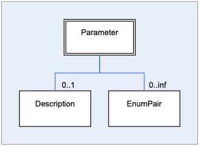

# Key Concepts

## Element Hierarchy

The FIXatdl® schema provides a set of XML elements that are used to
create a conforming FIXatdl® document. These elements are described later
in this section. The attributes of each of these elements are described
in latter in this document.

In a FIXatdl® document an algorithm provider can define any number of
algorithmic order interfaces by using multiple `Strategy` elements. Each
strategy is identified by a unique name that must be provided in the XML
of each of the `Strategy` elements. Instances of documents begin with the
root element `Strategies` and follow the hierarchy:

```xml
<Strategies>
    <Strategy>
        ... strategy definition ...
    </Strategy>
    <Strategy>
        ... strategy definition ...
    </Strategy>
        ...
    <Strategy>
        ... strategy definition ...
    </Strategy>
</Strategies>
```
\
At the root level, the algorithm provider must specify which tag to use
to identify the individual strategies. (At one time TargetStrategy(847) was
intended to carry this information. However, most providers use
a user-defined field for this purpose.) For example to indicate that tag
25009 will be used to identify strategies the `Strategies` element would be
written as

```xml
<Strategies strategyIdentifierTag="25009"/>
```
\
Parameters for each strategy are defined via `Parameter` elements.
Validation rules are defined via `StrategyEdit` elements. Each strategy
can have any number of parameters or validation rules. An algorithm can
have only one section where the layout of the controls is defined. A
layout is defined via the `StrategyLayout` element. So when looking deeper
into the strategy definition, one can see that it follows the hierarchy:

```xml
<Strategy>
    <Parameter>
    <Parameter>
    ...
    <Parameter>
    <StrategyEdit>
    <StrategyEdit>
    ...
    <StrategyEdit>
    <StrategyLayout>
</Strategy>
```
\
The following figure shows the hierarchy of elements in tree form
starting from the root element, `Strategies`. The XML Schema values
minOccurs and maxOccurs are given for each branch of the tree. Elements
with optional or required child elements are indicated by double-line
borders. Elements with no children (leaf nodes) have single-line
borders. Abstract elements, ones which require the use of a substitution
group, are shaded. The elements `Parameter`, `StrategyLayout`, and
`StrategyEdit` are somewhat complex; the hierarchy of their children is
shown in figures 2 through 4.

Note that the figures that follow are intended to give a generalized structure of the schema and do not necessarily show all the child elements.  Please refer to the FIXatdl&reg; XML Schema files for a complete list and definition of the FIXatdl&reg; elements.


The following figure gives the hierarchy of elements descending from the
`Parameter` element.



The following figure gives the hierarchy of elements descending from the
`StrategyLayout` element. This element is responsible for binding GUI
controls to parameters and describing their arrangement on the
order-entry screen.


The following figure shows the `StrategyEdit` hierarchy. This element is
used to describe validation rules which are applied to the values of a
strategy's parameters at order-generation time. Each `StrategyEdit` element must
contain a single `Edit` element (may contain further nested `Edit` rules)
which is used to describe a particular condition that must be met in
order to pass validation.


## Parameter Description

The interface of an algorithmic order type is described by a set of FIX
messages, the required, optional and user-defined fields of those
messages, and user-defined restrictions on the range of values for
particular fields. In general, when speaking of the parameters of an
algorithmic order one is, in fact, referring to the user-defined fields
of a NewOrderSingle(35=D), OrderCancelRequest(35=F), and OrderCancelReplaceRequest(35=G)
message. (In some cases a parameter may also refer to a standard FIX
field, one with a tag number in the range 1-5000, that broker-dealers
commonly included in their algorithmic interface specifications, such as
EffectiveTime(168) and ExpireTime(128).)

Parameters are strictly described in FIXatdl&reg; by the target firm who will
receive them (*order recipients*), and are communicated via an XML file
to various senders (*order initiators*). To describe these parameters,
FIXatdl&reg; provides the `Parameter` element. `Parameter` elements are
identified by their "name" attribute. There is no limit to the number of
parameters a strategy may have as long as each is uniquely identified at
the strategy level. Besides a parameter's name, other parameter
attributes include: its type; its maximum and minimum values (if
applicable); its corresponding FIX tag number; and its usage (optional
vs. required). For example, the following code snippet describes an
integer type parameter:

```xml
<Parameter name="SampleRate" xsi:type="Int_t" fixTag="28000"
use="optional" minValue="1" maxValue="9"/>
```
\
This listing describes a parameter named "SampleRate" which can
optionally be populated in tag 28000 of an order message. The attributes
"minValue" and "maxValue" describe the minimum and maximum values that
the recipient of an order message is expecting. Orders with "SampleRate"
values outside that range may be rejected. The attribute "xsi:type"
describes the parameter's type which must be one of the datatypes
specified by the FIX Protocol. FIXatdl&reg; provides enumeration values for
xsi:type that map directly to the FIX datatypes. (An explanation of
xsi:type can be found in this document in the section
[Abstract Element Extensions](#abstract-element-extensions).)

For certain parameters it may be appropriate to limit the legal values
to a set of enumerated values. This is done by adding child `EnumPair`
elements to the `Parameter` element. Each `EnumPair` represents one of the
enumerated values expected to be transmitted over the wire. For example:

```xml
<Parameter name="Aggression" xsi:type="Char_t" fixTag="28001" use="required">
    <EnumPair enumID="low" wireValue="L"/>
    <EnumPair enumID="medium" wireValue="M"/>
    <EnumPair enumID="high" wireValue="H"/>
</Parameter>
```
\
This describes the "Aggression" parameter. An order recipient would
expect to receive one of the values, "L", "M" or "H" in tag 8001 of an
order message. The attribute `EnumPair/@enumID` is a unique identifier of
`EnumPair` elements.

If a user of an order-entry system were to submit an order with
"SampleRate" set to 5 and "Aggression" set to "high", the order
recipient would expect to receive a FIX message containing a substring
similar to:

`...35=D|11=0001|55=AXP|44=77.25| ... 28000=5|28001=H ...`

## Validation Rules

Validation rules are defined by use of the `StrategyEdit` element. This
XML element enables the creation of complex and conditional rules which
can be applied to the orders generated by an E/OMS. The goal of a
validation rule is to process the

values of the strategy parameters after they have been entered by the
user. Each validation rule consists of a condition and an error message.
If the condition is true then the values of the parameters are valid. If
the condition is false, then the values of the parameters are invalid and
the provided error message should be displayed. That is to say,
validation conditions are much like assertions. When an assertion has
failed an error has occurred.

The conditions described within a validation rule are defined by use of
the `Edit` element. An `Edit` element defines a Boolean expression where
values of parameters can be compared to one another or to constant
values.

To illustrate, consider the most common parameters of all algorithms,
`StartTime` and `EndTime`. Their description and a rule guaranteeing that
`StartTime` precedes `EndTime` can be described by the following statements:

```xml
<Parameter name="StartTime" xsi:type="UTCTimestamp_t" fixTag="28005" use="required">
<Parameter name="EndTime" xsi:type="UTCTimestamp_t" fixTag="28006" use="required">
<StrategyEdit errorMessage="Start Time must precede End Time.">
    <Edit field="StartTime" operator="LT" field2="EndTime"/>
</StrategyEdit>
```
\
Here both `StartTime` and `EndTime` are defined as UTCTimestamp
parameters. At validation time, the rule described in the `StrategyEdit` element
instructs the E/OMS to perform an evaluation of the Boolean expression
provided by the `Edit` element. In this case a comparison of `StartTime` and
`EndTime` will be made using the "LT" (less than) operator. If `StartTime`
is less than `EndTime` then the parameter values are deemed to be valid.
However, if `StartTime` is greater than or equal to `EndTime` then the
parameter values are invalid and the E/OMS can inform the user by
displaying the error message in a dialog box.

For more complex rules, Boolean expression may be formed by multiple
`Edit` elements organized in an expression tree using logical operators
AND, OR, XOR and NOT. For example consider these declarations:

```xml
<Parameter name="ParticipationRate" xsi:type="Float_t" fixTag="28008" use="optional"/>
<StrategyEdit errorMessage="If Participation Rate is entered it must be between 1 and 50">
    <Edit logicOperator="OR">
        <Edit field="ParticipationRate" operator="NX"/>
        <Edit logicOperator="AND">
            <Edit field="ParticipationRate" operator="GE" value="1"/>
            <Edit field="ParticipationRate" operator="LE" value="50"/>
        </Edit>
    </Edit>
</StrategyEdit>
```
\
This is a tree of `Edit` elements. The root `Edit` element is describing
a logical "OR" condition asserting that either "ParticipationRate" was not
provided or its value is in the range from 1 to 50. Note how in the
"AND" expression a parameter value is compared not to another parameter
but to a constant value.

Also note that the logical operators, AND and OR, can have more than two
operands. Furthermore, they both perform short-circuit evaluation of
their operands. (I.e. their operands are evaluated from left to right.
As soon as the value is known, evaluation of the
expression stops and the value is returned. Consequently, not all
operands need to be evaluated. For example, consider the previous
example in which "ParticipationRate" is an optional parameter. It is
quite possible that the user does not provide a value for
"ParticipationRate". If that is the case then evaluation of the "OR"
statement will terminate after it is established that its first operand,
`<Edit field="ParticipationRate" operator="NX"/>`, is true. The "AND"
statement that follows is never evaluated -- which is a good result
since, if one attempts to evaluate it, it is quite possible that a "Null Reference"
error would occur.) That being the case, it is important
that XML parsing or binding libraries maintain the order of the elements
as they appear; otherwise unexpected results may occur.

The logical operator XOR can also have more than two operands. As a
convention, XOR is defined as "one and only one", which means
it evaluates to "true" when one and only one of its operands is true. If
none or more than one of its operands is true then XOR is false.
Short-circuit evaluation cannot be applied to XOR.

The "field" attribute of an `Edit` element is not restricted to strategy
parameters. Standard order tags (those not described in a FIXatdl&reg;
instance but nevertheless are required tags of order, cancel and
cancel/replace messages) may also be used to create Boolean expressions.

For example:

```xml
<StrategyEdit errorMessage="For IOC orders Participation Rate must
be between 1 and 25">
    <Edit logicOperator="OR">
        <Edit field="FIX_TimeInForce" operator="NX"/>
            <Edit field="FIX_TimeInForce" operator="NE" value="3"/>
            <Edit logicOperator="AND">
                <Edit field="ParticipationRate" operator="GE" value="1"/>
                <Edit field="ParticipationRate" operator="LE" value="25"/>
        </Edit>
    </Edit>
</StrategyEdit>
```
\
This rule incorporates the value of TimeInForce(59) which is a standard tag
found in most order messages. The values associated with standard tags
are those that are sent over the wire. For example, TimeInForce(59) is an
enumeration of char values ranging from "0" to "9" and "A" to "C" (FIX Latest as of EP266). So care must be
taken to assure the corresponding operand, "value", is of a similar
type. Support for these types of expressions is highly dependent on a
vendor's implementation of FIXatdl&reg;. Not all standard tags may be
available.

In cases where the field attribute is not recognized or not supported,
the rule containing the offending `Edit` element should be skipped over by
a vendor's application and should not cause a validation error. The
end-result will be the same as if the condition of the rule were true.

## GUI Layout Description

In order to render a parameter within an order entry screen, an OMS must
be able to pick an appropriate GUI control to display. For instance, a
parameter representing a price would best be rendered as a number
spinner control while a parameter representing a choice between limited
numbers of values, such as "High", "Medium" and "Low", would best be
rendered as a combo box.

Once the GUI controls have been selected, the OMS must appropriately
arrange them on the screen. By using the elements and attributes of the
Layout Schema, an algorithm provider can describe the GUI controls to
use and describe how they should be arranged on the screen.

FIXatdl&reg; does not attempt to dictate user-interface style or
look-and-feel. It is designed to be platform neutral. The components
that are provided are those typically found in .Net, Java and Web
environments.

The layout schema allows GUI controls to be arranged by adding them to a
container define by the `StrategyPanel` element. Controls within a panel
may be arranged either vertically or horizontally. Panels themselves may
be nested and arranged either vertically or horizontally as well. The
attributes of the `StrategyPanel` element include

- **Title** -- a string representing the panel title which may or may
not be displayed

- **Collapsible** -- a Boolean value indicating whether the panel can be
collapsed.

- **Collapsed** -- a Boolean value indicating the panel's initial state.

- **Orientation** -- defines whether the panel's components should be
vertically, horizontally or grid aligned.

An important aspect of the GUI description is that it is platform
neutral. The algorithm provider describes GUI controls without knowing
how an E/OMS has been implemented or knowledge of the widget toolkit
that it uses. The controls provided by FIXatdl&reg; are those typically found
in .Net, Java or Web environments. (The initial intention was to adopt a
standard such as XAML or XUL. However, it was believed that this would
put an excessive constraint on the E/OMS vendors. So a conscious
decision was made not to adopt any one of these languages. Instead
FIXatdl&reg; presents its own with the understanding that a vendor may extend
or transform it to be aligned with their architecture and internal data
structures.)

Most Controls are associated with a particular Parameter. This is done
via the Control attribute, parameterRef. However some controls may not
have an associated Parameter. These controls are typically defined in
order to affect the state of other controls via the use of a `StateRule` element.

The following listing describes four parameters and the layout of their
four associated controls. If we
examine the code we'll notice that the controls are enclosed in two
`StrategyPanel` elements, one entitled "Time Parameters" and the other entitled
"Advanced". These two panels are nested horizontally into the top-level
`StrategyPanel` element of the `StrategyLayout` element.

```xml
<Parameter name="StartTime" xsi:type="UTCTimestamp_t" fixTag="28005" use="required"/>
<Parameter name="EndTime" xsi:type="UTCTimestamp_t" fixTag="28006" use="required"/>
<Parameter name="ParticipationRate" xsi:type="Float_t" fixTag="28007" use="optional"/>
<Parameter name="Aggression" xsi:type="Char_t" fixTag="28001" use="required">
    <EnumPair enumID="e_low" wireValue="L"/>
    <EnumPair enumID="e_med" wireValue="M"/>
    <EnumPair enumID="e_high" wireValue="H"/>
</Parameter>
<StrategyLayout>
    <StrategyPanel orientation="HORIZONTAL">
        <StrategyPanel title="Time Parameters" orientation="VERTICAL">
            <Control ID="c_ST" xsi:type="Clock_t" label="Start Time" parameterRef="StartTime"/>
            <Control ID="c_ET" xsi:type="Clock_t" label="End Time" parameterRef="EndTime"/>
        </StrategyPanel>
        <StrategyPanel title="Advanced" orientation="VERTICAL">
            <Control ID="c_PR" xsi:type="SingleSpinner" label="Partic. Rate"
              parameterRef="ParticipationRate"/>
            <Control ID="c_A" xsi:type="DropDownList_t" label="Aggression"
              parameterRef="Aggression">
                <ListItem enumID="e_low" uiRep="Low"/>
                <ListItem enumID="e_med" uiRep="Medium"/>
                <ListItem enumID="e_high" uiRep="High"/>
            </Control>
        </StrategyPanel>
    </StrategyPanel>
</StrategyLayout>
```
\
Notice how the `Parameter/@name` attributes match with the
`Control/@parameterRef` attributes. This creates the binding between
parameters and controls. Also note how the `EnumPair/@EnumID` attributes
match with the `ListItem/@EnumID` attributes. This creates the binding
between the enumeration values of the parameter and the items of a
drop-down list.

If an application were to render this information on an order ticket it
would have to decide which GUI controls to instantiate and find a way to
insert them into panels and lay the panels out according to the
instructions of the XML. Different platforms will have different
controls and panels available for this purpose and the application built
on these platforms will have different appearances. So, a rendering of
the controls described in the previous listing may look similar to the
following image:


### Enable/Disable Clock Controls

Clock controls are the GUI component rendered in an OMS/EMS that allows a user to enter a time of day value. For example, the most common parameters to an algorithmic order, "Start Time" and "End Time" will be rendered via a clock control. A common use case involving a clock control is one where the user enters an order without specifying a time in the control, thus keeping a value from going out over the wire in the order message. The receiving broker in this case will apply a default value or default behavior based on the non-presence of this field. To do this, two helper controls are used. They are either check boxes or radio buttons and affect the value of the Clock control by use of a `StateRule` element.

For example:

```xml
<lay:StrategyPanel orientation="VERTICAL" title="Start Time">
    <lay:StrategyPanel orientation="HORIZONTAL">
	      <lay:Control ID="c_NoStartTime" xsi:type="lay:RadioButton_t"
                        label="Now" initValue="true" radioGroup="StartTimeRB">
	      </lay:Control>
    </lay:StrategyPanel>
    <lay:StrategyPanel orientation="HORIZONTAL">
        <lay:Control ID="c_EnableStartTime" xsi:type="lay:RadioButton_t" label=""
                      radioGroup="StartTimeRB">
	      </lay:Control>
	      <lay:Control ID="StartTimeClock" xsi:type="lay:Clock_t" label=""
                        parameterRef="StartTime">
		        <flow:StateRule enabled="false" value="{NULL}">
			           <val:Edit field="c_EnableStartTime" operator="EQ" value="false"/>
		        </flow:StateRule>
	      </lay:Control>
    </lay:StrategyPanel>
</lay:StrategyPanel>
```
\
Here is how it might be rendered:


The value of the Clock control depends on which radio button is selected. If the first is selected, then the state rule defined within the Clock control will set the value of the Clock to null. If the Control is null, then the Parameter bound to the Control is null, and the parameter / FIX Tag is not populated when the order message goes out on the wire. If the second button is selected, then the value of the parameter that goes out on the wire is taken directly from the value the user entered.

The same can be done using a dropdown (combo box) with two items instead:

```xml
<lay:StrategyPanel orientation="VERTICAL" title="Start Time">
    <lay:StrategyPanel orientation="HORIZONTAL">
	     <lay:Control ID="c_StartTimeOption" xsi:type="lay:DropDownList_t" label="">
		       <lay:ListItem enumID="e_now" uiRep="Now"/>
		       <lay:ListItem enumID="e_custom" uiRep="Custom"/>
	     </lay:Control>
    </lay:StrategyPanel>
    <lay:StrategyPanel orientation="HORIZONTAL">
	      <lay:Control ID="c_StartTimeClock" xsi:type="lay:Clock_t" label=""
                        parameterRef="StartTime">
		        <flow:StateRule enabled="false" value="{NULL}">
			           <val:Edit field="c_StartTimeOption" operator="EQ" value="e_now"/>
		        </flow:StateRule>
	      </lay:Control>
    </lay:StrategyPanel>
</lay:StrategyPanel>
```
\
Rendering the following:


Here the "Custom" item has been selected from the dropdown list. If the user had selected "Now" then the time below the dropdown would be greyed out.

The following set of Clock control attributes allows this behavior to be supported without the need of helper controls or state rules. To do so, an OMS would need to implement a compound GUI control (a GUI control with at least two underlying controls: a datetime picker and a check box / radio button). To achieve this goal, the attributes "enablingControlType", "disablingControlType", and "disablingControlText" are available for the Clock control.

Using these attributes, the previous FIXatdl&reg; sample could be written as follows:

```xml
<lay:StrategyPanel orientation="VERTICAL" title="Start Time">
    <lay:Control ID="StartTimeClock" xsi:type="lay:Clock_t" label=""
                  disablingControlType="RadioButton"
                  disablingControlLabel="Now"
                  enablingControlType="RadionButton"
                  parameterRef="StartTime">
    </lay:Control>
</lay:StrategyPanel>
```
\
The rendering would remain as before:


If an explicit GUI control used to disable user input is not desired, then the "disablingControlType" attribute can be omitted:

```xml
<lay:StrategyPanel orientation="VERTICAL" title="Start Time">
    <lay:Control ID="StartTimeClock" xsi:type="lay:Clock_t" label=""
                  enablingControlType="RadionButton"
                  parameterRef="StartTime">
    </lay:Control>
</lay:StrategyPanel>
```
\
An OMS may choose to render this clock control as follows:


As with previous examples, if the radio button is selected then the value that goes on the wire is derived from what the user had entered. If the radio button is not selected, then no value goes on the wire.

###	Duration as an Alternative to Expiration Time

While it is the best practice to receive the effective time of an order through use of FIX fields EffectiveTime(168) and ExpireTime(126), some algorithm providers employ a user-defined tag to receive a duration rather than an expiration time. The following example shows the layout of GUI controls that will collect a start time and end time:

```xml
<StrategyPanel orientation="HORIZONTAL">
    <StrategyPanel orientation="VERTICAL" title="Start Time">
        <StrategyPanel orientation="HORIZONTAL">
	           <Control ID="c_NoStartTime" xsi:type="RadioButton_t"
                      label="Now" initValue="true" radioGroup="StartTimeRB">
	           </Control>
        </StrategyPanel>
        <StrategyPanel orientation="HORIZONTAL">
	          <Control ID="c_EnableStartTime" xsi:type="RadioButton_t" label=""
                     radioGroup="StartTinmeRB">
	          </Control>
	          <Control ID="StartTimeClock" xsi:type="Clock_t" label=""
                     parameterRef="StartTime">
		            <flow:StateRule enabled="false" value="{NULL}">
			               <val:Edit field="c_EnableStartTime" operator="EQ" value="false"/>
		            </flow:StateRule>
	          </Control>
        </StrategyPanel>
    </StrategyPanel>
    <StrategyPanel orientation="VERTICAL" title="End Time">
        <StrategyPanel orientation="HORIZONTAL">
	          <Control ID="c_NoEndTime" xsi:type="RadioButton_t"
                     label="Mkt Close" initValue="true" radioGroup="EndTimeRB">
	          </Control>
        </StrategyPanel>
        <StrategyPanel orientation="HORIZONTAL">
	          <Control ID="c_EnableEndTime" xsi:type="RadioButton_t" label=""
                     radioGroup="EndTimeRB">
	          </Control>
	          <Control ID="EndTimeClock" xsi:type="Clock_t" label=""
                     parameterRef="EndTime">
		            <flow:StateRule enabled="false" value="{NULL}">
			              <val:Edit field="c_EnableEndTime" operator="EQ" value="false"/>
		            </flow:StateRule>
	          </Control>
        </StrategyPanel>
    </StrategyPanel>
</StrategyPanel>
```
\
Rendering:


A Duration control represents a time span rather than a point in time. Replacing the EndTime control in the previous example with a Duration control results in:

```xml
<StrategyPanel orientation="HORIZONTAL">
    <StrategyPanel orientation="VERTICAL" title="Start Time">
        <StrategyPanel orientation="HORIZONTAL">
	          <Control ID="c_NoStartTime" xsi:type="RadioButton_t"
                     label="Now" initValue="true" radioGroup="StartTimeRB">
	          </Control>
        </StrategyPanel>
        <StrategyPanel orientation="HORIZONTAL">
	          <Control ID="c_EnableStartTime" xsi:type="RadioButton_t" label=""
                     radioGroup="StartTinmeRB">
	          </Control>
	          <Control ID="StartTimeClock" xsi:type="Clock_t" label=""
                     parameterRef="StartTime">
		            <flow:StateRule enabled="false" value="{NULL}">
			              <val:Edit field="c_EnableStartTime" operator="EQ" value="false"/>
		            </flow:StateRule>
	          </Control>
        </StrategyPanel>
    </StrategyPanel>
    <StrategyPanel orientation="VERTICAL" title="Duration">
        <StrategyPanel orientation="HORIZONTAL">
	          <Control ID="c_NoDuration" xsi:type="RadioButton_t"
                     label="Until the close" initValue="true" radioGroup="DurationRB">
	         </Control>
        </StrategyPanel>
        <StrategyPanel orientation="HORIZONTAL">
	          <Control ID="c_EnableDuration" xsi:type="RadioButton_t" label=""
                     radioGroup="DurationRB">
	          </Control>
	          <Control ID="c_Duration" xsi:type="Duration_t" label="" parameterRef="Duration">
                <flow:StateRule enabled="false" value="{NULL}">
			              <val:Edit field="c_EnableDuration" operator="EQ" value="false"/>
		            </flow:StateRule>
	          </Control>
        </StrategyPanel>
    </StrategyPanel>
</StrategyPanel>
```
\
Rendering:


The parameter "Duration" can be defined as a UTCTimeOnly field, as in the following statement:

```xml
<parameter name="Duration" xsi:type="UTCTimeOnly_t" fixTag="29003" uiRep="Duration" use="optional"/>
```
\
It will be the responsibility of the OMS to correctly populate the Duration parameter on the wire (an integer or a time-related type) from the value returned by the Duration GUI control.

### Grid Layout for Strategy Panels
To better support the ability of FIXatdl&reg; to describe how GUI controls should be oriented when presented to an OMS user, a feature is available that allows controls to be arranged in grid. Specifically, the value of "GRID" is available for the type "PanelOrientation_t". The XML schema definition is now:

```xml
<xs:simpleType name="PanelOrientation_t">
	  <xs:restriction base="xs:string">
		    <xs:enumeration value="HORIZONTAL"/>
		    <xs:enumeration value="VERTICAL"/>
		    <xs:enumeration value="GRID"/>
	  </xs:restriction>
</xs:simpleType>
```
\
As before, `StrategyPanel` elements define their orientation by setting their orientation attribute to one of these values which can now include "GRID". For example:

```xml
<StrategyPanel orientation="GRID">
```

This allows for all the elements contained in the panel, whether they are controls or other panels, to be arranged by rows and columns. Any item contained within a grid may declare a row, column, row span or column span value to explicitly guide its placement in the grid. However, explicitly declaring the placement of an item in the grid is optional. If row and column values are not provided, then the items are expected to be arranged in row-major or column-major order. The attribute "fillOrder" indicates which to use. If row or column span values are not provided, then the item is assumed to take up one row or column.

The attributes "row", "col", rowSpan", and "colSpan" may be specified in any `Control` or `StrategyPanel` elements which are child elements of a grid-oriented `StrategyPanel` element. The attributes "numRows", "numCols", and "fillOrder" may be specified in any grid-oriented `StrategyPanel` element.

In the following three code samples a panel is created with two rows and two columns. The rendering from each sample is identical. In the first, the controls, which are contained within the panel, each explicitly declare a row and column number.

```xml
<lay:StrategyPanel orientation="GRID" numRows="2" numCols="2">
    <lay:Control ID="control1" label="control1" row="0" col="0"/>
    <lay:Control ID="control2" label="control2" row="1" col="0"/>
    <lay:Control ID="control3" label="control3" row="0" col="1"/>
    <lay:Control ID="control4" label="control4" row="1" col="1"/>
</lay:StrategyPanel>
```
\
Next, the `StrategyPanel` attributes `numRows` and `numCols` are left out. One can still determine how to render the controls based on the attributes "row" and "col" of each `Control` element.

```xml
<lay:StrategyPanel orientation="GRID">
    <lay:Control ID="control1" label="control1" row="0" col="0"/>
    <lay:Control ID="control2" label="control2" row="1" col="0"/>
    <lay:Control ID="control3" label="control3" row="0" col="1"/>
    <lay:Control ID="control4" label="control4" row="1" col="1"/>
</lay:StrategyPanel>
```
\
Finally, an implicit declaration of each item's placement is supported by not specifying their row and column attributes. Given the number of rows and columns and the fill order, the arrangement of the controls is easily determined.

```xml
<lay:StrategyPanel orientation="GRID" numRows="2" numCols="2" fillOrder="COL-MAJOR">
    <lay:Control ID="control1" label="control1"/>
    <lay:Control ID="control2" label="control2"/>
    <lay:Control ID="control3" label="control3"/>
    <lay:Control ID="control4" label="control4"/>
</lay:StrategyPanel>
```
\
Each of the previous three samples will result in the same arrangement of the GUI controls:


Note that when switching from column-major to row-major order, as in

```xml
<lay:StrategyPanel orientation="GRID" numRows="2" numCols="2" fillOrder="ROW-MAJOR">
```

the controls are rendered as follows:


When it makes sense for a control (or panel) to span multiple columns or rows, the "colSpan" and "rowSpan" attributes can be used. They provide the same functionality as "merge cell" in spreadsheet programs like Excel. The value of either attribute must be a positive integer and specifies the number of columns or rows that the control (or panel) fills. For example,

```xml
<lay:StrategyPanel orientation="GRID" numRows="2" numCols="2" fillOrder="ROW-MAJOR">
    <lay:Control ID="control1" label="control1"/>
    <lay:Control ID="control2" label="control2"/>
    <lay:Control ID="control3" label="control3" colSpan="2"/>
</lay:StrategyPanel>
```

will render the following:


#### Error Conditions

Since the attributes "row", "col", "numRows", "numCols", "rowSpan", and "colSpan" are optional, their use may be prone to error. One must be rather careful not to define their values in such a way as to make their arrangement ambiguous or to be in conflict. With that in mind, guidance is provided for the following error conditions:

---------------------------------------------------------------------------------------------------------------------
Error                  Scenario                                 Resolution
---------------------- ---------------------------------------- -----------------------------------------------------
Row/column conflicts.  Two or more items in a grid 	            Ignore all "row"/"col" attributes of all grid items and
                       specify the same row and column values.  render as if they had not been specified.

Row or column values	 The "numRows" and "numCols" attributes   Override the "numRows" or "numCols" attribute of the
are out-of-range.      of a `StrategyPanel` element are defined `StrategyPanel` element with a value large enough to
                       as N and M, but a child control's "row"  accommodate the child control's "row" or "col" attribute.
                       attribute b is >= N or its "col"
                       attribute is >= M.

Mismatch in 	         Grid attributes are defined on a 	      The grid attributes of the control are ignored.
parent-child           control whose parent is not a grid.
orientation.
----------------------------------------------------------------------------------------------------------------------

This list is not definitive and is expected to grow as issues are raised and identified by those implementing FIXatdl&reg;.

## Flow Control Rules

Interdependencies among standard FIX tags affecting their applicability
are quite common. For example, Price(44) is not applicable when OrdType(40)
is set to "Market". The same can be said for algorithmic order types
and their parameters. Many algorithmic order types will have parameters
whose applicability is dependent on the value of one or more other
parameters. These rules are often listed in algorithmic order
specifications in the comments column of tables that describe the
parameters of the algorithm.

In order to standardize the way these rules are described,
a sub-schema is provided, which contains elements and attributes used to
define rules that can be applied to the visual state of GUI Controls.
This capability is a means to direct the user's workflow and this is why
it has been called "flow control". When creating flow-control rules the
expectations are that they are evaluated every time a Control's value
has changed. Based on the outcome of the evaluations, certain GUI
controls may become grayed-out or hidden as the user enters values into
text fields or selects items from drop-down lists.

Flow-control rules can be described via the `StateRule` element. A
`StateRule` element will consist of a Boolean expression and an action to take
when the Boolean expression is true. There are three actions that are
supported: (1) change the "enabled" state of a control to either "true" or
"false"; (2) change the "visible" state of a control to either "true" or
"false"; and (3) change the current value of the control to a supplied
value. (Supplied values may be a constant string value, an enumID, or
the special token {NULL}.)

As with validation rules, flow-control rules employ the `Edit` element to
describe the condition (or Boolean expression). However, when an `Edit` element is
used in a Flow-control rule, it will not make comparisons of parameter
values; rather it will compare the values returned by the controls. For
example, the attributes `Edit/@field` and `Edit/@field2` will refer to
either control values or constant values.

Another difference between validation rules and flow-control rules is
that the action of a flow-control rule is performed when the condition
it describes is true. This differs from validation rules, where the
action of "raising an error" occurs when the condition is false.

To illustrate the description of a Flow-control rule consider the
following code snippet. (Note how the `Control/@ID` attribute value
"c_AlphaMode" matches the `Edit/@field` attribute value "c_AlphaMode" and how the
"enumID" attribute value "e_Custom" matches the "value" attribute value "e_Custom"):

```xml
<Parameter name="AlphaMode" xsi:type="Int_t" fixTag="28300" use="required">
    <EnumPair enumID="e_Annual" wireValue="1"/>
    <EnumPair enumID="e_Daily" wireValue="2"/>
    <EnumPair enumID="e_Custom" wireValue="3"/>
</Parameter>
<Parameter name="CustomValue" xsi:type="Float_t" fixTag="28301" use="optional"/>
<StrategyLayout>
    <StrategyPanel orientation="HORIZONTAL">
        <Control ID="c_AlphaMode" xsi:type="DropDownList" label="Alpha Benchmark"
                 parameterRef="AlphaMode">
            <ListItem enumID="e_Annual" uiRep="Annual"/>
            <ListItem enumID="e_Daily" uiRep="Daily"/>
            <ListItem enumID="e_Custom" uiRep="Custom"/>
        </Control>
        <Control ID="c_CustomValue" xsi:type="SingleSpinner_t" label="Custom Alpha"
                 parameterRef="CustomValue">
            <StateRule enabled="true">
                <Edit field="c_AlphaMode" operator="EQ" value="e_Custom"/>
            </StateRule>
            <StateRule value="{NULL}">
                <Edit field="c_AlphaMode" operator="NE" value="e_Custom"/>
            </StateRule>
        </Control>
    </StrategyPanel>
</StrategyLayout>
```
\
Two parameters are defined in this listing, "AlphaMode" and
"CustomValue". Also two controls corresponding to the
parameters are defined. A rule has been supplied to the control identified by
"c_CustomValue" governing its visual behavior. The rule should be
interpreted as: "The control c_CustomValue is enabled only when the
value of control c_AlphaMode has been set to "Custom". So a user who
selects "Annual" or "Daily" would not able to enter a custom Alpha
value. Only when "Custom" is selected from the dropdown list would the
custom Alpha control be able to accept values entered by the user.

While StateRules are explicit in defining the changes to a control when
the condition, described by its `Edit` element, makes the transition from
being false to being true, it is not clear what changes to make when the
condition becomes false again (or is initially false). So, to clarify
the behavior of the controls, the following conventions are applied:

1. A `StateRule` element that changes the "enabled" property of a control to X
   when its condition becomes true, will implicitly cause the
   "enabled" property of the control to change to NOT(X) when its
   condition becomes false, where X is Boolean. (The "enabled"
   property simply controls whether or not the value within the
   control can be changed (is read-only) and is not a determining
   factor in whether or not the control's value is to be included in
   the message transmitted over the wire.)

2. A `StateRule` element that changes the "visible" property of a control to X
   when its condition becomes true, will implicitly cause the
   "visible" property of the control to change to NOT(X) when its
   condition becomes false, where X is Boolean.

3. A `StateRule` element that changes the value of a control when its condition
   becomes true will cause no action to take place when its
   condition becomes false. Provided the vale expressed in the
   `StateRule` element is not the special token "{NULL}".

4. A `StateRule` element that changes the value of a control to "{NULL}" when its
   condition becomes true will cause the control's value to revert
   back to its previous non-{NULL} value or its initial value.

Note that due to point 4 above, when a `StateRule` element condition becomes false it may
cause the control to become un-initialized. When this occurs the control
will have no value. Should a NewOrderSingle(35=D), OrderCancelRequest(35=F) or
OrderCancelReplaceRequest(35=G) message be generated while the control is
in this condition, the associated parameter will not be included in that
message.

Also note that the state of a control's enabled property or visible
property does not influence whether the control's associated parameter
is sent on the wire or not. This behavior is governed entirely by the
control's value. To clarify this, one must adhere to another convention:

5. To the extent that a control's value determines the "wire-value" of
   a particular parameter, if the control is un-initialized or has
   been set to the value of "{NULL}" then the associated parameter
   will not have a "wire-value" and will not have its tag-value pair
   included in a NewOrderSingle(35=D), OrderCancelRequest(35=F) or
   OrderCancelReplaceRequest(35=G) message.

In other words, if a user enters a value into a control and subsequently
the control becomes disabled then the value that was entered would cause
a tag to be populated in the generated FIX message and the value would
go out over the wire. This is why, in the previous listing, a second
`StateRule` element was required:

```xml
<StateRule value="{NULL}">
    <Edit field="c_AlphaMode" operator="NE" value="e_Custom"/>
</StateRule>
```
\
If this rule had not been provided, a "CustomValue" parameter (tag 28301)
would be transmitted on the wire if the user had entered a value into
the spinner and then selected "Daily" or "Annual" from the drop-down
list.

## Parameter-to-Control Bindings

In order for an E/OMS to generate an order message it must iterate
through all the parameters, find the associated controls, retrieve the
control values and determine appropriate values with which to populate
the custom FIX tags of the order message. In order for this to be
accomplished FIXatdl&reg; provides a means for relating controls to
parameters, mainly, the `parameterRef` attribute of the `Control` element.
This attribute is set to the value of a `Parameter` element's name attribute, thus
providing a binding between the two.

Bindings of controls to parameters may be either one-to-one, where one
control is bound to one parameter, or many-to-one, where multiple
controls are bound to one parameter. (The only cases of many-to-one
bindings involve groups of radio buttons. All other bindings are
one-to-one.)

When a binding of a control to a parameter is declared it must be
possible for the control's value to be converted to a legal wire-value
of the control. For example, it makes little sense for a checkbox
control to be bound to a floating point parameter. Rather, a checkbox is
more logically fit to be bound to a Boolean parameter.

Not all parameters need an associated control. Some parameters are
intended to act as constants and have no GUI control representation. The
FIX tags of the parameters are expected to be populated with the same
value in every order message regardless of the values of other
parameters. When this is the case, an attribute of the `Parameter`
element, `constValue`, is used to indicate that the parameter is a
constant and provides the value, as in the following listing.

```xml
<Parameter name="ExecService" xsi:type="Char_t" fixTag="29050" constValue="A"/>
```
\
Based on this description of "ExecService" the order recipient would
expect to receive a FIX message containing the substring "29050=A".

Conversely, it is also the case that not all control need to be bound to
a parameter. Controls with no declared `parameterRef` attribute are
considered helper controls. They are used to manage the state of other
controls via the use of flow-control rules. For example, the following
listing describes two controls -- a helper control and a control bound
to some integer parameter named "CrossQty".

```xml
<Control ID="EnableCross" xsi:type="CheckBox_t" label="Enable Cross" initValue="false">
<Control ID="CrossQty" xsi:type="SingleSpinner_t" label="Cross Qty" parameterRef="CrossQty">
    <StateRule enable="true">
        <Edit field="EnableCross" operator="EQ" value="true"/>
    </StateRule>
</Control>
```
\
For a strategy rendered from this description, the user would not be
able to enter a value into the "CrossQty" spinner control unless the
"EnableCross" checkbox is checked.

## Transport of Strategy Parameters

The FIX Protocol allows algorithmic order parameters to be transported
between parties either by use of the StrategyParametersGrp repeating
group or by use of user-defined tags mutually agreed upon by the order
originator and order recipient. FIXatdl&reg; provides a means for the order
recipient to inform the order originator which of these methods to use.

An algorithmic order provider indicates that it can receive parameters
through the StrategyParametersGrp component (tags 957-960) by
setting the attribute of the `Strategies` element, `tag957Support`, to true.
The recipient can also indicate that it is able to receive parameters
via user-defined tags by proving values for the `fixTag` attributes of
each `Parameter` element. An algorithmic order provider may support both
transport methods.

To illustrate, consider the following listing:

```xml
<Strategies strategyIdentifierTag="27000" versionIdentifierTag="27001" tag957Support="true">
    <Strategy name="POV" uiRep="POV" wireValue="v" version="1" fixMsgType="D">
        <Parameter name="PctVol" xsi:type="Percentage_t" fixTag="27002" use="required"/>
        <Parameter name="FC" xsi:type="Boolean_t" fixTag="27003" use="required"/>
        <StrategyLayout>
            <StrategyPanel>
                <Control ID="c_PctVol" xsi:type="SingleSpinner_t" label="Pct of Volume"
                         parameterRef="PctVol"/>
                <Control ID="c_FC" xsi:type="CheckBox_t" label="Force Completion"
                         parameterRef="FC"/>
            </StrategyPanel>
        </StrategyLayout>
    </Strategy>
</Strategies>
```
\
This document instance describes an algorithm with two parameters,
PctVol and ForceCompletion. The algorithm provider has also indicated
that it supports receipt of these parameters via StrategyParametersGrp
and via the UDFs 27002 and 27003. So an E/OMS would be free to
choose between the two methods when it transmits the parameters. If this
were to be rendered by an E/OMS and a user was to enter a "PctVol" value
of 0.15 and check the Force Completion checkbox, then the order
generated may contain a substring similar to:

`... 35=D|11=1234|55=AXP|... |27000=v|27001=1|957=2|958=PctVol|959=11|960=0.15|958=FC|959=13|960=Y`

In this case the E/OMS has decided to use the StrategyParametersGrp
repeating group. If the `tag957Support` attribute were set to false then the E/OMS
would be forced to use the UDFs, 27002 and 27003, as in:

`... 35=D|11=1234|55=AXP|... |27000=v|27001=1|27002=0.15|27003=Y`

The general rule for determining which method to use is as follows.

 **tag957Support**   **fixTag attributes provided**  **Method for transmitting parameters**
------------------- -------------------------------- --------------------------------------------------------
true                no                               StrategyParametersGrp
true                yes                              StrategyParametersGrp or UDFs (but never both)
false               yes                              UDFs
false               no                               (Not allowed -- at least one method must be specified)

## Support for Basket, List and Multileg Order Types

FIXatdl&reg; provides robust support for multileg order types and clarify how their interfaces are described. In doing so, the following concepts were considered.

### Order Delivery

Any algorithm provider must inform its clients, or its clients’ OMSs, which method(s) to use so the order can be delivered as expected. There are three acceptable methods used to deliver multileg orders to an execution venue:

- Multiple NewOrderSingle(35=D) messages -- one for each leg, where an additional identifier is used to associate the individual legs with one another.
- A single NewOrderMultiLeg(35=AB) message -- information about individual legs are placed into the repeating group LegOrdGrp.
- A single NewOrderList(35=E) message -- information about individual legs are placed into the repeating group ListOrdGrp. Note that it may also be possible to partition the legs into several NewOrderList(35=E) messages provided they share the same values for ListID(66) and TotNoOrders(68).

The most common method in use today is to issue multiple NewOrderSingle(35=D) messages; one for each leg or each order in a basket.

### Leg Count

The description of the order interface must include a number representing the required number of legs for the strategy. An OMS should use this information to render a fixed number of GUI controls where values for the leg parameters can be entered. For example, a pairs strategy would require two legs; with this information, an OMS should render two sets of GUI controls which are associated with the fields of the legs. A value of "unbounded" must be allowed in order to support the delivery of a variable number of legs such as in the case of a basket/portfolio strategy. The attributes "minLegs" and "maxLegs" are provided for this purpose.

The following examples show the description of a strategy which requires exactly two legs, followed by a strategy which requires one or more legs.

```xml
<Strategy name="two-legged-order"
    ...
    minLegs="2" maxLegs="2">
    ...
</Strategy>

<Strategy name="one-or-more-legged-order"
    ...
    minLegs="1" maxLegs="unbounded">
    ...
</Strategy>
```

###	Linking and Sequencing of Single Orders

When accepting multileg orders via a group of NewOrderSingle(35=D) messages, the orders need to be linked. FIXatdl&reg; supports the definition of a FIX tag number in which the OMS will place a unique ID (or "Global" Order ID) in each of the messages, the definition of a tag number in which the OMS will place a leg sequence number, and the definition of a tag number in which the OMS will place the total number of legs of the order. The attributes "commonIDTag", "legSequenceTag", and "totalLegsTag" are provided for this purpose.

For example, the following strategy requires that linking and sequencing data is to be populated in the user-defined tags 27066, 27067 and 27068.

```xml
<Strategy
    ...
    commonIDTag="27066"
    legSequenceTag="27067"
    totalLegsTag="27068">
    ...
</Strategy>
```
\
Note that the semantics of these attributes are analogous to ListID(66), ListSeqNum(67) and TotNoOrders(68) in a NewOrderList(35=E) message. However, use of these values should be avoided as the associated fields are not members of the NewOrderSingle(35) message. Instead, broker/dealers should use UDFs.


### Parameter Scope

Algorithmic order parameters can either apply to the entire order or to the legs of the order. In the description of a parameter, the scope must be clear; at the order level or at the leg level. To represent this, the leg parameters are wrapped in a the `Leg` element.

For example:

```xml
<Parameter name="p_OrdParamA" xsi:type="Int_t" fixTag="25000"/>
<Parameter name="p_OrdParamB" xsi:type="Int_t" fixTag="25001"/>
<Leg>
  <Parameter name="p_LegParamA" xsi:type="Int_t" fixTag="26001"/>
  <Parameter name="p_LegParamB" xsi:type="Int_t" fixTag="26002"/>
</Leg>
```
\
Here there are two strategy parameters; both of which will be included in each leg of the order.

### Cancel/Modify of Legs

When the delivery option being used is the NewOrderSingle(35=D) message then the OMS must know how to handle cancellation and modification of the order. The description of the strategy must indicate whether an individual leg can be cancelled or modified and, if so, whether it is necessary to re-send all the legs that were not modified. The attribute Strategy/@legsAreSeverable is provided for this purpose.

### Validation of Leg Parameter Values

The validation rules allow references to parameter values in the evaluation of its Boolean expression. For multileg orders, the values of leg parameters need to be supported in the validation rules. This is provided with an additional attribute Edit/@legNo to indicate a leg number.

The following example shows a rule for validating a Pairs trade, confirming, without knowing the sequence of the legs, that one leg is a Buy and the other is a Sell.

```xml
<val:StrategyEdit errorMessage="One leg must be a BUY, the other a SELL">
    <val:Edit logicOperator="OR">
        <val:Edit logicOperator="AND">
            <val:Edit field="FIX_Side" legNo="1" operator="EQ" field2="1"/>
            <val:Edit logicOperator="OR">
                <val:Edit field="FIX_Side" legNo="2" operator="EQ" field2="2"/>
                <val:Edit field="FIX_Side" legNo="2" operator="EQ" field2="5"/>
            </val:Edit>
        </val:Edit>
        <val:Edit logicOperator="AND">
            <val:Edit field="FIX_Side" legNo="2" operator="EQ" field2="1"/>
            <val:Edit logicOperator="OR">
                <val:Edit field="FIX_Side" legNo="1" operator="EQ" field2="2"/>
                <val:Edit field="FIX_Side" legNo="1" operator="EQ" field2="5"/>
            </val:Edit>
        </val:Edit>
    </val:Edit>
</val:StrategyEdit>
```

### Display/Layout of Leg Parameters

For single-leg order definitions there are certain standard fields that should not be included in the Parameter or Controls declarations. These include: Symbol(55), Side(54), OrderQty(38), OrdType(40), Price(44) and StopPrice(99). OMSs tend to handle these separately from strategy parameters and display them regardless of whether they are declared in the FIXatdl&reg; code, or rather, if they are declared in FIXatdl&reg;, they are somehow ignored, or some special processing is involved.

Extending this model to multileg orders, there are certain standard fields that should not be included in the leg definitions, yet it can be assumed that they will be presented to the user. If an order requires N legs, then these standard fields will be presented in all N legs.  So, in effect, if a single order entry screen is segregated into a standard section and a custom parameter section, then a multileg order entry screen is segregated into N+1 sections: a global custom parameter section and N leg sections where each leg section contains a standard section and a custom parameter section.

FIXatdl&reg; supports a panel to hold all leg-level controls. It needs to be declared just once with the expectation that it will be repeated as many times as necessary according to the value of the attribute "requiredNumberOfLegs". The `LegPanel` element is provided for this purpose.

Example:

```xml
<StrategyLayout>
    <StrategyPanel collapsible="false" orientation="VERTICAL">
        <Control ID="c_OrdParam1" label="Ord Param A" parameterRef="p_OrdParamA"
                 xsi:type="SingleSpinner_t"/>
        <Control ID="c_OrdParam2" label="Ord Param B" parameterRef="p_OrdParamB"
                 xsi:type="SingleSpinner_t"/>
    </StrategyPanel>
    <LegPanel collapsible="false" orientation="VERTICAL">
        <Control ID="c_LegParamA" label="Leg Param A" parameterRef="p_LegParamA"
                 xsi:type="SingleSpinner_t"/>
        <Control ID="c_LegParamB" label="Leg Param B" parameterRef="p_LegParamB"
                 xsi:type="SingleSpinner_t"/>
    </LegPanel>
</StrategyLayout>
```

### GUI State Rule for Leg Panel Controls

GUI Controls contained within a leg panel can have their states and values change just like Controls found in a regular strategy panel. However, controls that are referenced by a state rule of another control are assumed to be in the same scope as the referring control. For example, in the following listing, the second GUI control is disabled and given a null value if the first control (checkbox) is checked.

```xml
<lay:LegPanel collapsible="false" orientation="VERTICAL">
    <lay:Control ID="c_LegParamA" label="Leg Param A" parameterRef="p_LegParamA"
                 xsi:type="lay:Checkbox_t"/>
    <lay:Control ID="c_LegParamB" label="Leg Param B" parameterRef="p_LegParamB"
                 xsi:type="lay:SingleSpinner_t">
        <StateRule enabled="false" value="{NULL}">
            <Edit field="c_LegParamA" operator="EQ" value="True"/>
        </StateRule>
    </lay:Control>
</lay:LegPanel>
```
\
If there are several legs, then this state rule will be enforced in each leg panel. The behavior of the state rules in each leg panel is independent of the others.

### Vendor Configurations

Different GUI layouts can be defined based on set types of vendor configurations or service levels. For an implementation of this feature, an XML element defined at the Strategy level is used. It allows filtering of strategies to be performed much in the same way as the Regions element does. (As of now the only configuration level identified is whether an OMS allows leg parameters. Some do not.)

The following two examples show the description of a two-legged order strategy. In the first, it is expected that the vendor’s system supports leg parameters, i.e. leg parameters may take different values from leg to leg. In the second, it is expected that the vendor’s system does not support leg parameters having different values from leg to leg; effectively disallowing their use. Populating the message with the necessary information requires that all leg parameters are repeated with the same value in each leg.

```xml
<Strategy
    ...
    minLegs="2"
    maxLegs="2"
    ...
    >
    <VendorConfig legParameters="true"/>
    <DeliveryMethods>
      <FixMsg msgType="NewOrderSingle"/>
      <FixMsg msgType="NewOrderMultiLeg"/>
    </DeliveryMethods>
    <Parameter name="p_OrdParamA" xsi:type="Int_t" fixTag="25000"/>
    <Parameter name="p_OrdParamB" xsi:type="Int_t" fixTag="25001"/>
    <Leg>
        <Parameter name="p_LegParamA" xsi:type="Int_t" fixTag="26001"/>
        <Parameter name="p_LegParamB" xsi:type="Int_t" fixTag="26002"/>
    </Leg>
    <lay:StrategyLayout>
        <lay:StrategyPanel collapsible="false" orientation="VERTICAL">
            <lay:Control ID="c_OrdParam1" label="Ord Param A" parameterRef="p_OrdParamA"
                         xsi:type="lay:SingleSpinner_t"/>
            <lay:Control ID="c_OrdParam2" label="Ord Param B" parameterRef="p_OrdParamB"
                         xsi:type="lay:SingleSpinner_t"/>
        </lay:StrategyPanel>
        <lay:LegPanel collapsible="false" orientation="VERTICAL">
            <lay:Control ID="c_LegParamA" label="Leg Param A" parameterRef="p_LegParamA"
                         xsi:type="lay:SingleSpinner_t"/>
            <lay:Control ID="c_LegParamB" label="Leg Param B" parameterRef="p_LegParamB"
                         xsi:type="lay:SingleSpinner_t"/>
        </lay:LegPanel>
    </lay:StrategyLayout>
</Strategy>

<Strategy
    ...
    minLegs="2"
    maxLegs="2"
    ...
    >
    <VendorConfig legParameters="false"/>
    <DeliveryMethods>
      <FixMsg msgType="NewOrderSingle"/>
    </DeliveryMethods>
    <Parameter name="p_Ord_ParamA" xsi:type="Int_t" fixTag="25000"/>
    <Parameter name="p_Ord_ParamB" xsi:type="Int_t" fixTag="25001"/>
    <Leg>
      <Parameter name="p_Buy_Leg_ParamA" xsi:type="Int_t" fixTag="26001"/>
      <Parameter name="p_Buy_Leg_ParamB" xsi:type="Int_t" fixTag="26002"/>
      <Parameter name="p_Sell_Leg_ParamA" xsi:type="Int_t" fixTag="26003"/>
      <Parameter name="p_Sell_Leg_ParamB" xsi:type="Int_t" fixTag="26004"/>
    </Leg>
    <lay:StrategyLayout>
        <lay:StrategyPanel collapsible="false" orientation="VERTICAL">
            <lay:Control ID="c_OrdParamA" label="Ord Param A"
                         parameterRef="p_OrdParamA"
                         xsi:type="lay:SingleSpinner_t"/>
            <lay:Control ID="c_OrdParamB" label="Ord Param B"
                         parameterRef="p_OrdParamB"
                         xsi:type="lay:SingleSpinner_t"/>
            <lay:StrategyPanel orientation="HORIZONTAL">
                <lay:StrategyPanel orientation="VERTICAL">
                    <lay:Control ID="c_BuyLegParamA" label="Buy Leg Param A"
                                 parameterRef="p_Buy_Leg_ParamA"
                                 xsi:type="lay:SingleSpinner_t"/>
                    <lay:Control ID="c_BuyLegParamB" label="Buy Leg Param B"
                                 parameterRef="p_Buy_Leg_ParamB"
                                 xsi:type="lay:SingleSpinner_t"/>
                </lay:StrategyPanel>
                <lay:StrategyPanel orientation="VERTICAL">
                    <lay:Control ID="c_SellLegParamA" label="Sell Leg Param A"
                                 parameterRef="p_Sell_Leg_ParamA"
                                 xsi:type="lay:SingleSpinner_t"/>
                    <lay:Control ID="c_SellLegParamB" label="Sell Leg Param B"
                                 parameterRef="p_Sell_Leg_ParamB"
                                 xsi:type="lay:SingleSpinner_t"/>
                </lay:StrategyPanel>
            </lay:StrategyPanel>
        </lay:StrategyPanel>
    </lay:StrategyLayout>
</Strategy>
```
\
Note that in the latter example there is no support for delivery by the NewOrderMultiLeg(35=AB) message. The assumption being that the OMS ‘s lack of support for leg parameters is due to the way it handles its collection of NewOrderSingle(35=D) messages. It is reasonable to expect that an OMS which supports delivery by NewOrderMultiLeg(35=AB) message will also be able to support leg parameters.

## Additional Global Definitions

FIXatdl&reg; supports the global definition of `Parameter`, `Control`, `StrategyPanel`, `Edit`, `StateRule` and `Filter` elements. This allows them to be defined once and referenced within multiple `Strategy` elements, thus making the XML less verbose and more readable.

## OMS Hooks

One of the key features of FIXatdl&reg; is the ability to refer to OMS variables in the description of order interfaces. In effect, a FIXatdl&reg; instance would have a "hook" into the OMS and have access to certain environment variables or order parameters not defined in the XML for use in validation rules or filtering.

### Validation Rules with References to Standard FIX Fields
In the FIXatdl&reg; specification, several references are made to standard FIX fields. For example, the specification of the `Edit` element (see section [Validation Rules](#validation-rules)), which is used to build validation or flow rules, states the following:

*The "field" attribute of an `Edit` element is not restricted to strategy parameters. Standard order tags (those not described in a FIXatdl&reg; instance but nevertheless are required tags of order, cancel and cancel/replace messages) may also be used to create Boolean expressions.*

*For example:*

```xml
<StrategyEdit errorMessage="For IOC orders Participation Rate must be between 1 and 25">
  <Edit logicOperator="OR">
	   <Edit field="FIX_TimeInForce" operator="NX"/>
     <Edit field="FIX_TimeInForce" operator="NE" value="3"/>
     <Edit logicOperator="AND">
        <Edit field="ParticipationRate" operator="GE" value="1"/>
        <Edit field="ParticipationRate" operator="LE" value="25"/>
     </Edit>
   </Edit>
</StrategyEdit>
```
\
Also, the section [Dependencies and Structural Constraints beyond XML Schema](#dependencies) states the following:

*Within an `Edit` element the attributes field and field2 must refer to either a pre-declared parameter name or a standard FIX tag name (taken from the [normative FIX specification](https://www.fixtrading.org/online-specification/)) pre-pended with the string "FIX_".*

The intention was that the OMS would make the standard FIX tags accessible and allow them to be referenced by the validation rules. For example, in single-leg order definitions it is generally understood that Standard fields (Symbol(55), Side(54), OrderQty(38), OrdType(40), Price(44), etc.) should not be included in the Parameter or Controls declarations. OMS platforms tend to handle these separately from strategy parameters and display them regardless of whether they are declared in the FIXatdl&reg; code (or, *if* they are declared in FIXatdl&reg;, they are somehow ignored, or some special processing is involved.) FIXatdl&reg; allows these fields to be referred to from within a validation rule.

This can work for a small number of fields; and in fact, some OMS platforms support this. But not all do, and the fields they make accessible are not consistent.

FIXatdl&reg; seeks to provide clarity concerning the use of standard fields and the fields of an order that an OMS would be expected to make available. The following table lists the fields of an order which may be referenced in a validation rule.

Field Name        Tag Number  Comments
---------------- ------------ -------------------------------------------
Symbol           55           -
Side             54           -
OrderQty         38           -
OrdType	         40           -
Price	           44           -
StopPx           99           -
TimeInForce	     59           -
HandlInst	       21           -
ExecInst         18	          This is a MultipleCharValue type. Values are space delimited and arranged in alpha-numeric order.
SecurityType     167          -
TargetSubID	     57           -

### Filtering according to OMS Environment Values

FIXatdl&reg; defines filtering of strategies based on regions, asset classes and markets. For example, the specification of the `Regions` element (see section [Element Definitions](#element-definitions)) includes the following:

*This element defines the globally based regions to which the strategy is applicable. It serves as a container of `Region` elements. To define a set of regions for a strategy, use one or more `Region` elements. The attribute Region/@inclusion determines whether the region is included or excluded from the set.*

*If no `Regions` element is defined, then the strategy is applicable for \*ALL\* regions.*

Filtering, however, is restricted to strategies. Other elements of a strategy, such as parameters or controls, cannot be filtered. For example, the following strategy applies only to a specific combination of region, market, client and security type.

```xml
<Strategy name="Tazer1" uiRep="Tazer" wireValue="Tazer" providerID="ABC">
    <!-- US only -->
    <Regions>
        <Region name="TheAmericas" inclusion="Include">
            <Country CountryCode="US" inclusion="Include"/>
        </Region>
    </Regions>
    <!-- Nasdaq only -->
    <Markets>
        <Market MICCode="XNAS" inclusion="Include"/>
    </Markets>
    <!-- Equities ("CS") only -->
    <SecurityTypes>
        <SecurityType name="CS" inclusion="Include"/>
    </SecurityTypes>
    ...
</Strategy>
```
\
The filtering capability can also be applied to parameters and controls to allow strategies with a set of parameters that are applicable only to certain regions, markets or clients, to be defined in one `Strategy` element rather than several.

The following example describes a strategy with a parameter that is filtered by a region and an enumerated value of another parameter filtered by the same region. Note that it makes use of a global filter definition.

```xml
<Filter id="US-filter">
    <Regions>
      <Region name="TheAmericas" inclusion="Include">
        <Country CountryCode="US" inclusion="Include"/>
      </Region>
    </Regions>
</Filter>

<Strategy>
    ...
    <Parameter name="StartTime" xsi:type="UTCTimestamp_t" fixTag="27602"/>
    <Parameter name="EndTime" xsi:type="UTCTimestamp_t" fixTag="27603"/>
    <Parameter name="Text" xsi:type="String_t" fixTag="29999" use="optional"/>
    <Parameter name="Variance" xsi:type="Float_t" fixTag="27641" filter="US-filter"/>
    <Parameter name="Benchmark" xsi:type="String_t" fixTag="27666">
        <EnumPair wireValue="Arrival" enumID="e_Arrival"/>
        <EnumPair wireValue="Close" enumID="e_Close"/>
        <EnumPair wireValue="Open" enumID="e_Open"/>
        <EnumPair wireValue="SectorETF" enumID="e_SectorETF" filter="US-filter"/>
    <StrategyLayout>
    ...
        <StrategyPanel orientation="HORIZONTAL">
            <Control xsi:type="TextField_t" ID="Variance" parameterRef="Variance"
                     filter="US-filter">
            </Control>
            <Control xsi:type="DropDownList_t" parameterRef="Benchmark">
                <ListItem uiRep="Arrival" enumID="e_Arrival"/>
                <ListItem uiRep="Close" enumID="e_Close"/>
                <ListItem uiRep="Open" enumID="e_Open"/>
                <ListItem uiRep="SectorETF" enumID="e_SectorETF" filter="US-filter"/>
            </Control>
        </StrategyPanel>
    ...
    </StrategyLayout>
</Strategy>
```
\
The filtering criteria includes types of a client. More specifically, a list of client types can be defined in a `ClientGroups` element. For example, a broker-dealer may classify a set of its clients as high frequency traders. A client-group filter could be declared as follows:

```xml
<Filter id="US-HFT">
    <ClientGroups>
        <ClientGroup ID="HFT"/>
    </ClientGroups>
</Filter>
```
